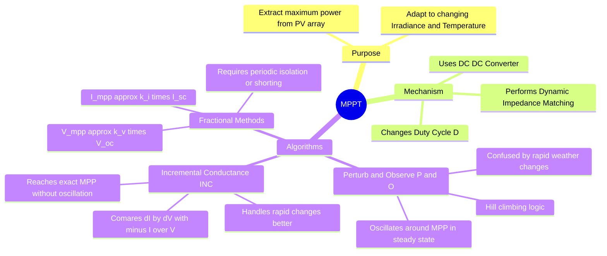

---
tags:
  - power-electronics
  - renewable-energy
  - control-system
  - mppt
  - gate
created: 2025-10-14
aliases:
  - MPPT
  - Perturb and Observe
  - Incremental Conductance
subject: "[[Power Electronics]]"
parent: "[[Impedance Matching in Power Electronics]]"
modified: 2026-07-16
---
### Maximum Power Point Tracking (MPPT)
#power-electronics/mppt #renewable-energy 

> **Maximum Power Point Tracking (MPPT)** is an electronic control technique used primarily with solar photovoltaic (PV) systems (and wind turbines) to maximize power extraction under all conditions. Because a PV panel has a non-linear V-I characteristic, there is a unique operating point where the output power is maximized. The MPPT controller continuously adjusts the system's operating point to stay at this peak.

---
#### The PV Characteristic Curve
#renewable-energy/pv-curve

A solar cell acts neither as a perfect voltage source nor a perfect current source. Its power output $P = V \times I$ depends on the operating voltage.
*   **Open Circuit Voltage ($V_{oc}$):** Max voltage, Current = 0, Power = 0.
*   **Short Circuit Current ($I_{sc}$):** Max current, Voltage = 0, Power = 0.
*   **Maximum Power Point (MPP):** Located at the "knee" of the I-V curve. At this point, the panel produces $V_{mpp}$ and $I_{mpp}$, yielding the absolute maximum power $P_{max}$.
*   **Environmental Impact:** Irradiance changes primarily affect $I_{sc}$, while temperature changes primarily affect $V_{oc}$. Thus, the MPP constantly shifts, necessitating dynamic tracking.

---
#### The Mechanism: Impedance Matching
#power-electronics/impedance-matching

> Compare with [[Maximum Power Transfer Theorem]] regarding efficiency limits.

The physical load connected to the system (e.g., a battery or grid inverter) rarely matches the optimal internal impedance of the solar panel ($R_{opt} = V_{mpp}/I_{mpp}$). 
To bridge this gap, a **DC-DC Converter** (Buck, Boost, or Buck-Boost) is placed between the panel and the load.

The MPPT algorithm acts on the converter's **Duty Cycle ($D$)** to transform the load impedance $R_L$ into an effective input impedance $R_{in}$ that matches the panel's optimal impedance:
$$\boxed{\quad R_{in}(D) = R_{opt} = \frac{V_{mpp}}{I_{mpp}} \quad}$$

---
#### Perturb and Observe (P&O) Algorithm
#mppt/algorithms #p-and-o

This is the most widely used algorithm due to its simplicity. It operates on a "hill-climbing" principle.
1.  **Perturb:** The controller intentionally introduces a small perturbation in the operating voltage ($\Delta V$) or duty cycle ($\Delta D$).
2.  **Observe:** It measures the resulting change in power ($\Delta P$).
3.  **Logic:**
    *   If $\Delta P > 0$ (power increased), the perturbation moved the operating point closer to the MPP. Keep perturbing in the **same direction**.
    *   If $\Delta P < 0$ (power decreased), the perturbation moved away from the MPP. **Reverse the direction** of the perturbation.

*   **Drawbacks:** 
    *   It never perfectly settles; it continuously **oscillates** around the MPP, causing minor power losses in steady state.
    *   It can track in the wrong direction during rapidly changing weather conditions (e.g., passing clouds).

---
#### Incremental Conductance (INC) Algorithm
#mppt/algorithms #incremental-conductance #gate/formulas

This method overcomes the drawbacks of P&O by utilizing the mathematical fact that the derivative of power with respect to voltage is zero at the MPP.

$$P = V \cdot I$$
$$\frac{dP}{dV} = \frac{d(V \cdot I)}{dV} = I \cdot \frac{dV}{dV} + V \cdot \frac{dI}{dV} = I + V\frac{dI}{dV}$$

At the Maximum Power Point, the slope of the P-V curve is zero ($\frac{dP}{dV} = 0$). Setting the equation to zero gives the fundamental condition for the INC algorithm:
$$\boxed{\quad \frac{dI}{dV} = -\frac{I}{V} \quad}$$

**Decision Logic:**
*   $\frac{dI}{dV} > -\frac{I}{V} \implies \frac{dP}{dV} > 0$ (Left of MPP, increase $V$).
*   $\frac{dI}{dV} = -\frac{I}{V} \implies \frac{dP}{dV} = 0$ (**At exact MPP**, keep $V$ constant).
*   $\frac{dI}{dV} < -\frac{I}{V} \implies \frac{dP}{dV} < 0$ (Right of MPP, decrease $V$).

*   **Advantages:** It stops exactly at the MPP (no steady-state oscillation) and handles rapid irradiance changes better than P&O.
*   **Drawbacks:** More computationally intensive, requires highly accurate sensors.

---
#### Fractional Voltage and Current Methods
#mppt/fractional-methods

These are simple, approximate methods based on empirical linear relationships.
*   **Fractional $V_{oc}$ Method:** $V_{mpp} \approx k_v \cdot V_{oc}$ (where $k_v$ is typically $0.71$ to $0.78$). The converter periodically disconnects the panel to measure $V_{oc}$, sets the operating voltage to $k_v V_{oc}$, and resumes.
*   **Fractional $I_{sc}$ Method:** $I_{mpp} \approx k_i \cdot I_{sc}$ (where $k_i$ is typically $0.78$ to $0.92$). The converter periodically shorts the panel to measure $I_{sc}$.
*   **Drawbacks:** Periodic power loss during measurement phases; the proportionality constant $k$ is an approximation and changes with panel aging and severe conditions.

---
### Related Concepts
#topic/related-concepts

> [[Impedance Matching in Power Electronics]]

[[Analysis of DC-DC Converters]]
[[Maxima and Minima (Single Variable)]] (Mathematical basis for the INC algorithm)
[[Buck-Boost Converter]] (Often used for MPPT as it can match any impedance)
[[Open-Loop and Closed-Loop (Feedback) Control Systems|Feedback Control Systems]]
