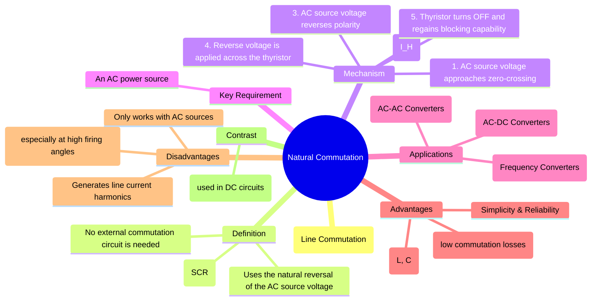

---
tags:
  - power-electronics
  - thyristors
  - commutation
  - rectifiers
  - ac-circuits
created: 2025-08-30
aliases:
  - Line Commutation
  - Natural Commutation of Thyristors
subject:
  - "[[Power Electronics]]"
parent:
modified: 2026-08-04T10:05:54
---
### Natural Commutation
#natural-commutation #line-commutation #thyristor #power-electronics

> Natural Commutation, also known as Line Commutation, is the process of turning off a thyristor (SCR) using the natural characteristics of the AC source voltage. The turn-off is achieved automatically when the AC voltage reverses its polarity and the current through the device falls to zero, without the need for any additional external components. This simple and reliable method is the basis for most high-power AC-DC converters (rectifiers).

---
###### Principle of Operation
#natural-commutation/principle

A thyristor, once triggered ON, will continue to conduct as long as its anode current ($I_A$) is greater than its holding current ($I_H$). To turn it off, the current must drop below this level, and a reverse voltage must be applied across it for a brief period. In an AC circuit, this happens naturally every cycle.

The process unfolds in two key steps:
1.  **Current Zero-Crossing**: As the AC source voltage sine wave approaches the end of a half-cycle, the current flowing through the thyristor and load naturally decreases. When the current falls below the thyristor's holding current, the device's internal latching mechanism ceases.
2.  **Reverse Voltage Application**: Immediately following the current zero-crossing, the AC source voltage reverses its polarity. This applies a reverse bias across the anode and cathode of the thyristor. This reverse voltage prevents the thyristor from turning back on and allows the internal charge carriers to recombine, enabling the device to regain its forward voltage blocking capability.

The duration for which the circuit provides this reverse voltage is called the **circuit turn-off time ($t_c$)**. For successful commutation, this time must be longer than the thyristor's specified **device turn-off time ($t_q$)**. In line-commutated systems operating at 50/60 Hz, this condition is almost always met.

###### Applications
#natural-commutation/applications
Natural commutation is exclusively used in circuits powered by an AC source.
1.  **Phase-Controlled Rectifiers (AC-DC Converters)**: This is the most common application. By controlling the point in the AC cycle at which the thyristors are fired (the firing angle, $\alpha$), the average DC output voltage can be regulated. These are used in high-power applications like DC motor drives, HVDC transmission, and industrial power supplies.
2.  **AC Voltage Controllers**: Two thyristors are used in an anti-parallel configuration (or a TRIAC is used) to control the power delivered to an AC load. They are fired at a certain point in each half-cycle and naturally commutate at the next zero-crossing. Common examples include industrial heaters and light dimmers.
3.  **Cycloconverters**: These are complex converters that synthesize a lower frequency AC output from a higher frequency AC input, using banks of naturally commutated thyristors.

###### Advantages and Disadvantages
#natural-commutation/advantages-disadvantages

#### Advantages
*   **Simplicity and Reliability**: The process is inherent to the AC supply, requiring no extra components like commutation capacitors or inductors. This makes the circuits simple, cost-effective, and highly reliable.
*   **High Efficiency**: Since there are no auxiliary commutation circuits, the associated switching losses are very low.
*   **High Power Handling**: The simplicity allows for robust designs capable of handling very high power levels (megawatts).

#### Disadvantages
*   **AC Source Dependent**: It can only be used in circuits with an AC source. It is not applicable for DC choppers or inverters that are powered from a DC bus.
*   **Poor Input Power Factor**: The firing angle delay ($\alpha$) causes the AC input current to lag the voltage, resulting in a poor, lagging power factor. This becomes progressively worse as the output DC voltage is reduced (i.e., as $\alpha$ increases).
*   **Harmonic Distortion**: The non-sinusoidal, chopped current waveforms drawn by the converter inject harmonic currents back into the AC supply, which can distort the utility grid voltage and affect other connected equipment.

---
### Related Topics
#power-electronics-concepts

> [[Forced Commutation]] (The opposite technique, used for DC circuits)

[[Power Thyristors|Thyristors (SCRs)]] (The key component that utilizes commutation)
[[Phase-Controlled Rectifiers]]
[[0. Basics/Power Factor]]
[[Harmonics]]
