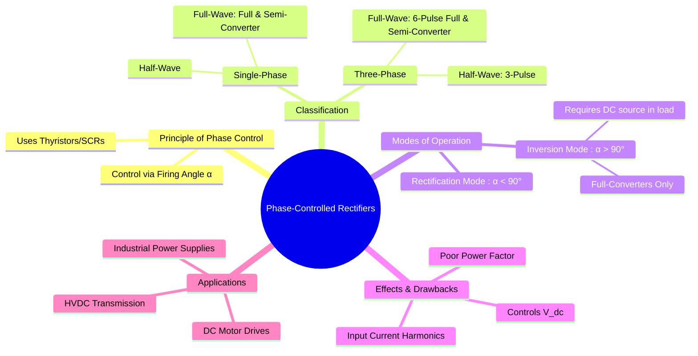

---
tags:
  - power-electronics
  - rectifiers
  - controlled-rectifiers
  - thyristors
  - ac-dc-converter
created: 2025-09-17
aliases:
  - Controlled Rectifiers
  - Thyristor Rectifiers
  - Phase Control
subject: "[[Power Electronics]]"
parent:
  - Rectifiers
modified: 2026-08-04T10:12:09
---
### Phase-Controlled Rectifiers
#controlled-rectifiers #thyristor

> A **Phase-Controlled Rectifier** (or converter) is <u>an AC-to-DC converter whose average DC output voltage can be controlled by adjusting the timing of the gate pulses supplied to its thyristors (SCRs)</u>. Unlike [[Uncontrolled Rectifiers]] which use diodes, these rectifiers provide a variable DC output.

---
#### Principle of Phase Control
#firing-angle

The control is achieved by using [[Power Thyristors]] (SCRs) instead of diodes. An SCR will only start conducting when it is forward-biased **and** it receives a trigger pulse at its gate terminal.
* **Firing Angle ($\alpha$)**: The control parameter is the **firing angle** or **delay angle**, $\alpha$. It is defined as the angle (measured from the point where a diode would naturally start conducting) by which the gate pulse is delayed.
* **Control Action**: By delaying the firing angle ($\alpha > 0$), we "chop" a portion of the AC voltage waveform before it is applied to the load. This reduces the area under the output voltage curve, thereby reducing the average (DC) output voltage.

$$\boxed{\quad \text{Increasing } \alpha \implies \text{Decreasing } V_{dc} \quad}$$

---
#### Classification of Controlled Rectifiers

##### Single-Phase Converters
1. **[[Single-Phase Half-Wave Controlled Rectifier|Half-Wave Controlled Rectifier]]**: Uses one SCR.
    * Average Output Voltage: $$\boxed{\quad V_{dc} = \frac{V_m}{2\pi}(1 + \cos\alpha) \quad}$$
2. **Full-Wave Fully-Controlled Rectifier (Full Converter)**: Uses four SCRs.
	> 1. [[Single-Phase Full-Wave Bridge Controlled Rectifier]]
    > 2. [[Single-Phase Full-Wave Center-Tapped Controlled Rectifier]]
    * Average Output Voltage: $$\boxed{\quad V_{dc} = \frac{2V_m}{\pi}\cos\alpha \quad}$$
    * Can operate in two quadrants (rectification and inversion).

3.  **[[Single-Phase Semi-Converter|Full-Wave Semi-Converter]]**: Uses two SCRs and two diodes.
    * Average Output Voltage: $$\boxed{\quad V_{dc} = \frac{V_m}{\pi}(1 + \cos\alpha) \quad}$$
    * Operates in only one quadrant (rectification). The freewheeling diode action gives it a better power factor than a full converter.

##### Three-Phase Converters
Used for high-power applications. The most common is the **6-pulse full-bridge converter**.
* **[[Three-Phase Full-Bridge Controlled Rectifier|Three-Phase Full Converter (6-Pulse)]]**: Uses six SCRs.
    * Average Output Voltage: $$\boxed{\quad V_{dc} = \frac{3V_{m,L-L}}{\pi}\cos\alpha \quad}$$

> See [[Three-Phase Semi-Converter]]

---
#### Inversion Mode of Operation
#inversion-mode #regenerative-braking

A unique capability of **fully-controlled converters** is their ability to operate in the inversion mode.
* **Condition**: This occurs when the firing angle is delayed beyond 90° ($\alpha > 90^\circ$). In this range, $\cos\alpha$ is negative, causing the average DC output voltage $V_{dc}$ to become negative.
* **Requirement**: For current to flow, the load must contain a DC voltage source (like the back-EMF of a DC motor) that is larger than the converter's negative voltage, forcing current against it.
* **Result**: The converter draws power from the DC load and delivers it back to the AC supply. This is called **inversion**.
* **Application**: This principle is used for the **regenerative braking** of DC motor drives, where the motor's kinetic energy is converted back into electrical energy and fed to the AC grid.

---
#### Effects and Disadvantages
* **Poor Power Factor**: The input current drawn from the AC supply is delayed by the angle $\alpha$ and is non-sinusoidal (typically a square-like wave). This results in a poor displacement factor ($\approx \cos\alpha$) and a low overall power factor, especially at large firing angles.
* **Input Current Harmonics**: The non-sinusoidal nature of the input current injects significant [[Input Current Harmonics|current harmonics]] into the AC supply, which is a major [[Power Quality]] issue.

---
### Related Concepts
#related-concepts

> [[Uncontrolled Rectifiers]] (The baseline for comparison)

[[Power Thyristors]] (The key enabling component)
[[Conduction Modes in Power Electronics]]
[[Commutation Failure and Overlap]]
[[DC Motor Drives]] (A primary application)
[[HVDC Transmission]] (High-power application)
[[Power Factor]] (A key performance issue)
[[Harmonic Analysis]] (A major drawback)