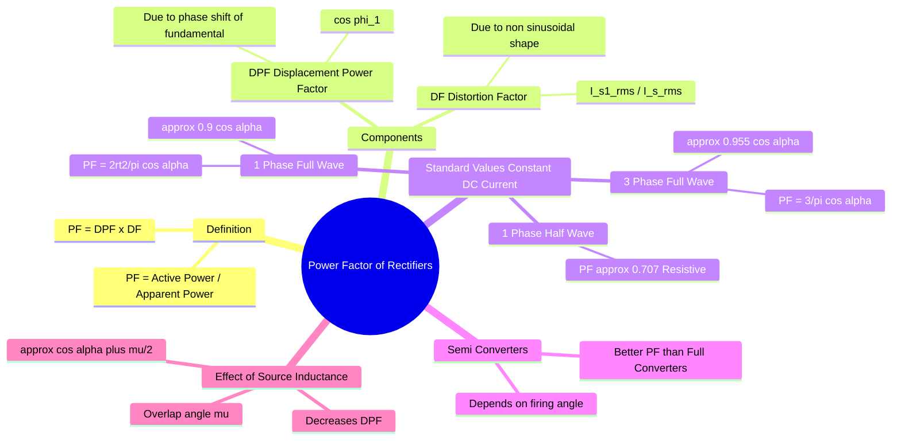

---
tags:
  - power-electronics
  - rectifiers
  - gate
  - power-factor
created: 2026-01-06
aliases:
  - Input Power Factor of Rectifiers
  - Distortion Factor and Displacement Factor
subject: "[[Power Electronics]]"
parent:
  - "[[Performance Metrics]]"
modified: 2026-07-18
---
### Power Factor of Rectifiers
#power-electronics/rectifiers #power-factor

> In power electronics, the **Input Power Factor (PF)** is not solely determined by the phase shift between voltage and current (as in linear circuits). It is the product of the **Displacement Power Factor (DPF)** and the **Distortion Factor (DF)**, accounting for the non-sinusoidal nature of the input current drawn by rectifiers.

---

#### 1. Fundamental Definition
#power-factor/definition

For non-linear loads like rectifiers supplied by a sinusoidal voltage $v_s(t)$ but drawing a non-sinusoidal current $i_s(t)$:

$$\boxed{\quad \text{Input Power Factor} = \frac{\text{Average Input Power}}{\text{Input RMS VA}} = \text{DPF} \times \text{DF} \quad}$$

**A. Displacement Power Factor (DPF):**
Also called the Fundamental Power Factor. It relates to the phase angle $\phi_1$ between the *fundamental component* of the input current ($I_{s1}$) and the input voltage ($V_s$).
$$\text{DPF} = \cos \phi_1$$
*   For phase-controlled rectifiers, $\phi_1 \approx -\alpha$ (firing angle), so $\text{DPF} \approx \cos \alpha$ (lagging).

**B. Distortion Factor (DF):**
Also called the Current Distortion Factor (CDF). It represents the purity of the current waveform.
$$\text{DF} = \frac{I_{s1(rms)}}{I_{s(rms)}}$$
*   For a pure sine wave, $\text{DF} = 1$.
*   For square/quasi-square waves, $\text{DF} < 1$.

**Relationship with THD:**
$$\boxed{\quad \text{PF} = \frac{\cos \phi_1}{\sqrt{1 + \text{THD}^2}} \quad}$$

---

#### 2. Power Factor of Standard Rectifiers (GATE High Yield)
#gate/formulas

Assume **Ripple Free Load Current** (High Inductance Load, $I_0 = \text{constant}$) for full-wave and three-phase cases.

| Rectifier Type | Input Current Waveform | Distortion Factor (DF) | Displacement PF (DPF) | **Input Power Factor (PF)** |
| :--- | :--- | :--- | :--- | :--- |
| **1-$\phi$ Half Wave** (R-Load) | Sinusoidal (Half) | $1/\sqrt{2} \approx 0.707$ | $1$ | **0.707** |
| **1-$\phi$ Full Converter** (Bridge) | Square Wave | $\frac{2\sqrt{2}}{\pi} \approx 0.9$ | $\cos \alpha$ | $\boxed{\frac{2\sqrt{2}}{\pi} \cos \alpha \approx 0.9 \cos \alpha}$ |
| **1-$\phi$ Semi Converter** | Stepped | $\sqrt{\frac{2(1+\cos\alpha)}{\pi(\pi-\alpha)}}$ | $\cos(\alpha/2)$ | $\sqrt{\frac{2(1+\cos\alpha)}{\pi(\pi-\alpha)}} \cos(\alpha/2)$ |
| **3-$\phi$ Full Converter** (Bridge) | Quasi-Square (120°) | $\frac{3}{\pi} \approx 0.955$ | $\cos \alpha$ | $\boxed{\frac{3}{\pi} \cos \alpha \approx 0.955 \cos \alpha}$ |

> [!warning] GATE Tip
> * **1-$\phi$ Full Converter:** PF decreases linearly with $\cos \alpha$. At $\alpha=0$ (Diode Bridge), PF $\approx 0.9$.
> * **3-$\phi$ Full Converter:** PF is higher than 1-$\phi$. At $\alpha=0$, PF $\approx 0.955$.
> * **Semi-Converters** always have a **better** (higher) power factor than Full Converters for the same firing angle because the freewheeling action reduces the RMS input current while maintaining the same active power transfer.

---

#### 3. Effect of Source Inductance ($L_s$)
#rectifiers/source-inductance

Source inductance causes **Current Overlap**, characterized by the overlap angle $\mu$. This affects the power factor in two ways:
1.  **Fundamental Phase Shift:** The fundamental current shifts further by approximately $\mu/2$.
2.  **Harmonic Reduction:** The finite slope of current transitions slightly reduces higher-order harmonics (improving DF slightly), but the DPF drop dominates.

**Approximate Formula with Overlap:**
$$\boxed{\quad \text{PF} \approx \frac{3}{\pi} \cos \left( \alpha + \frac{\mu}{2} \right) \quad}$$
*(Note: This is a practical approximation. The exact active power is $P = V_{do} I_0 \cos(\alpha) - \text{Drop}$, but for PF angle estimation, the effective delay is often taken as $\alpha + \mu/2$).*

---
### Related Concepts
#topic/related-concepts

> [[Performance Metrics]]

[[Performance Metrics|Total Harmonic Distortion]]
[[Single-Phase Full-Wave Center-Tapped Controlled Rectifier|Single-Phase Full-Wave Controlled Rectifier (Center-Tapped, R or RL loads)]]
[[Three Phase Rectifiers]]
[[Source Inductance in Rectifiers]]
[[Fourier Series]] (Used to derive $I_{s1}$ and DF)
