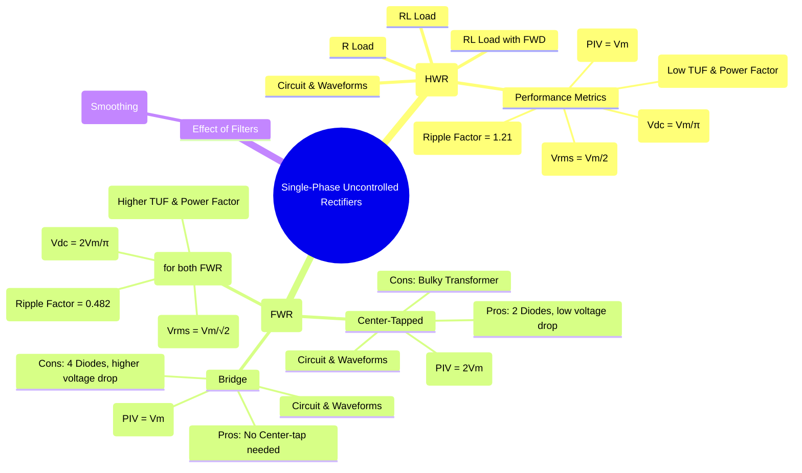

---
tags:
  - power-electronics
  - rectifiers
  - single-phase
  - diode-rectifiers
  - ac-dc-converter
created: 2025-09-04
aliases:
  - Single Phase Diode Rectifiers
  - Single-Phase Rectifier
subject: "[[Power Electronics]]"
parent: "[[Uncontrolled Rectifiers]]"
modified: 2026-08-04T10:29:47
---
### Single-Phase Uncontrolled Rectifiers
#single-phase-rectifier #diode-rectifier #ac-dc-conversion

> Single-phase uncontrolled rectifiers are circuits that convert single-phase AC voltage into pulsating DC voltage using only [[Power Diodes]]. They are the most fundamental type of AC-DC converters, widely used in low-power DC supplies. They are classified into two main types: Half-Wave and Full-Wave.

#### Single-Phase Half-Wave Rectifier (HWR)
#half-wave-rectifier

The HWR uses a single diode to pass only one half-cycle (typically the positive one) of the AC input to the load, while blocking the other half.

##### HWR with Resistive (R) Load
#hwr/r-load 

*   **Operation**: During the positive half-cycle of the input voltage $v_s$ (from $0$ to $\pi$), the diode D is forward-biased and conducts. The load voltage $v_o$ follows the source voltage. During the negative half-cycle ($\pi$ to $2\pi$), the diode is reverse-biased, blocking current flow, and the load voltage is zero.
*   **Performance Parameters**:
    *   Average (DC) Output Voltage:
        $$\boxed{\quad V_{dc} = \frac{1}{2\pi} \int_0^\pi V_m \sin(\omega t) d(\omega t) = \frac{V_m}{\pi} \quad}$$
    *   RMS Output Voltage:
        $$\boxed{\quad V_{rms} = \sqrt{\frac{1}{2\pi} \int_0^\pi (V_m \sin(\omega t))^2 d(\omega t)} = \frac{V_m}{2} \quad}$$
    *   Ripple Factor ($\gamma$): A measure of the pulsating AC component in the output.
        $$\boxed{\quad \gamma = \sqrt{\left(\frac{V_{rms}}{V_{dc}}\right)^2 - 1} = \sqrt{\left(\frac{V_m/2}{V_m/\pi}\right)^2 - 1} = 1.21 \quad}$$
        (This indicates a very high ripple content, 121%).
    *   Peak Inverse Voltage (PIV): Maximum reverse voltage the diode must withstand.
        $$\boxed{\quad PIV = V_m \quad}$$
    *   **Drawbacks**: Very high ripple, low DC output, and poor Transformer Utilization Factor (TUF = 0.287). It also introduces a DC component in the transformer secondary, which can lead to saturation.

##### HWR with Inductive (RL) Load and Freewheeling Diode (FWD)
#hwr/rl-load #freewheeling-diode

For an inductive load, the inductor's energy storage causes current to flow even after the voltage becomes negative. A [[freewheeling diode]] (FWD) is used to provide a path for this inductive current, preventing the output voltage from going negative and improving the waveform.
*   **Operation with FWD**: When $v_s$ becomes negative, the FWD becomes forward-biased and provides a path for the inductor current to decay, clamping the load voltage to approximately zero. This improves the load current waveform and the power factor.

---
#### Single-Phase Full-Wave Rectifier (FWR)
#full-wave-rectifier

FWRs utilize both half-cycles of the input AC waveform to produce a more continuous DC output with significantly less ripple than a HWR.

##### 1. FWR with Center-Tapped Transformer
#center-tapped-rectifier

This configuration uses a transformer with a center-tapped secondary winding and two diodes.

![[Pasted image 202509041101.png]]

*   **Operation**: During the positive half-cycle, the upper secondary winding is positive, so diode $D_1$ conducts. During the negative half-cycle, the lower secondary winding becomes positive (relative to the center), so diode $D_2$ conducts. Current always flows through the load in the same direction.
*   **Key Feature - PIV**: Each diode must block the entire secondary voltage ($V_m - (-V_m) = 2V_m$).
    $$\boxed{\quad \text{PIV} = 2V_m \quad}$$
*   **Pros/Cons**: Requires only two diodes (lower forward voltage drop) but needs a bulky and expensive center-tapped transformer.

##### 2. FWR Bridge Rectifier
#bridge-rectifier

This is the most common single-phase rectifier configuration, using four diodes in a bridge topology. It does not require a center-tapped transformer.

![[Pasted image 202509041102.png]]

*   **Operation**:
    *   During the positive half-cycle, diodes $D_1$ and $D_2$ are forward-biased and conduct.
    *   During the negative half-cycle, diodes $D_3$ and $D_4$ are forward-biased and conduct.
    *   In both cases, the current flows through the load in the same direction.
*   **Key Feature - PIV**: Each diode only needs to block the peak input voltage.
    $$\boxed{\quad \text{PIV} = V_m \quad}$$

##### Performance Parameters (for both FWR types with R Load)
*   Average (DC) Output Voltage:
    $$\boxed{\quad V_{dc} = \frac{1}{\pi} \int_0^\pi V_m \sin(\omega t) d(\omega t) = \frac{2V_m}{\pi} \quad}$$
*   RMS Output Voltage:
    $$\boxed{\quad V_{rms} = \sqrt{\frac{1}{\pi} \int_0^\pi (V_m \sin(\omega t))^2 d(\omega t)} = \frac{V_m}{\sqrt{2}} \quad}$$
*   Ripple Factor ($\gamma$):
    $$\boxed{\quad \gamma = \sqrt{\left(\frac{V_{rms}}{V_{dc}}\right)^2 - 1} = \sqrt{\left(\frac{V_m/\sqrt{2}}{2V_m/\pi}\right)^2 - 1} = 0.482 \quad}$$
    (The ripple content is much lower than HWR).

---
#### Performance Comparison

| Parameter | Half-Wave (HWR) | FWR (Center-Tapped) | FWR (Bridge) |
| :--- | :---: | :---: | :---: |
| No. of Diodes | 1 | 2 | 4 |
| Average Voltage ($V_{dc}$) | $V_m/\pi$ | $2V_m/\pi$ | $2V_m/\pi$ |
| Ripple Factor ($\gamma$) | 1.21 | 0.482 | 0.482 |
| Peak Inverse Voltage (PIV) | $V_m$ | **$2V_m$** | **$V_m$** |
| Transformer Utilization | 0.287 (Low) | 0.693 (Better) | 0.812 (Best) |

---
### Related Concepts
#related-concepts

> [[Uncontrolled Rectifiers]] (Parent Concept)

[[Three-Phase Uncontrolled Rectifiers]] (For higher power applications)
[[Controlled Rectifiers]] (Using thyristors for variable DC output)
[[Power Diodes]]
[[Filters]] (Capacitor and LC filters are used to smooth the pulsating DC output)
[[freewheeling diode]]
[[Ripple Factor]]
[[Transformer Utilization Factor]]