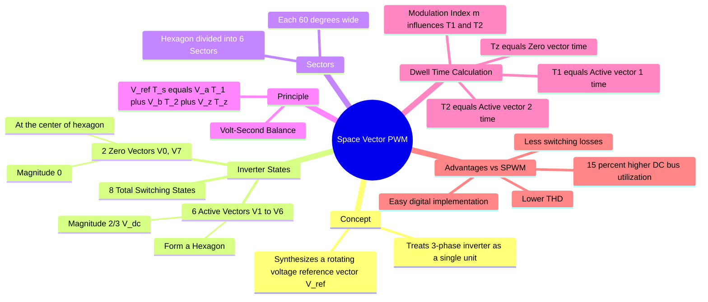

---
tags:
  - power-electronics
  - electric-drives
  - inverter
  - gate
  - pwm-techniques
created: 2026-08-04T10:32:12
aliases:
  - Space Vector Modulation
  - SVM
  - Voltage Space Vector
subject: "[[Power Electronics]]"
parent:
  - DC-AC Converters (Inverters)
modified: 2026-08-04T10:32:12
---
### Space Vector PWM (SVPWM)
#power-electronics/pwm #electric-drives

> **Space Vector Pulse Width Modulation (SVPWM)** is an advanced modulation technique for three-phase voltage source inverters. Unlike Sinusoidal PWM (SPWM) which compares sine waves with a triangular carrier for each phase independently, SVPWM treats the inverter as a single unit producing a **rotating voltage vector** in the $\alpha\beta$ space. It is the standard modulation scheme for **Vector Control** drives.

---
#### Concept of Voltage Space Vectors
#svpwm/vectors

A three-phase 2-level inverter has 3 legs, each with 2 switches (Top/Bottom). There are $2^3 = 8$ possible switching states.
Representing the switching state as $[S_a, S_b, S_c]$ (1 = Top ON, 0 = Bottom ON):

*   **Active Vectors ($V_1$ to $V_6$):** 6 states produce a non-zero output voltage. They form the vertices of a regular hexagon.
    *   Magnitude: $\boxed{\quad |V_k| = \frac{2}{3} V_{dc} \quad}$
*   **Zero Vectors ($V_0, V_7$):** 2 states ($[0,0,0]$ and $[1,1,1]$) short the load terminals.
    *   Magnitude: $0$. Located at the origin.

**Vector Representation:**
$$V_s = \frac{2}{3} (V_{an} + V_{bn} e^{j2\pi/3} + V_{cn} e^{-j4\pi/3})$$

---
#### The Reference Vector and Sectors
#svpwm/sectors

We wish to synthesize a rotating reference voltage vector $\vec{V}_{ref}$ with magnitude $V_{ref}$ and angle $\theta$.
*   The hexagon is divided into **6 Sectors** (I to VI), each spanning $60^\circ$.
*   At any instant, $\vec{V}_{ref}$ lies in one of these sectors, bounded by two adjacent active vectors ($\vec{V}_a$ and $\vec{V}_b$) and the zero vectors.

---
#### Dwell Time Calculation (Volt-Second Balance)
#svpwm/calculations

To generate $\vec{V}_{ref}$, we apply the adjacent active vectors and zero vectors for specific durations ($T_1, T_2, T_0$) within a switching period $T_s$ (sampling time).
By the principle of **Volt-Second Balance**:
$$\boxed{\quad \vec{V}_{ref} \cdot T_s = \vec{V}_1 \cdot T_1 + \vec{V}_2 \cdot T_2 + \vec{V}_z \cdot T_z \quad}$$

For a vector in Sector I (bounded by $V_1[100]$ and $V_2[110]$):
$$\begin{align}
T_1 &= \frac{\sqrt{3} \cdot T_s \cdot V_{ref}}{V_{dc}} \sin(60^\circ - \theta) \\
T_2 &= \frac{\sqrt{3} \cdot T_s \cdot V_{ref}}{V_{dc}} \sin(\theta) \\
T_z &= T_s - T_1 - T_2
\end{align}$$
*   $T_1$: Time for Leading Vector.
*   $T_2$: Time for Lagging Vector.
*   $T_z$: Time for Zero Vector (Usually split equally between $V_0$ and $V_7$ to minimize switching).

---
#### Maximum Linear Modulation Range
#svpwm/limits

*   **Inscribed Circle:** The maximum $V_{ref}$ that can be synthesized without distortion (linear region) corresponds to the radius of the circle inscribed within the hexagon.
    $$V_{ref,max} = \frac{\sqrt{3}}{2} \times |V_k| = \frac{\sqrt{3}}{2} \times \frac{2}{3} V_{dc} = \frac{V_{dc}}{\sqrt{3}} \approx 0.577 V_{dc}$$

*   **Comparison with SPWM:**
    *   Max Phase Voltage in SPWM = $0.5 V_{dc}$.
    *   Max Phase Voltage in SVPWM = $0.577 V_{dc}$.
    *   **Utilization:** SVPWM provides **15.5% higher DC bus utilization** than SPWM.

---
#### Switching Sequence (Symmetric PWM)

To minimize switching losses (only one switch changes state at a time) and reduce THD, a symmetric sequence is used.
For Sector I ($V_0 \to V_1 \to V_2 \to V_7 \to V_2 \to V_1 \to V_0$):
$$000 \leftrightarrow 100 \leftrightarrow 110 \leftrightarrow 111$$

---
#### Advantages over SPWM

1.  **Higher DC Bus Utilization:** (15.5% more output voltage for same DC input).
2.  **Lower Switching Losses:** Due to optimized switching sequences.
3.  **Lower THD:** Better harmonic spectrum.
4.  **Digital Implementation:** Ideally suited for Microcontrollers/DSPs (no sine look-up tables needed, just sector logic).

---
### Related Concepts
#topic/related-concepts

> [[Inverters (DC-AC Converters)]]

[[Pulse Width Modulation (PWM) Techniques]] (Basics of SPWM)
[[Clarke Transformation]] (Used to project reference into $\alpha\beta$ plane)
[[Vector Control of Drives]] (SVPWM is the actuation stage for FOC)
[[Three-Phase Circuits]]
[[Total Harmonic Distortion (THD)]]
