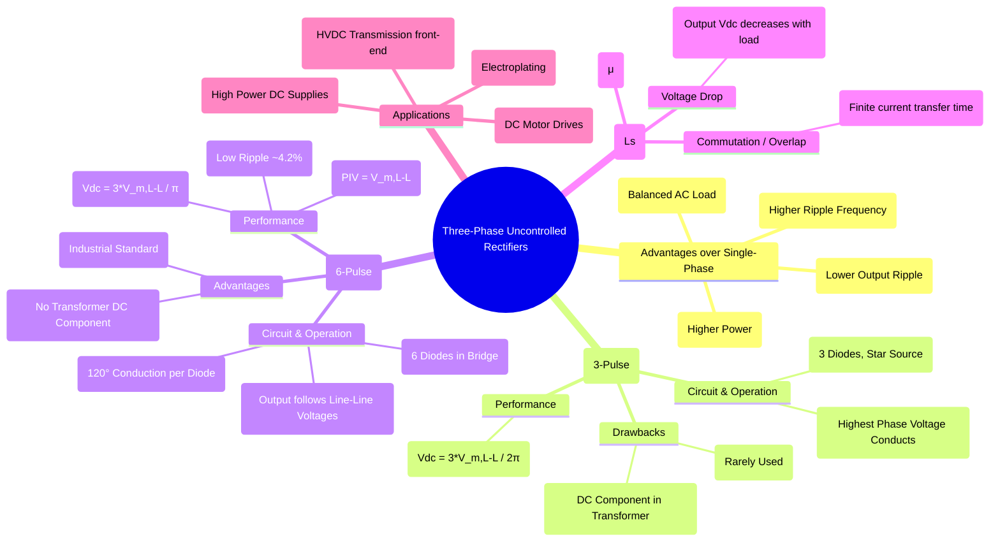

---
tags:
  - power-electronics
  - rectifiers
  - three-phase
  - polyphase-rectifier
  - ac-dc-converter
created: 2025-09-05
aliases:
  - Three Phase Diode Rectifiers
  - 3-Phase Rectifier
subject: "[[Power Electronics]]"
parent: "[[Uncontrolled Rectifiers]]"
modified: 2026-08-04T10:40:34
---
### Three-Phase Uncontrolled Rectifiers
#three-phase-rectifier #polyphase-rectifier #high-power-rectifier

> Three-phase uncontrolled rectifiers are used to convert three-phase AC voltage to DC voltage in high-power applications (typically > 15 kW). They offer significant advantages over single-phase rectifiers, including a higher average output voltage, much lower output ripple, a higher ripple frequency (making filtering easier), and drawing balanced currents from the AC supply.

---
#### Three-Phase Half-Wave Rectifier (3-Pulse Converter)
#3-pulse-rectifier #mid-point-rectifier #center-tapped-rectifier 

This is the simplest three-phase rectifier, consisting of three diodes connected to a star (wye) connected secondary winding.

* **Operation**: The three diodes have a common cathode. At any instant, only the diode connected to the phase with the highest instantaneous positive voltage conducts. Each diode conducts for $120^\circ$. The output voltage waveform follows the positive envelope of the three-phase input voltages.
* **Performance**:
    * The output voltage has 3 pulses per input cycle.
    * Average Output Voltage ($V_{dc}$):
        $$\boxed{\quad V_{dc} = \frac{3 V_{m,L-L}}{2\pi} \approx 0.477 V_{m,L-L} \quad}$$
        where $V_{m,L-L}$ is the peak line-to-line voltage.
* **Drawback**: The primary disadvantage is that the current drawn from each phase of the transformer secondary has a DC component. This can lead to the saturation of the transformer core and is why this topology is rarely used in practice.

---
#### Three-Phase Full-Wave Bridge Rectifier (6-Pulse Converter)
#6-pulse-rectifier #bridge-rectifier

This is the most widely used rectifier in industrial applications. It employs six diodes in a bridge configuration and does not require a neutral connection.

![[Pasted image 202509051201.png]]

* **Operation**: The bridge consists of a positive group of diodes ($D_1, D_3, D_5$) and a negative group ($D_2, D_4, D_6$). At any instant, two diodes conduct: one from the positive group (connected to the most positive phase) and one from the negative group (connected to the most negative phase).
* Each diode conducts for $120^\circ$. The conduction sequence is $D_1D_6 \rightarrow D_1D_2 \rightarrow D_3D_2 \rightarrow D_3D_4 \rightarrow D_5D_4 \rightarrow D_5D_6$, with each pair conducting for $60^\circ$.
* The output voltage waveform is composed of segments of the line-to-line voltages, resulting in 6 pulses per input cycle.
* **Performance**:
    * Average Output Voltage ($V_{dc}$):
        $$\boxed{\quad V_{dc} = \frac{3 V_{m,L-L}}{\pi} \approx 0.955 V_{m,L-L} \quad}$$
        (Note: this is exactly double the output of a 3-pulse rectifier).
    * Ripple Frequency: $6f_s$, where $f_s$ is the supply frequency.
    * Ripple Factor ($\gamma$): Very low, approximately **4.3%**.
    * Peak Inverse Voltage (PIV) across any diode:
        $$\boxed{\quad \text{PIV} = V_{m,L-L} \quad}$$
* **Advantages**: High output voltage, very low ripple, no DC component in supply lines, high transformer utilization.

---
#### Effect of Source Inductance (Commutation Overlap)
#commutation #overlap-angle

In a practical AC supply, there is always some source inductance, $L_s$. This inductance prevents current from transferring (commutating) instantaneously from a turning-off diode to a turning-on diode.
* **Overlap**: For a short period, known as the **overlap period**, three diodes conduct simultaneously (e.g., $D_1$, $D_2$, and $D_3$). This creates a temporary short circuit between two phases, causing a "notch" in the output voltage waveform.
* **Effect on Output Voltage**: The commutation overlap reduces the average DC output voltage. The voltage drop is proportional to the source inductance and the DC load current $I_{dc}$.
    $$\boxed{\quad V_{dc} = V_{dc,ideal} - \Delta V_{dc} = \frac{3V_{m,L-L}}{\pi} - \frac{3 \omega L_s}{\pi} I_{dc} \quad}$$
This shows that a practical rectifier behaves somewhat like a DC voltage source with an internal resistance.

---
#### Performance Comparison

| Parameter | 3-Pulse Rectifier | 6-Pulse Bridge Rectifier |
| :--- | :---: | :---: |
| No. of Diodes | 3 | 6 |
| Pulse Number | 3 | 6 |
| $V_{dc}$ (ideal) | $\frac{3V_{m,L-L}}{2\pi}$ | $\frac{3V_{m,L-L}}{\pi}$ |
| Ripple Frequency | $3f_s$ | $6f_s$ |
| Ripple Factor ($\gamma$) | ~17% | ~4.2% |
| PIV per Diode | $\sqrt{3}V_{m,ph} = V_{m,L-L}$ | $V_{m,L-L}$ |
| Transformer DC Component? | Yes (Major issue) | No |

---
### Related Concepts
#related-concepts

> [[Uncontrolled Rectifiers]] (Parent Concept)

[[Single-Phase Uncontrolled Rectifiers]]
[[Controlled Rectifiers]] (Using thyristors to control the output voltage, e.g., 6-pulse controlled converter)
[[Harmonics]] (Rectifiers are non-linear loads and introduce current harmonics into the supply)
[[Power Factor Correction]]
[[HVDC Transmission]] (High-power rectifiers are the core of HVDC converter stations)