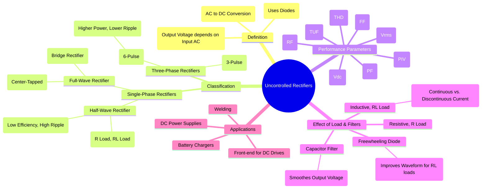

---
tags:
  - power-electronics
  - rectifiers
  - ac-dc-converter
  - diode-circuits
created: 2025-09-03
aliases:
  - Diode Rectifiers
subject: "[[Power Electronics]]"
parent:
  - Rectifiers
modified: 2026-08-04T10:45:46
---
### Uncontrolled Rectifiers
#rectifiers #ac-dc-conversion #diode-bridge

> An **Uncontrolled Rectifier** is a power electronic circuit that converts AC (Alternating Current) voltage to a pulsating DC (Direct Current) voltage using only [[Diodes|Power Diodes]]. The output voltage is "uncontrolled" because its average value depends solely on the magnitude of the input AC voltage and cannot be externally adjusted. It is the simplest form of an [[Rectifiers|AC-DC converter]].

---
#### Principle of Operation
#rectification-principle #diodes

The fundamental principle relies on the unidirectional current-conducting property of diodes. A diode allows current to flow when it is forward-biased (anode voltage is higher than cathode) and blocks current when it is reverse-biased. By arranging diodes strategically, the circuit can pass the positive halves of the AC waveform, negative halves, or both to the load, resulting in a unidirectional (DC) current flow.

---
#### Single-Phase Rectifiers
#single-phase-rectifier

##### 1. Single-Phase Half-Wave Rectifier (HWR)
#half-wave-rectifier

This is the simplest rectifier circuit, using a single diode. It only allows one-half of the AC cycle to pass through to the load.

* **Operation with R Load**: The diode conducts during the positive half-cycle ($0$ to $\pi$) and is reverse-biased during the negative half-cycle ($\pi$ to $2\pi$).
* **Performance**:
    * Average Output Voltage: $$\boxed{\quad V_{dc} = \frac{V_m}{\pi} \quad}$$
    * RMS Output Voltage: $$\boxed{\quad V_{rms} = \frac{V_m}{2} \quad}$$
    * Ripple Factor ($\gamma$): High, $\gamma = \sqrt{(\frac{V_{rms}}{V_{dc}})^2 - 1} = 1.21$.
    * Peak Inverse Voltage (PIV) on diode: $V_m$.
    * Transformer Utilization Factor (TUF): Very low (0.287).
* **With RL Load**: The inductor's energy storage causes the diode to conduct for a period beyond $\pi$, until the energy is dissipated.

##### 2. Single-Phase Full-Wave Rectifier (FWR)
#full-wave-rectifier #mid-point-rectifier #center-tapped-rectifier #bridge-rectifier 

This configuration utilizes both halves of the AC cycle, resulting in a much smoother output and better performance compared to the HWR.

1. **Center-Tapped Transformer Rectifier**: Uses two diodes and a transformer with a secondary winding tapped at the center.
    * **Pros**: Only two diodes, resulting in a lower total forward voltage drop.
    * **Cons**: Requires a bulky and expensive center-tapped transformer.
    * **PIV**: Each diode must block the full secondary voltage, $PIV = 2V_m$.
2. **Bridge Rectifier**: Uses four diodes in a bridge configuration. This is the most common single-phase rectifier.
    * **Pros**: Does not require a center-tapped transformer.
    * **Cons**: Four diodes are required; the forward voltage drop is higher (two diodes are always in series with the load).
    * **PIV**: Each diode must block the peak input voltage, $PIV = V_m$.

![[Pasted image 202509031001.png]]

* **Performance (for both FWR types with R Load)**:
    * Average Output Voltage: $$\boxed{\quad V_{dc} = \frac{2V_m}{\pi} \quad}$$
    * RMS Output Voltage: $$\boxed{\quad V_{rms} = \frac{V_m}{\sqrt{2}} \quad}$$
    * Ripple Factor ($\gamma$): Significantly lower, $\gamma = 0.482$.
    * TUF: Higher than HWR (0.812 for bridge).

---
#### Three-Phase Rectifiers
#three-phase-rectifier #polyphase-rectifier

Used for high-power applications (> 15 kW) as they draw balanced current from the supply and produce a much smoother DC output voltage with less ripple.

##### 1. Three-Phase Half-Wave Rectifier (3-Pulse)
#3-pulse-rectifier

Uses three diodes, one for each phase. The diode with the highest instantaneous positive phase voltage will conduct.
* Average Output Voltage: $$\boxed{\quad V_{dc} = \frac{3V_{mp}}{\pi} = \frac{3\sqrt{3}V_{mlp}}{2\pi} = \frac{3V_{ml}}{2\pi} \quad}$$
    where $V_{mp}$ is peak phase voltage and $V_{ml}$ is peak line-to-line voltage.

##### 2. Three-Phase Full-Wave Bridge Rectifier (6-Pulse)
#6-pulse-rectifier

The industrial standard for high-power AC-DC conversion. It uses six diodes in a bridge configuration. At any instant, the diode connected to the most positive phase (top group) and the diode connected to the most negative phase (bottom group) conduct. Each diode conducts for $120^\circ$, and the output voltage is composed of six segments (pulses) per cycle.
* Average Output Voltage: $$\boxed{\quad V_{dc} = \frac{3V_{ml}}{\pi} \quad}$$
* **Advantages**: High output voltage, very low ripple factor ($\gamma \approx 4\%$), and high TUF.

---
#### Effect of Load and Filtering
#rectifier-loads #filtering

##### Inductive (RL) Load and Freewheeling Diode (FWD)
#freewheeling-diode

For an RL load, the inductor attempts to keep the current flowing. Without a freewheeling diode, this can cause the output voltage to go negative, which is often undesirable.
* A **Freewheeling Diode** is placed in parallel across the RL load.
* **Function**: It provides a path for the inductor current to circulate ("freewheel") when the main diodes turn off. This prevents the output voltage from becoming negative, improves the input power factor, and makes the load current much smoother (less ripple).

##### Capacitor Filter
#capacitor-filter

A large capacitor connected in parallel with the load is the most common type of filter for smoothing the rectifier's output.
* **Operation**: The capacitor charges to the peak of the input voltage when the diodes are on. When the input voltage falls below the capacitor voltage, the diodes turn off, and the capacitor discharges slowly into the load.
* **Result**: This action significantly reduces the voltage ripple and raises the average DC output voltage, which approaches $V_m$ for a lightly loaded filter.

---
### Related Concepts
#related-concepts

> [[Phase-Controlled Rectifiers|Controlled Rectifiers]] [redirects to :: Phase-Controlled Rectifiers] (Mainly we study **Phase-Controlled Rectifiers** - *Uses SCRs/Thyristors to control the output DC voltage*)

[[Diodes|Power Diodes]] (The fundamental switching component)
[[Filters]] (LC and C filters for ripple reduction)
[[Power Factor Correction]] (PFC circuits are often needed to correct the poor power factor of rectifiers)
[[Rectifiers|AC-DC Converters]] (The broader class of circuits)
[[Harmonic Analysis|Harmonics]] (Rectifiers draw non-sinusoidal current, introducing harmonics into the AC supply)