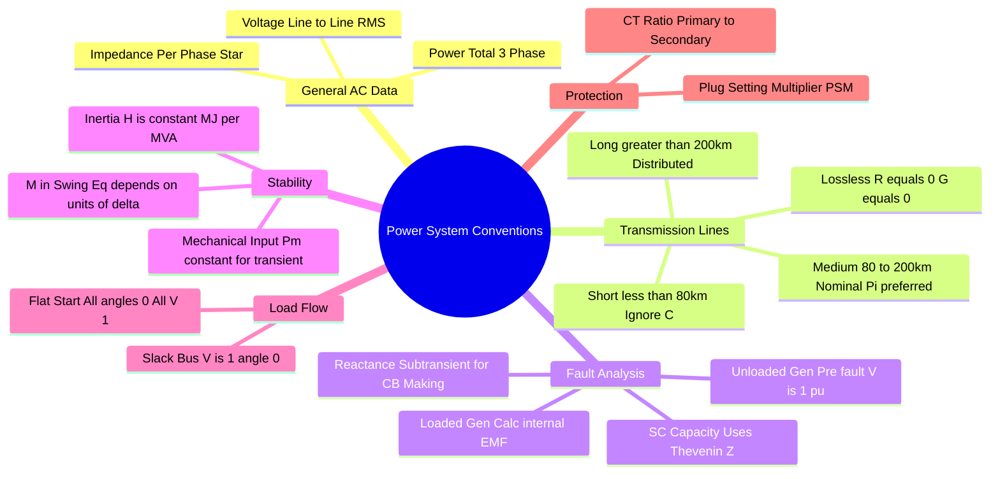

---
tags:
  - power-system
  - problem-solving
  - gate
  - conventions
  - definitions
created: 2026-08-04T09:06:52
aliases:
  - Power System Exam Assumptions
  - ⚙️ Default Values in Power Systems
  - Interpreting PS Question Data
subject: "[[Power Systems]]"
parent: Problem Solving Strategies
modified: 2026-08-04T09:06:52
---
### Exam Conventions for Power Systems
#power-system/conventions #gate/tips

> In Power System analysis for competitive exams like GATE, specific standard assumptions apply when data is missing or ambiguous. Deviating from these conventions often leads to incorrect options.
 

---
#### 1. General System Values (The "Golden Rules")
#power-system/basics

Unless explicitly stated otherwise (e.g., "per phase power", "peak voltage"):

1.  **System Voltage:** Given as **Line-to-Line RMS** ($V_{LL,rms}$).
    *   *Calculation:* For single-phase equivalent circuits, use $V_{ph} = V_{LL}/\sqrt{3}$.
2.  **System Power ($S, P, Q$):** Given as **Total Three-Phase Power**.
    *   *Calculation:* $S_{3\phi} = \sqrt{3} V_L I_L = 3 V_{ph} I_{ph}$.
3.  **Impedance ($Z$):** Given as **Per-Phase** Impedance.
    *   **Star/Delta:** Transmission lines and generators are typically modeled as **Star (Wye)** connected.
    *   If a load is Delta connected, convert $Z_{\Delta}$ to $Z_{Y} = Z_{\Delta}/3$ before using in single-line diagrams.
4.  **Frequency:** Default is **50 Hz** (for Indian exams/GATE) or **60 Hz** (if specified/US context). $\omega_s \approx 314$ rad/s for 50 Hz.

---
#### 2. Transmission Line Modeling
#transmission/modeling

Classification based on length ($l$) and frequency ($f$):

| Type | Length ($l$) | Condition ($l \cdot f$) | Model Convention |
| :--- | :--- | :--- | :--- |
| **Short** | $< 80$ km | $< 4000$ | Series $R-L$ only. **Capacitance $C$ is neglected**. $A=1, B=Z, C=0, D=1$. |
| **Medium** | $80 - 200$ km | $4000 - 10000$ | Lumped $R, L, C$. **Nominal $\pi$** is preferred over Nominal T (easier Nodal analysis). |
| **Long** | $> 200$ km | $> 10000$ | **Distributed Parameters**. Hyperbolic functions ($\cosh \gamma l, \sinh \gamma l$). |

*   **"Lossless Line"**: Assume $R=0$ and $G=0$. Characteristic Impedance $Z_c = \sqrt{L/C}$ is purely real (Surge Impedance). Propagation constant $\gamma = j\beta = j\omega\sqrt{LC}$.

---
#### 3. Per Unit (pu) System
#per-unit

*   **Base Values:**
    *   $S_{base}$ (3-phase) is constant for the *entire* system.
    *   $V_{base}$ (Line-to-Line) changes across transformers.
*   **Transformer Impedance:**
    *   The pu impedance of a transformer is the **same** whether referred to HV or LV side.
*   **Change of Base Formula (Crucial):**
    $$\boxed{\quad Z_{pu(new)} = Z_{pu(old)} \times \left( \frac{V_{base(old)}}{V_{base(new)}} \right)^2 \times \left( \frac{S_{base(new)}}{S_{base(old)}} \right) \quad}$$

---
#### 4. Fault Analysis Conventions
#fault-analysis/conventions

**A. Generator State:**
*   **"Unloaded Generator":** Assume pre-fault terminal voltage $V_{t}^0 = 1.0 \angle 0^\circ$ pu. The internal EMF $E_g = V_t^0$.
*   **"Loaded Generator":** You *must* calculate the internal EMF ($E_g$) using the pre-fault current and terminal voltage.
    *   $E_g = V_t + j I_{load} X_d''$ (or appropriate reactance).

**B. Reactance Selection:**
*   **For Fault Current Magnitude (Initial):** Use **Subtransient Reactance ($X_d''$)**.
*   **For Circuit Breaker "Making" Capacity:** Use $X_d''$ (Peak current).
*   **For Circuit Breaker "Breaking" Capacity:** Use **Transient Reactance ($X_d'$)** (Current after few cycles).
*   **For Steady State Short Circuit:** Use Synchronous Reactance ($X_d$).

**C. Short Circuit Capacity (SCC):**
Also called Fault MVA.
$$\text{SCC} = \frac{S_{base}}{|Z_{th, pu}|} \quad \text{or} \quad \sqrt{3} V_{rated} I_{sc}$$
*   Assumption: Unless specified, assume pre-fault voltage $V_{th} = 1.0$ pu.

---
#### 5. Stability Analysis
#stability/conventions

**A. Inertia Constants:**
*   **$H$ (Inertia Constant):** Units are **MJ/MVA**. It is normalized.
*   **$M$ (Angular Momentum):** Units depend on the angle $\delta$.
    *   If $\delta$ in **electrical radians**: $M = \frac{S \cdot H}{\pi f}$ (MJ-s/rad).
    *   If $\delta$ in **electrical degrees**: $M = \frac{S \cdot H}{180 f}$ (MJ-s/deg).
    *   *GATE Trap:* Always check if the question asks for or gives $\delta$ in degrees or radians.

**B. Swing Equation:**
$$ \frac{2H}{\omega_s} \frac{d^2\delta}{dt^2} = P_m - P_e \quad (\text{in pu}) $$
*   If calculating Critical Clearing Time/Angle, assume **$P_m$ (Mechanical Input) is constant** during the fault.

---
#### 6. Load Flow Studies
#load-flow

*   **Slack Bus (Reference Bus):** If not specified, Bus 1 is Slack.
    *   **Assumptions:** $|V| = 1.0$ pu, $\delta = 0^\circ$.
*   **"Flat Start":** For iterative methods (Gauss-Seidel/Newton-Raphson):
    *   Assume all unknown voltage magnitudes $= 1.0$ pu.
    *   Assume all unknown voltage angles $= 0^\circ$.
*   **Acceleration Factor ($\alpha$):** Used in Gauss-Seidel. Typical value $\alpha \approx 1.6$.

---
#### 7. Protection and Switchgear
#protection/conventions

*   **CT Ratio:** Given as Primary/Secondary (e.g., 500/5). Calculations are done on the secondary side.
*   **Plug Setting Multiplier (PSM):**
    $$PSM = \frac{\text{Fault Current (Secondary)}}{\text{Relay Current Setting} \times \text{CT Secondary Rated Current}}$$
*   **Reach:** Distance protection "reach" is usually given in percentage of line length or impedance ohms.

---
### Related Concepts
#topic/related-concepts

[[Per-Unit System]]
[[Transmission Line Parameters and Performance]]
[[Analysis of Symmetrical Faults|Analysis of Symmetrical Faults (Three-Phase Faults)]]
[[Swing Equation]]
[[Classification of Power System Stability|Power System Stability]]
[[Interpreting Given Value Data]] (General Electrical Engineering conventions)
