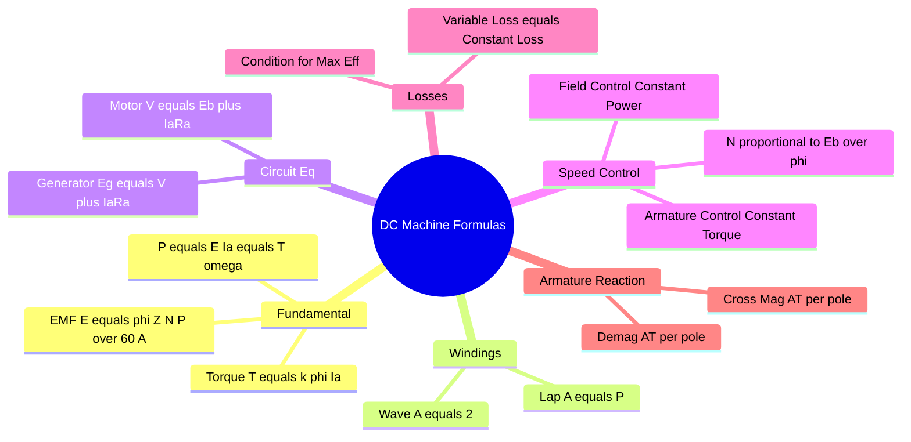

---
tags:
  - electrical-machines
  - dc-machines
  - formulas
  - gate
  - cheat-sheet
created: 2026-08-04T09:40:48
aliases:
  - DC Motor Formulas
  - DC Generator Equations
  - Speed Control Formulas
subject: "[[Electrical Machines]]"
parent:
  - DC Machines
modified: 2026-08-04T09:40:48
---
### Exhaustive Formulas: DC Machines
#electrical-machines/formulas #dc-machines

> This note consolidates all critical mathematical relationships for DC Generators and Motors, covering circuit equations, speed control, efficiency, and armature reaction for GATE.

---
#### Fundamental EMF and Torque Equations
#dc-machines/basics

*   **Generated EMF ($E_g$) / Back EMF ($E_b$):**
    $$\boxed{\quad E = \frac{\phi Z N P}{60 A} \quad}$$
    Where:
    *   $P$: Number of Poles.
    *   $\phi$: Flux per pole (Weber).
    *   $Z$: Total number of armature conductors.
    *   $N$: Speed in RPM.
    *   $A$: Number of parallel paths.

*   **Parallel Paths ($A$):**
    *   **Simplex Lap Winding:** $\boxed{A = P}$ (Low Voltage, High Current).
    *   **Simplex Wave Winding:** $\boxed{A = 2}$ (High Voltage, Low Current).

*   **Electromagnetic Torque ($T_e$):**
    $$P_{mech} = T_e \cdot \omega_m = E \cdot I_a$$
    $$\boxed{\quad T_e = \frac{P Z \phi I_a}{2\pi A} = K_a \phi I_a \quad}$$
    *   $T_e \propto \phi I_a$.
    *   $\omega_m = \frac{2\pi N}{60}$ (rad/s).

---
#### Circuit Equations (Voltage and Current)
#dc-machines/circuits

Let $V_t$ be terminal voltage, $I_a$ armature current, $R_a$ armature resistance, $R_{sh}$ shunt field resistance, $R_{se}$ series field resistance.

**A. DC Generator:**
*   **EMF Equation:**
    $$\boxed{\quad E_g = V_t + I_a R_a + V_{brush} + I_{se}R_{se} \quad}$$
*   **Currents:** $I_a = I_L + I_{sh}$ (for Shunt/Long Shunt).

**B. DC Motor:**
*   **Voltage Equation:**
    $$\boxed{\quad V_t = E_b + I_a R_a + V_{brush} + I_{se}R_{se} \quad}$$
*   **Currents:** $I_L = I_a + I_{sh}$ (Input current splits).

**C. Field Currents:**
*   **Shunt:** $I_{sh} = \frac{V_{sh}}{R_{sh}}$ (Depends on connection: $V_t$ for Shunt/Long Shunt; $E_b + I_a R_a$ for Short Shunt).
*   **Series:** $I_{se} = I_a$ (usually).

---
#### Speed Equation and Control
#dc-machines/speed-control

From the EMF equation ($E_b \propto N \phi$):
$$\boxed{\quad N = \frac{E_b}{k \phi} = \frac{V_t - I_a R_a}{k \phi} \quad}$$

**Types of Control:**
1.  **Flux Control ($\phi$):** (Field Weakening)
    *   $N \propto 1/\phi$.
    *   Used for **Speed > Rated Speed**.
    *   **Constant Power Drive** ($T \propto 1/N$).
2.  **Armature Voltage Control ($V_t$):**
    *   $N \propto V_t$.
    *   Used for **Speed < Rated Speed**.
    *   **Constant Torque Drive**.
3.  **Armature Resistance Control ($R_{ext}$):**
    *   $N \propto (V_t - I_a(R_a + R_{ext}))$.
    *   Inefficient (High losses).

#### 4. Characteristics
*   **DC Series Motor:**
    *   $\phi \propto I_a$ (before saturation).
    *   $T_e \propto I_a^2$.
    *   $N \propto \frac{1}{I_a}$ (Rectangular Hyperbola).
    *   **Warning:** Never start without load ($N \to \infty$).
*   **DC Shunt Motor:**
    *   $\phi \approx \text{constant}$.
    *   $T_e \propto I_a$.
    *   $N$ drops slightly with load (due to $I_a R_a$ drop).

---
#### Losses and Efficiency
#dc-machines/efficiency

*   **Total Losses:** Copper Loss ($I^2R$) + Iron Loss ($P_i$) + Mechanical Loss ($P_m$).
    *   Constant Losses ($P_k$) = Iron + Mechanical + Shunt Field ($V^2/R_{sh}$).
    *   Variable Losses = Armature Circuit Copper Loss ($I_a^2 R_a$).

*   **Condition for Maximum Efficiency:**
    $$\boxed{\quad I_a^2 R_a = P_k \quad}$$
    (Variable Loss = Constant Loss).

*   **Current at Max Efficiency:**
    $$\boxed{\quad I_{L(\eta_{max})} = \sqrt{\frac{P_k}{R_{eq}}} \quad}$$

---
#### Armature Reaction
#dc-machines/armature-reaction

Shift of MNA due to armature flux. Let $\theta_m$ be the brush shift angle in **mechanical degrees**. $\theta_e = \frac{P}{2}\theta_m$.

Total Armature Ampere-Turns per Pole:
$$AT_{total}/pole = \frac{Z I_a}{2 A P}$$

1.  **Demagnetizing AT/Pole ($AT_d$):**
    Opposes main flux.
    $$\boxed{\quad AT_d/pole = \frac{Z I_a}{2 A P} \times \frac{4 \theta_m}{360} \quad}$$

2.  **Cross-Magnetizing AT/Pole ($AT_c$):**
    Distorts main flux.
    $$\boxed{\quad AT_c/pole = \frac{Z I_a}{2 A P} \left( 1 - \frac{4 \theta_m}{360} \right) \quad}$$

3.  **Compensating Winding ($AT_{cw}$):**
    Neutralizes cross-magnetizing flux under pole faces.
    $$\boxed{\quad AT_{cw}/pole = \frac{Z I_a}{2 A P} \times \left( \frac{\text{Pole Arc}}{\text{Pole Pitch}} \right) \approx 0.7 \times AT_{total} \quad}$$

---
#### Starting Resistance Calculation
To limit starting current to $I_{start}$ (typically $1.5 \text{ to } 2 \times I_{rated}$):
$$I_{start} = \frac{V_t}{R_a + R_{start}}$$
$$\boxed{\quad R_{start} = \frac{V_t}{I_{start}} - R_a \quad}$$

---
### Related Concepts
#topic/related-concepts

[[Characteristics of DC Generators]]
[[Characteristics of DC Motors]]
[[Speed Control of DC Motors]]
[[Losses and Efficiency of DC Machines]]
[[Swinburne's Test and Hopkinson's Test]]
[[Armature Reaction]]
