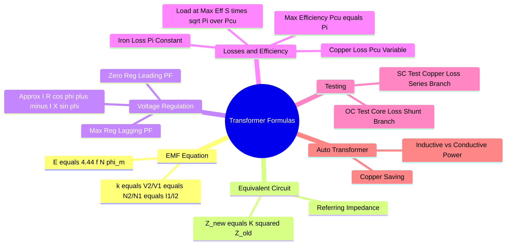

---
tags:
  - electrical-machines
  - transformers
  - formulas
  - gate
  - cheat-sheet
created: 2026-08-04T09:41:05
aliases:
  - Single Phase Transformer Formulas
  - Transformer Equations
  - Efficiency and Regulation Formulas
subject: "[[Electrical Machines]]"
parent:
  - Single-Phase Transformers
modified: 2026-08-04T09:41:05
---
### Exhaustive Formulas: Single Phase Transformer
#electrical-machines/formulas #transformers

> This note compiles all essential mathematical relationships for Single Phase Transformers required for GATE.

---
#### Fundamental EMF and Transformation
#transformer/emf

*   **EMF Equation:**
    $$\boxed{\quad E_1 = 4.44 f N_1 \phi_m \quad} \quad \text{and} \quad \boxed{\quad E_2 = 4.44 f N_2 \phi_m \quad}$$
    Where $\phi_m = B_{max} \cdot A_{core}$.

*   **Transformation Ratio ($k$):**
    $$k = \frac{N_2}{N_1} = \frac{E_2}{E_1} \approx \frac{V_2}{V_1} = \frac{I_1}{I_2}$$
    *   $k > 1$: Step-up.
    *   $k < 1$: Step-down.

*   **Flux Density:**
    $$B_{max} = \frac{E}{4.44 f N A} \implies B_{max} \propto \frac{V}{f}$$

---
#### Equivalent Circuit Parameter Referral
#transformer/equivalent-circuit

To transfer an impedance $Z$ from one side to the other, multiply by the square of the **destination-to-source turns ratio**.

*   **Referring Secondary ($Z_2$) to Primary ($Z_2'$):**
    $$\boxed{\quad Z_2' = \frac{Z_2}{k^2} = Z_2 \left(\frac{N_1}{N_2}\right)^2 \quad}$$
    Similarly, $R_2' = R_2/k^2$ and $X_2' = X_2/k^2$.

*   **Referring Primary ($Z_1$) to Secondary ($Z_1'$):**
    $$\boxed{\quad Z_1' = Z_1 \cdot k^2 = Z_1 \left(\frac{N_2}{N_1}\right)^2 \quad}$$

*   **Total Equivalent Impedance referred to Primary ($Z_{01}$):**
    $$Z_{01} = R_{01} + jX_{01} = (R_1 + R_2') + j(X_1 + X_2')$$

---
#### Voltage Regulation (VR)
#transformer/regulation

Defined as the change in terminal voltage from No-load to Full-load (at constant supply voltage and temperature), expressed as a percentage of rated voltage.

$$\text{VR} = \frac{|E_2| - |V_2|}{|E_2|} \times 100 \quad \text{(Regulation Up - Preferred)}$$

*   **Approximate Formula (Per Unit):**
    $$\boxed{\quad \%VR = \%R \cos\phi \pm \%X \sin\phi \quad}$$
    *   **$+$** for **Lagging** PF.
    *   **$-$** for **Leading** PF.
    *   $\%R = \epsilon_r = \frac{I_{fl}R_{eq}}{V_{rated}} \times 100$ (pu Resistance).
    *   $\%X = \epsilon_x = \frac{I_{fl}X_{eq}}{V_{rated}} \times 100$ (pu Reactance).

*   **Condition for Zero Regulation:**
    Possible only at **Leading PF**.
    $$\boxed{\quad \tan\phi = \frac{R_{eq}}{X_{eq}} \quad} \quad (\text{PF} = \text{Lead})$$

*   **Condition for Maximum Regulation:**
    Occurs at **Lagging PF**.
    $$\boxed{\quad \tan\phi = \frac{X_{eq}}{R_{eq}} \quad} \quad (\text{PF} = \text{Lag})$$
    Max $\%VR = \%Z_{eq}$.

---
#### Losses
#transformer/losses

*   **Total Losses:** $P_{total} = P_i + P_{cu}$
*   **Iron (Core) Losses ($P_i$):** Constant (Voltage Dependent).
    *   **Hysteresis Loss:** $P_h = K_h f B_{max}^x \propto V^{1.6} f^{-0.6}$ (if $x=1.6$).
    *   **Eddy Current Loss:** $P_e = K_e f^2 B_{max}^2 t^2 \propto V^2$ (Independent of $f$ if $V$ is const).
*   **Copper Losses ($P_{cu}$):** Variable (Current Dependent).
    $$P_{cu} = I^2 R_{eq}$$
    *   At fraction $x$ of full load: $P_{cu(x)} = x^2 P_{cu(fl)}$.

---
#### Efficiency ($\eta$)
#transformer/efficiency

$$\eta = \frac{\text{Output Power}}{\text{Input Power}} = \frac{x S \cos\phi}{x S \cos\phi + P_i + x^2 P_{cu(fl)}}$$

*   **Condition for Maximum Efficiency:**
    Variable Loss = Constant Loss
    $$\boxed{\quad x^2 P_{cu(fl)} = P_i \quad}$$

*   **Load (kVA) at Maximum Efficiency:**
    $$\boxed{\quad S_{\eta max} = S_{rated} \sqrt{\frac{P_i}{P_{cu(fl)}}} \quad}$$

*   **All-Day Efficiency:** (Energy Efficiency)
    $$\eta_{all-day} = \frac{\text{Total kWh Output in 24 hrs}}{\text{Total kWh Input in 24 hrs}}$$

---
#### Testing of Transformers
#transformer/testing

*   **Open Circuit (OC) Test:** (Performed on LV side, HV open).
    *   Measures **Iron Loss ($P_i$)** and Shunt Branch parameters ($R_c, X_m$).
    *   $\cos\phi_0 = \frac{W_{oc}}{V_{oc}I_{oc}}$.
    *   $I_c = I_{oc} \cos\phi_0$, $I_m = I_{oc} \sin\phi_0$.
    *   $R_c = V_{oc}/I_c$, $X_m = V_{oc}/I_m$.

*   **Short Circuit (SC) Test:** (Performed on HV side, LV shorted).
    *   Measures **Full Load Copper Loss ($P_{cu}$) at reduced voltage** and Series parameters ($R_{eq}, X_{eq}$).
    *   $Z_{eq} = V_{sc}/I_{sc}$.
    *   $R_{eq} = W_{sc}/I_{sc}^2$.
    *   $X_{eq} = \sqrt{Z_{eq}^2 - R_{eq}^2}$.

---
#### Auto-Transformer
#transformer/auto-transformer

Let transformation ratio $a = \frac{V_H}{V_L} > 1$.

*   **Copper Saving:**
    $$\frac{\text{Wt of Cu (Auto)}}{\text{Wt of Cu (2-Wdg)}} = 1 - \frac{1}{a}$$
*   **Power Transfer:**
    Total Power $S_{auto} = S_{conductive} + S_{inductive}$.
    $$\boxed{\quad S_{inductive} = S_{auto} \left(1 - \frac{1}{a}\right) \quad}$$
    $$\boxed{\quad S_{conductive} = S_{auto} \left(\frac{1}{a}\right) \quad}$$
*   **Capacity Increase:**
    $$S_{auto} = \frac{1}{1 - \frac{1}{a}} S_{2-wdg} = \frac{a}{a-1} S_{2-wdg}$$

---
#### Parallel Operation
#transformer/parallel

For two transformers A and B in parallel supplying a total load $S_{load}$.
Let impedances be $Z_A$ and $Z_B$ (in ohms referred to same side, or pu on *common* base).

*   **Load Sharing:**
    $$\boxed{\quad S_A = S_{load} \frac{Z_B}{Z_A + Z_B} \quad}$$
    $$\boxed{\quad S_B = S_{load} \frac{Z_A}{Z_A + Z_B} \quad}$$

*   **Condition for sharing load proportional to ratings:**
    $Z_{pu, A} = Z_{pu, B}$ (Per unit impedances on their *own* ratings must be equal).
    Or $\frac{X_A}{R_A} = \frac{X_B}{R_B}$ (for same PF operation).

---
### Related Concepts
#topic/related-concepts

[[Losses and Efficiency in a Transformer]]
[[Voltage Regulation of a Transformer]]
[[Open Circuit and Short Circuit Test on Transformer]]
[[Autotransformers]]
[[Parallel Operation of Single Phase Transformers]]
