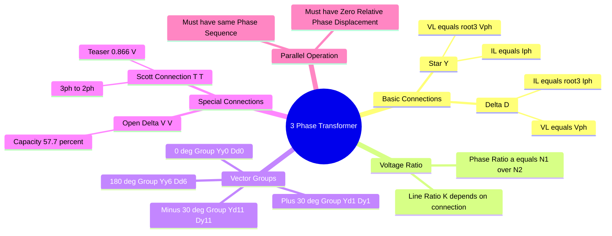

---
tags:
  - electrical-machines
  - transformers
  - three-phase
  - formulas
  - gate
created: 2026-08-04T09:41:25
aliases:
  - Three Phase Transformer Equations
  - Star Delta Transformations
  - Scott Connection Formulas
  - Open Delta Capacity
subject: "[[Electrical Machines]]"
parent:
  - Three-Phase Transformers
modified: 2026-08-04T09:41:25
---
### Exhaustive Formulas: Three Phase Transformer
#electrical-machines/formulas #three-phase

> This note covers the mathematical relationships for Star/Delta connections, capacity calculations for special connections (Open-Delta, Scott), and Vector Groups necessary for GATE.

---
#### Fundamental Relations (Star vs Delta)
#three-phase/basics

Let $V_L, I_L$ be Line quantities and $V_{ph}, I_{ph}$ be Phase quantities.

| Parameter | **Star Connection ($Y$)** | **Delta Connection ($\Delta$)** |
| :--- | :--- | :--- |
| **Voltage** | $\boxed{V_L = \sqrt{3} V_{ph} \angle 30^\circ}$ | $\boxed{V_L = V_{ph}}$ |
| **Current** | $\boxed{I_L = I_{ph}}$ | $\boxed{I_L = \sqrt{3} I_{ph} \angle -30^\circ}$ |
| **Power** | $S = \sqrt{3} V_L I_L$ | $S = \sqrt{3} V_L I_L$ |

---
#### Transformation Ratio ($a$ vs $K$)
#transformer/ratio

There are two ratios to distinguish:
1.  **Turns Ratio / Phase Voltage Ratio ($a$):**
    This is fixed by the physical windings.
    $$\boxed{\quad a = \frac{N_1}{N_2} = \frac{V_{ph1}}{V_{ph2}} \quad}$$
2.  **Line Voltage Ratio ($K$):**
    This depends on the connection type (Y or $\Delta$).

**Voltage Ratios for Different Banks:**

| Connection (Pri-Sec) | Phase Ratio ($V_{ph1}/V_{ph2}$) | **Line Ratio ($V_{L1}/V_{L2}$)** | Key Feature |
| :--- | :--- | :--- | :--- |
| **$Y - Y$** | $a$ | $a$ | No Phase Shift ($0^\circ, 180^\circ$) |
| **$\Delta - \Delta$** | $a$ | $a$ | No Phase Shift ($0^\circ, 180^\circ$) |
| **$Y - \Delta$** | $a$ | $\boxed{a \sqrt{3}}$ | $30^\circ$ Phase Shift |
| **$\Delta - Y$** | $a$ | $\boxed{a / \sqrt{3}}$ | $30^\circ$ Phase Shift |

*   **Step-Up/Down Tip:** For high voltage steps, use $\Delta - Y$ (Step Up) or $Y - \Delta$ (Step Down).

---
#### Vector Groups (Clock Notation)
#transformer/vector-group

The High Voltage (HV) winding is the reference (Minute hand at 12). The Low Voltage (LV) winding is the Hour hand. Each hour represents $30^\circ$.

*   **Group 1 ($0^\circ$ shift):** $Yy0, Dd0, Dz0$.
*   **Group 2 ($180^\circ$ shift):** $Yy6, Dd6, Dz6$.
*   **Group 3 ($-30^\circ$ lag):** $Dy1, Yd1, Yz1$. (LV lags HV by $30^\circ$).
*   **Group 4 ($+30^\circ$ lead):** $Dy11, Yd11, Yz11$. (LV leads HV by $30^\circ$).

> **Conditions for Parallel Operation:**
> 1.  Same Voltage Ratio.
> 2.  Same Phase Sequence.
> 3.  **Zero Relative Phase Displacement:** A $Yy0$ can parallel with $Dd0$, but **cannot** parallel with $Dy1$ or $Dy11$.

---
#### Open Delta (V-V) Connection
#transformer/open-delta

Used when one transformer of a $\Delta-\Delta$ bank fails or is removed.

*   **Capacity Ratio:**
    $$\frac{S_{V-V}}{S_{\Delta-\Delta}} = \frac{\sqrt{3} V_L I_{ph}}{3 V_L I_{ph}} = \frac{1}{\sqrt{3}}$$
    $$\boxed{\quad S_{V-V} = 57.7\% \text{ of } S_{\Delta-\Delta} \quad}$$

*   **Overload on remaining transformers:**
    If the original load is maintained, the current in the remaining two transformers increases by $\sqrt{3}$ (1.732).
    $$\text{Load per transformer} = \frac{S_{total}}{\sqrt{3}}$$

*   **Power Factor:**
    Even at Unity Power Factor (UPF) load, the two transformers operate at different internal power factors:
    *   Transformer 1 PF: $\cos(30^\circ + \phi)$
    *   Transformer 2 PF: $\cos(30^\circ - \phi)$

---
#### Scott Connection (T-T Connection)
#transformer/scott-connection

Used to convert 3-Phase to 2-Phase (e.g., for electric furnaces). Uses two transformers: **Main** and **Teaser**.

*   **Main Transformer:** Center tapped ($50\%$) on the primary.
    *   Voltage: $V_L$ (Line Voltage).
*   **Teaser Transformer:** Tapped at $\frac{\sqrt{3}}{2}$ ($86.6\%$) on the primary.
    *   Voltage: $\boxed{0.866 V_L}$.
*   **Secondary Side:** Both produce equal voltages ($V_{2ph}$) with $90^\circ$ phase shift.
*   **Neutral Point:** Located on the Teaser transformer at distance $\frac{1}{3}$ from the base (connection to Main). $\frac{V_N}{V_{Teaser}} = 1/3$.

---
#### Tertiary Winding
#transformer/tertiary

A third winding (Delta connected) added to $Y-Y$ transformers.

*   **Purpose:**
    1.  Provides path for **3rd Harmonic currents** (suppresses harmonic voltages).
    2.  Stabilizes the oscillating neutral.
    3.  Supplies auxiliary loads.
*   **Rating:** Typically rated for **1/3rd** of the main winding rating if used only for stabilization.

---
#### Per-Unit Impedance in 3-Phase
#per-unit

$$Z_{pu} = Z_{actual}(\Omega) \times \frac{S_{base(3\phi)}}{V_{base(LL)}^2}$$

*   **Important:** $Z_{pu}$ is the same whether calculated using Line values or Phase values, provided bases are consistent.

---
### Related Concepts
#topic/related-concepts

[[Exhaustive Formulas - Single-Phase Transformer]]
[[Three-Phase Circuits]]
[[Parallel Operation of Transformers]]
[[Autotransformers]]
[[Harmonics in Transformers]]
