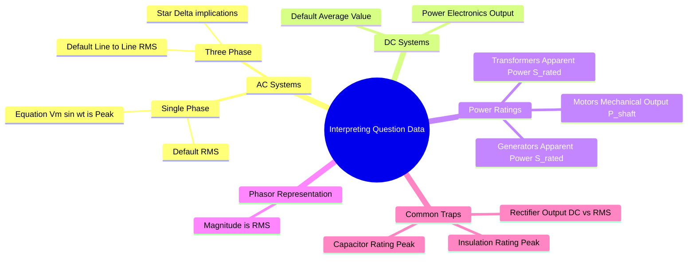

---
tags:
  - circuit-theory
  - power-system
  - electrical-machines
  - power-electronics
  - problem-solving
  - gate
created: 2026-08-04T09:50:58
aliases:
  - Interpreting Question Data
  - ⚙️ Default Assumptions in Electrical Engineering
  - RMS vs Peak vs Average
  - ❗Important
  - Notations
subject: "[[Electric Circuits]]"
parent:
  - Problem Solving Strategies
modified: 2026-08-04T09:50:58
---
### Interpreting Given Value Data
#problem-solving #gate/tips

> One of the most common reasons for calculation errors in GATE is the misinterpretation of given data values (e.g., taking a line voltage as a phase voltage, or an RMS value as a peak value). Standard conventions exist across Electrical Engineering disciplines (Circuits, Machines, Power Systems) which **must be assumed unless explicitly stated otherwise**.

---
#### 1. AC Voltage and Current Definitions
#circuit-theory/ac-values

**Rule:** Unless the word "Peak" or "Maximum" is explicitly used, or the value is given in a time-domain equation, **all AC voltages and currents are RMS values.**

*   **Case A: "A $230\text{ V}, 50\text{ Hz}$ source..."**
    *   **Interpretation:** $V_{rms} = 230\text{ V}$.
    *   **Calculation Data:** $V_{peak} (V_m) = 230 \times \sqrt{2} \approx 325.2\text{ V}$.
    *   **Angular Freq:** $\omega = 2\pi f = 100\pi \approx 314\text{ rad/s}$.

*   **Case B: "$v(t) = 400 \sin(314t)$"**
    *   **Interpretation:** This is a time-domain equation. The coefficient is **Peak**.
    *   **Calculation Data:** $V_{peak} = 400\text{ V}$.
    *   **RMS:** $V_{rms} = 400 / \sqrt{2} = 282.8\text{ V}$.

*   **Case C: Phasor "$V = 100 \angle 30^\circ$"**
    *   **Interpretation:** Phasor magnitudes are always **RMS**.
    *   **Calculation Data:** $|V_{rms}| = 100\text{ V}$.

> [!mistake] GATE Trap
> **Insulation Ratings** and **Dielectric Breakdown** strength always depend on the **PEAK** voltage, not RMS.
> * *Example:* A capacitor for a $230\text{ V}$ AC line must be rated for at least $325\text{ V}$.

---
#### 2. Three-Phase Systems (The "Line" Default)
#three-phase/defaults

**Rule:** For a 3-phase system, unless the phrase "Phase Voltage" is explicitly used, **all given voltages are Line-to-Line RMS ($V_{LL}$)**.

*   **Case A: "A $400\text{ V}$, 3-phase Induction Motor..."**
    *   **Interpretation:** Line Voltage $V_L = 400\text{ V}$.
    *   **If Star Connected:** Phase Voltage $V_{ph} = 400 / \sqrt{3} \approx 231\text{ V}$.
    *   **If Delta Connected:** Phase Voltage $V_{ph} = 400\text{ V}$.

*   **Case B: "A 3-phase transmission line with $132\text{ kV}$..."**
    *   **Interpretation:** Line Voltage $V_L = 132\text{ kV}$.
    *   **Per-Phase Analysis:** You must use $V_{ph} = 132 / \sqrt{3}\text{ kV}$ for single-phase equivalent circuits ($Y$-bus, Faults).

*   **Case C: Power Calculation**
    *   Total Power is always $P = \sqrt{3} V_L I_L \cos\phi$.
    *   Alternatively $P = 3 V_{ph} I_{ph} \cos\phi$.
    *   *Note:* If the problem gives "Impedance per phase $Z_{ph}$", you must first find $V_{ph}$ (based on connection) to find $I_{ph} = V_{ph} / Z_{ph}$.

> [!pyq]- PYQ : 2018 (Practice Question for Clarity)
> ![[ee_2018#^q51]]

---
#### 3. Power Electronics (Rectifiers/Converters)
#power-electronics/values

**Rule:**
1.  **Input (AC side):** Defined as RMS ($V_s$).
2.  **Output (DC side):** Unless specified as "RMS output voltage", the term "Output Voltage" usually refers to the **Average Value ($V_0$ or $V_{dc}$)**.

*   **Case A: "A single phase full converter is fed from $230\text{ V}$..."**
    *   Input $V_s = 230\text{ V}$ (RMS).
    *   $V_m = 230\sqrt{2}$ (Peak) is used in the formula $V_0 = \frac{2V_m}{\pi}\cos\alpha$.

*   **Case B: "Thyristor Rating"**
    *   **Voltage:** Rated for **Peak Inverse Voltage (PIV)** (e.g., $V_m$).
    *   **Current:** Rated for **RMS Current** (heating effect) of the switch, *not* average current.

---
#### 4. Machine Ratings (Nameplate Data)
#electrical-machines/ratings

**Rule:** The "Rating" on a machine refers to what it delivers at its output terminals.

*   **Motors (Induction/DC/Sync):**
    *   Rating = **Mechanical Output Power** ($P_{shaft}$) in kW or HP.
    *   *Calculation:* Electrical Input $P_{in} = \frac{P_{rated}}{\eta}$. ($P_{in}$ is usually calculated using $\sqrt{3} V_L I_L \cos\phi$).

*   **Generators (Alternators):**
    *   Rating = **Electrical Apparent Power Output** ($S$) in kVA or MVA.
    *   Real Power Output = $S \times \text{pf}$.

*   **Transformers:**
    *   Rating = **Apparent Power** ($S$) in kVA.
    *   Input kVA $\approx$ Output kVA (Efficiency is very high, losses neglected for rating definition).
    *   **Voltage Ratio ($V_1 / V_2$):** These are always **Line Voltages** at no-load. E.g., $11\text{ kV} / 400\text{ V}$ Star-Delta means HV Line is $11\text{ kV}$, LV Line is $400\text{ V}$.

---
#### 5. Example Scenario
**Question:**
> *"A $400\text{ V}, 50\text{ Hz}$, $6$-pole, Star-connected Induction Motor draws $50\text{ A}$ at $0.8$ pf lag. Calculate total input power."*

**Interpretation:**
1.  **$400\text{ V}$**: This is $V_{L(rms)}$.
2.  **Star-connected**:
    *   $V_{ph} = 400/\sqrt{3}\text{ V}$.
    *   $I_L = I_{ph} = 50\text{ A}$ (In Star, line current = phase current).
3.  **Input Power Calculation**:
    *   Using Line values: $P = \sqrt{3} (400) (50) (0.8)$.
    *   Using Phase values: $P = 3 (400/\sqrt{3}) (50) (0.8)$.
    *   Both yield the same result.

---
### Related Concepts
#topic/related-concepts

> [[Synchronous Machines]]

[[AC Circuit Analysis]]
[[Three-Phase Circuits]]
[[Per-Unit System]] (Where base values are crucial)
[[Power Factor of Rectifiers]]
[[RMS and Average Values]]
