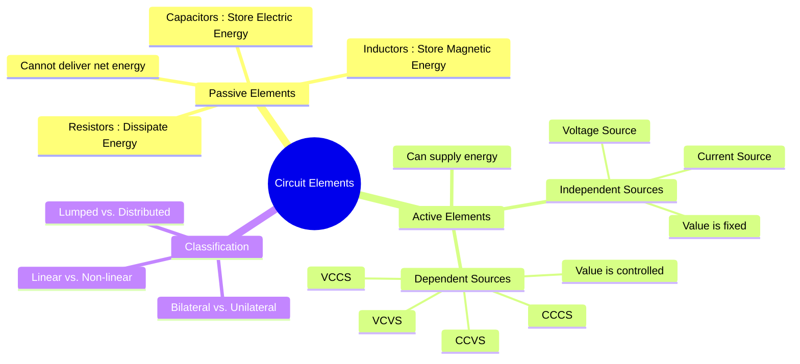

---
tags:
  - electric-circuits
  - circuit-elements
  - passive-elements
  - active-elements
aliases:
  - Circuit Elements
  - Electrical Components
created: 2025-09-11
subject: "[[Electric Circuits]]"
parent: "[[Electric Circuits]]"
confidence: 9
---

---
### Circuit Elements
#circuit-elements

> **Circuit elements** are the fundamental, idealized building blocks used to model and analyze real-world electrical systems. They are broadly classified into two main categories: **Active Elements** and **Passive Elements**.

---
#### Passive Elements
#passive-elements

> A passive element is a component that cannot supply net energy to a circuit on its own. It either dissipates energy (as heat) or stores it in an electric or magnetic field.

The three fundamental passive elements are:

1.  **[[Resistors]] (R)**: An element that opposes the flow of current and dissipates energy in the form of heat. Its behavior is governed by [[Ohm's Law]] ($V=IR$).
2.  **[[Inductors]] (L)**: An element that stores energy in a magnetic field and opposes any change in the current flowing through it. Its V-I relationship is $V = L \frac{di}{dt}$.
3.  **[[Capacitors]] (C)**: An element that stores energy in an electric field and opposes any change in the voltage across it. Its I-V relationship is $I = C \frac{dv}{dt}$.

---
#### Active Elements
#active-elements

> An active element is a component that is capable of delivering energy to a circuit. These are the sources of power in a circuit.

Active elements are further divided into independent and dependent sources.

##### Independent Sources
#independent-sources
An independent source provides a specified voltage or current that is completely independent of any other circuit variable. They are represented by **circular symbols**.

*   **Ideal Independent Voltage Source**: Maintains a specified voltage across its terminals, regardless of the current flowing through it.
*   **Ideal Independent Current Source**: Maintains a specified current, regardless of the voltage across its terminals.

##### Dependent Sources
#dependent-sources

A dependent (or controlled) source is an active element whose output voltage or current is controlled by another voltage or current elsewhere in the circuit. They are represented by **diamond-shaped symbols** and are essential for modeling electronic devices like transistors and op-amps. They are detailed in [[Dependent Sources]].

---
#### Classification of Circuit Elements
#element-classification

Beyond active/passive, elements can be classified by other properties:

1.  **Linear vs. Non-linear**:
    *   **Linear**: An element is linear if its V-I relationship is a straight line passing through the origin. They obey the principles of homogeneity and superposition. Examples: Ideal R, L, C, and dependent sources. See [[Linearity in Electric Circuits]].
    *   **Non-linear**: An element whose V-I characteristic is not a straight line. Examples: Diodes, transistors, iron-core inductors.

2.  **Bilateral vs. Unilateral**:
    *   **Bilateral**: An element that offers the same opposition to current flow in either direction. Its properties are independent of the direction of current. Examples: R, L, C.
    *   **Unilateral**: An element whose properties change with the direction of current flow. Example: Diodes.

3.  **Lumped vs. Distributed**:
    *   **Lumped**: The physical dimensions of the element are assumed to be negligible compared to the wavelength of the electrical signal. This is the basis of standard circuit theory (Kirchhoff's Laws).
    *   **Distributed**: The element's properties (resistance, inductance, capacitance) are distributed throughout its physical length. This model is used for high-frequency applications and transmission lines.

---
### Related Concepts
#related-concepts

> [[Resistors]]
> [[Inductors]]
> [[Capacitors]]
> [[Dependent Sources]]

[[Ohm's Law]]
[[Kirchhoff's Laws]]
[[Network Theorems]]