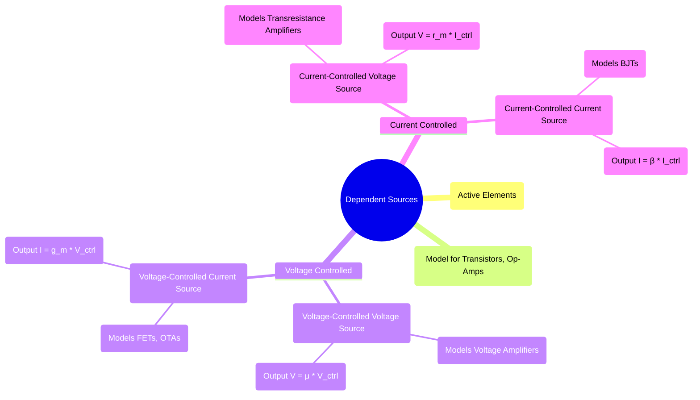

---
tags:
  - electric-circuits
  - dependent-sources
  - controlled-sources
  - network-analysis
aliases:
  - Dependent Source
  - Controlled Sources
  - Controlled Source
  - Test Source Method
created: 2025-09-11
subject: "[[Electric Circuits]]"
parent: "[[Circuit Elements]]"
modified: 2026-07-16
---
### Dependent Sources
#dependent-sources #controlled-sources #active-elements

> A **dependent (or controlled) source** is an active circuit element whose output voltage or current is controlled by another voltage or current elsewhere in the circuit. They are essential for creating simplified models of active devices like [[Operational Amplifiers (Op-Amps)|op-amps]], [[Bipolar junction transistors (BJTs)|transistors]], and other electronic components.

Dependent sources are typically represented by a diamond shape.

---

#### Types of Dependent Sources
#dependent-sources/types

There are four types of dependent sources, based on whether the controlling variable is a voltage or current, and whether the output is a voltage or current.

##### 1. Voltage-Controlled Voltage Source (VCVS)
#vcvs

A voltage source whose output voltage $V_s$ is determined by a controlling voltage $V_x$ from another part of the circuit.
$$\boxed{\quad V_s = \mu V_x \quad}$$
*   $\mu$ (mu) is the **dimensionless voltage gain** factor.
*   This is the basic model for an ideal voltage amplifier or a non-inverting op-amp configuration.

##### 2. Voltage-Controlled Current Source (VCCS)
#vccs

A current source whose output current $I_s$ is determined by a controlling voltage $V_x$.
$$\boxed{\quad I_s = g_m V_x \quad}$$
*   $g_m$ is the **transconductance**, with units of Siemens (S) or mhos ($\mho$). It represents the gain (Output Current / Input Voltage).
*   This is a key part of the small-signal model for [[Field-Effect Transistors (FETs)]].

##### 3. Current-Controlled Voltage Source (CCVS)
#ccvs

A voltage source whose output voltage $V_s$ is determined by a controlling current $I_x$.
$$\boxed{\quad V_s = r_m I_x \quad}$$
*   $r_m$ is the **transresistance**, with units of Ohms ($\Omega$). It represents the gain (Output Voltage / Input Current).
*   This can model current-to-voltage converters.

##### 4. Current-Controlled Current Source (CCCS)
#cccs

A current source whose output current $I_s$ is determined by a controlling current $I_x$.
$$\boxed{\quad I_s = \beta I_x \quad}$$
*   $\beta$ (beta) is the **dimensionless current gain** factor.
*   This is the fundamental component in the small-signal model for [[Bipolar junction transistors (BJTs)]].

---
#### Analysis with Dependent Sources
#dependent-sources/analysis

When analyzing circuits containing dependent sources, there are critical rules to follow:

1.  **Active Elements**: Dependent sources are active elements, meaning they can supply power to the circuit.
2.  **Mesh/Nodal Analysis**: When using [[Mesh Analysis|mesh]] or [[Nodal Analysis|nodal analysis]], the controlling variable ($V_x$ or $I_x$) must be expressed in terms of the mesh currents or node voltages. This creates an additional constraint equation that must be solved along with the KVL/KCL equations.
3.  **Thevenin/Norton Theorems**: This is a crucial point for GATE.
    *   **Dependent sources are NEVER deactivated** when finding the equivalent resistance ($R_{Th}$ or $R_N$). They must remain active in the circuit.
    *   Because they remain active, the simple series/parallel resistance combination method cannot be used.
    *   To find $R_{Th}$ or $R_N$, the **test source method** must be used:
        1.  Deactivate all *independent* sources.
        2.  Apply a test voltage source $V_T$ across the terminals and calculate the resulting current $I_T$ (or apply a test current $I_T$ and calculate $V_T$).
        3.  The equivalent resistance is $R_{Th} = R_N = V_T / I_T$.

> [!examtip]- Dependent Sources — Universal Rules (GATE / Exams)
> A dependent source is **never suppressed**; it always remains active because its value depends on a circuit variable.
> 
> **Controlling variable rule**
> - The source depends **only** on the variable explicitly shown (e.g. $i_1$, $v_x$).
> - The arrow next to a current (like $i_1$) defines its **reference direction**.
> - If the computed value is negative, the actual direction is opposite to the arrow.
> 
> **Finding $V_{th}$**
> - Load terminals are **open-circuited** → no load current flows.
> - Compute the controlling variable ($i_1$, $v_x$) from the remaining network.
> - Use its value directly in the dependent source.
> 
> **Finding $R_{th}$**
> - Suppress **independent sources only** (voltage → short, current → open).
> - Keep dependent sources active.
> - Apply a test source at the terminals.
> - Express the controlling variable **in terms of the test source** using KCL/KVL.
> 
> **Key insight**
> - A test source does NOT change what the dependent source depends on.
> - You never redefine the controlling variable; you only **relate it** to the test excitation.
> 
> **Common exam mistake**
> - Treating the controlling variable as independent or suppressing the dependent source.

---
### Related Concepts
#related-concepts

> [[Thevenin's Theorem]] (Requires special handling for $R_{Th}$ calculation)
> [[Norton's Theorem]] (Requires special handling for $R_N$ calculation)
> [[Superposition Theorem]] (Dependent sources are never deactivated)

[[Mesh Analysis]]
[[Nodal Analysis]]
[[Operational Amplifiers (Op-Amps)]]
[[Bipolar junction transistors (BJTs)]]
[[Field-Effect Transistors (FETs)]]
[[Circuit Elements]]