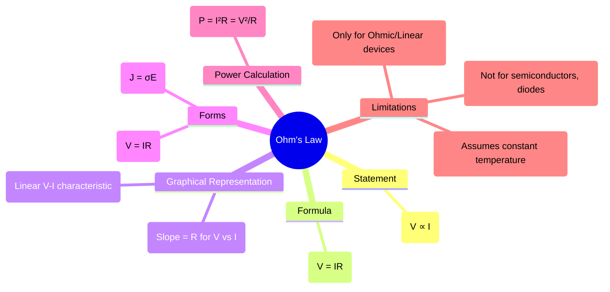

---
tags:
  - electric-circuits
  - fundamental-laws
  - ohms-law
aliases:
  - Ohm's Law
created: 2025-09-11
subject: "[[Electric Circuits]]"
parent: "[[Resistors]]"
modified: 2026-07-16
---

---
### Ohm's Law
#ohms-law

> **Ohm's Law** is a fundamental principle in electric circuits that describes the relationship between voltage, current, and resistance. It is the basis for analyzing linear resistive circuits.

---
#### Statement
#ohms-law/statement

> "For a conductor at constant temperature and other physical conditions, the voltage (V) across its ends is directly proportional to the current (I) flowing through it."

Mathematically, this proportionality is expressed as:
$$V \propto I$$
The constant of proportionality is the resistance ($R$) of the conductor. This gives rise to the famous equation:
$$\boxed{\quad V = IR \quad}$$
*   **V**: Voltage or potential difference, measured in **Volts (V)**.
*   **I**: Current, measured in **Amperes (A)**.
*   **R**: Resistance, measured in **Ohms ($\Omega$)**.

The law can be rearranged to find any of the three quantities:
$I = \frac{V}{R}$ and $R = \frac{V}{I}$.

---
#### Graphical Representation (V-I Characteristic)
#ohms-law/vi-characteristic

For an element that obeys Ohm's Law (an "ohmic" device), the relationship between voltage and current is linear.
*   If voltage ($V$) is plotted on the y-axis and current ($I$) on the x-axis, the graph is a straight line passing through the origin.
*   The **slope** of this line is equal to the **resistance ($R$)**.
    $$Slope = \frac{\Delta V}{\Delta I} = R$$
*   Conversely, if current ($I$) is plotted against voltage ($V$), the slope represents the **conductance ($G = 1/R$)**.

The linearity of this characteristic is the reason resistors are considered **[[Linearity in Electric Circuits|linear]]** circuit elements.

---
#### Power and Ohm's Law
#ohms-law/power

The basic formula for electric power is $P = VI$. By substituting Ohm's Law into this equation, we can derive two other essential power formulas for resistive elements:

1.  Substitute $V = IR$:
    $P = (IR)I = I^2R$
2.  Substitute $I = V/R$:
    $P = V(\frac{V}{R}) = \frac{V^2}{R}$

These formulas are used to calculate the power dissipated as heat in a resistor.
$$\boxed{\quad P = I^2R = \frac{V^2}{R} \quad}$$

---
#### Microscopic Form of Ohm's Law
#ohms-law/point-form

While $V=IR$ is the macroscopic form used in circuit analysis, the more fundamental "point form" of the law applies at any point within a conducting material. It relates the electric field to the current density.
$$\boxed{\quad \vec{J} = \sigma \vec{E} \quad}$$
*   $\vec{J}$ is the **current density** vector (current per unit area, A/m²).
*   $\sigma$ (sigma) is the **conductivity** of the material (Siemens/m).
*   $\vec{E}$ is the **electric field** vector (V/m).
This form is extensively used in [[3. Electromagnetic Fields/1. Electrostatics/Electromagnetic Fields]].

---
#### Limitations of Ohm's Law
#ohms-law/limitations

Ohm's Law is not a universal law of nature; it is an empirical observation for a specific class of materials under constant conditions.
1.  **Not Applicable to Non-linear Devices**: It does not apply to non-ohmic devices where the resistance is not constant, such as **diodes, transistors, SCRs**, and other semiconductor devices.
2.  **Not Applicable to Unilateral Devices**: It is not valid for elements where the V-I relationship depends on the direction of current (e.g., diodes).
3.  **Temperature Dependence**: The law assumes resistance is constant, but the resistance of most materials changes with temperature. For example, the resistance of an incandescent bulb filament increases significantly as it heats up.

---
### Related Concepts
#related-concepts

> [[Resistors]] (The component that is defined by this law)
> [[Kirchhoff's Laws]] (Used together with Ohm's Law to solve circuits)
> [[Linearity in Electric Circuits]] (A key property of ohmic devices)

[[Power and Energy in Circuits]]
[[Conductance]]
[[3. Electromagnetic Fields/1. Electrostatics/Electromagnetic Fields]]