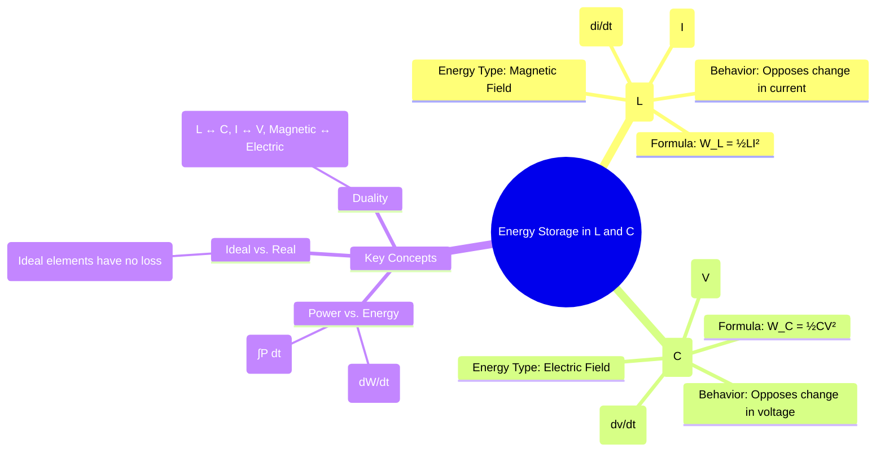

---
tags:
  - electric-circuits
  - energy-storage
  - inductor
  - capacitor
  - rlc-circuits
  - passive-components
created: 2025-08-07
aliases:
  - Stored Energy
  - Energy in L and C
subject: "[[Electric Circuits]]"
parent: "[[Passive Circuit Elements]]"
confidence: 9
---

---
### Energy Stored in Inductors and Capacitors
#energy-storage #inductor-energy #capacitor-energy

> Unlike resistors which only dissipate energy, inductors and capacitors are energy storage elements. They absorb energy from the circuit, store it temporarily in a field (magnetic for inductors, electric for capacitors), and can later return this energy to the circuit. This ability to store and release energy is the basis for filtering, oscillation, and transient behavior in electrical circuits.

---
#### Energy in an Inductor (L)
#magnetic-field #inductor

An inductor stores energy in the magnetic field created by the current flowing through its windings. The amount of energy stored is directly proportional to the inductance and the square of the current.

The instantaneous energy stored in an inductor is given by:
$$\boxed{\quad W_L = \frac{1}{2} L I^2 \quad \text{(Joules)}}$$
Where $I$ is the instantaneous current flowing through the inductor.

**Derivation**:
The energy stored is the integral of the power absorbed over time. The instantaneous power absorbed by the inductor is:
$$p_L(t) = v_L(t) i_L(t)$$
Since $v_L(t) = L \frac{di_L(t)}{dt}$, we have:
$$p_L(t) = \left(L \frac{di_L}{dt}\right) i_L$$
The energy stored $W_L$ is the work done to move the charge from time 0 to t:
$$\begin{align}
W_L &= \int_0^t p_L(\tau) d\tau = \int_0^t L i_L(\tau) \frac{di_L(\tau)}{d\tau} d\tau \\
&= L \int_{i_L(0)}^{i_L(t)} i' di' \\
&= \frac{1}{2} L \left[ i'^2 \right]_{i_L(0)}^{i_L(t)}
\end{align}$$
Assuming the inductor starts with zero current ($i_L(0)=0$), the energy stored at a time when the current is $I$ is $W_L = \frac{1}{2}LI^2$.

**Key Takeaway**: The current in an inductor cannot change instantaneously. An instantaneous change would imply an infinite rate of change ($di/dt \to \infty$), which would require an infinite voltage or power, which is physically impossible.

---
#### Energy in a Capacitor (C)
#electric-field #capacitor

A capacitor stores energy in the electric field established between its conductive plates due to the separation of charge (voltage). The amount of energy stored is proportional to the capacitance and the square of the voltage.

The instantaneous energy stored in a capacitor is given by:
$$\boxed{\quad W_C = \frac{1}{2} C V^2 \quad \text{(Joules)}}$$
Where $V$ is the instantaneous voltage across the capacitor.

**Derivation**:
The instantaneous power absorbed by the capacitor is:
$$p_C(t) = v_C(t) i_C(t)$$
Since $i_C(t) = C \frac{dv_C(t)}{dt}$, we have:
$$p_C(t) = v_C \left(C \frac{dv_C}{dt}\right)$$
The energy stored $W_C$ is:
$$\begin{align}
W_C &= \int_0^t p_C(\tau) d\tau = \int_0^t C v_C(\tau) \frac{dv_C(\tau)}{d\tau} d\tau \\
&= C \int_{v_C(0)}^{v_C(t)} v' dv' \\
&= \frac{1}{2} C \left[ v'^2 \right]_{v_C(0)}^{v_C(t)}
\end{align}$$
Assuming the capacitor starts with zero voltage ($v_C(0)=0$), the energy stored when the voltage is $V$ is $W_C = \frac{1}{2}CV^2$.

**Key Takeaway**: The voltage across a capacitor cannot change instantaneously. An instantaneous change would imply an infinite rate of change ($dv/dt \to \infty$), requiring an infinite current, which is physically impossible.

---
#### Duality between L and C

The energy storage formulas highlight the principle of duality between inductors and capacitors.

| Aspect | Inductor (L) | Capacitor (C) |
| :--- | :--- | :--- |
| **Energy Formula**| $\frac{1}{2} L I^2$ | $\frac{1}{2} C V^2$ |
| **Key Variable** | Current (I) | Voltage (V) |
| **Storage Field** | Magnetic | Electric |

---
### Related Concepts
#energy-storage/related-concepts

> [[Passive Circuit Elements]] (Parent topic)

[[Transient Analysis]] (Describes the charging/discharging process)
[[RLC Circuits]] (Circuits where energy oscillates between L and C)
[[Resonance]] (The condition of maximum energy oscillation)
[[AC Power Analysis]] (Defines reactive power, related to stored energy)