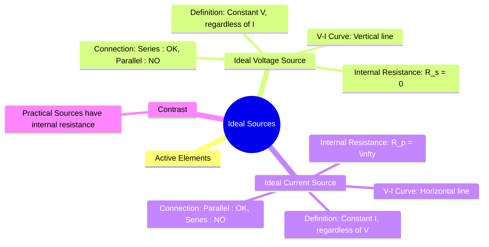

---
tags:
  - electric-circuits
  - circuit-elements
  - ideal-sources
  - active-elements
created: 2025-09-12
aliases:
  - Ideal Sources
  - Ideal Voltage Source
  - Ideal Current Source
subject: "[[Electric Circuits]]"
parent: "[[Circuit Elements]]"
modified: 2026-07-16
---
### Ideal Voltage and Current Sources
#ideal-sources #active-elements

> ==**Ideal sources** are fundamental active circuit elements that provide a specified voltage or current, completely independent of the load or other circuit variables.== They are theoretical models that form the basis for circuit analysis.

---
#### Ideal Voltage Source
#ideal-voltage-source

> [!definition]
> An **ideal voltage source** is a two-terminal active element that maintains a specified constant voltage ($V_s$) across its terminals, regardless of the magnitude or direction of the current ($I$) flowing through it.

##### Characteristics
#ideal-voltage-source/characteristics

1. **V-I Characteristic**: The V-I graph for an ideal voltage source is a vertical straight line. The voltage across it is always $V_s$ for any current.
2. **Internal Resistance**: An ideal voltage source has **zero internal series resistance** ($R_s = 0$). This means there is no internal voltage drop, and the terminal voltage is always equal to the source voltage.
3. **Power**: It can supply or absorb infinite power.
4. **Connection Rules**:
    * **Series**: Ideal voltage sources can be connected in series; their voltages add algebraically.
    * **Parallel**: Connecting ideal voltage sources of different values in parallel is forbidden as it violates [[Kirchhoff's Laws|Kirchhoff's Voltage Law (KVL)]] and implies infinite circulating current.

![[Pasted image 202509121600.png]]

---
#### Ideal Current Source
#ideal-current-source

> [!definition]
> An **ideal current source** is a two-terminal active element that supplies a specified constant current ($I_s$), regardless of the magnitude or polarity of the voltage ($V$) that appears across its terminals.

##### Characteristics
#ideal-current-source/characteristic 

1.  **V-I Characteristic**: The V-I graph for an ideal current source is a horizontal straight line. The current through it is always $I_s$ for any voltage.
2.  **Internal Resistance**: An ideal current source has **infinite internal parallel resistance** ($R_p = \infty$). This ensures that no current is shunted internally and the full source current is delivered to the external circuit.
3.  **Power**: It can supply or absorb infinite power.
4.  **Connection Rules**:
    * **Parallel**: Ideal current sources can be connected in parallel; their currents add algebraically.
    * **Series**: Connecting ideal current sources of different values in series is forbidden as it violates [[Kirchhoff's Laws|Kirchhoff's Current Law (KCL)]] at the node connecting them.

![[Pasted image 202509121601.png]]

---
#### Ideal vs. Practical Sources
#practical-sources

Real-world sources are not ideal. They have limitations and are modeled as **practical sources**.

* A **practical voltage source** is modeled as an ideal voltage source in series with a small internal resistance ($R_s$). The terminal voltage ($V_L = V_s - I_L R_s$) decreases as the load current increases.
* A **practical current source** is modeled as an ideal current source in parallel with a large internal resistance ($R_p$). The load current ($I_L = I_s - V_L/R_p$) decreases as the load voltage increases.

The concept of practical sources is essential for [[Source Transformation]] and the [[2. Electric Circuits/2. Network Theorems/1. DC & AC Network Theorems/Maximum Power Transfer Theorem|Maximum Power Transfer Theorem]].

---
### Related Concepts
#related-concepts

> [[Circuit Elements]] (Sources are active elements)

[[Kirchhoff's Laws]] (Violated by improper connection of ideal sources)
[[Source Transformation]] (Applies only to practical sources)
[[Dependent Sources]] (Another category of active sources)
[[Thevenin's Theorem]] and [[Norton's Theorem]] (Model real circuits as practical sources)