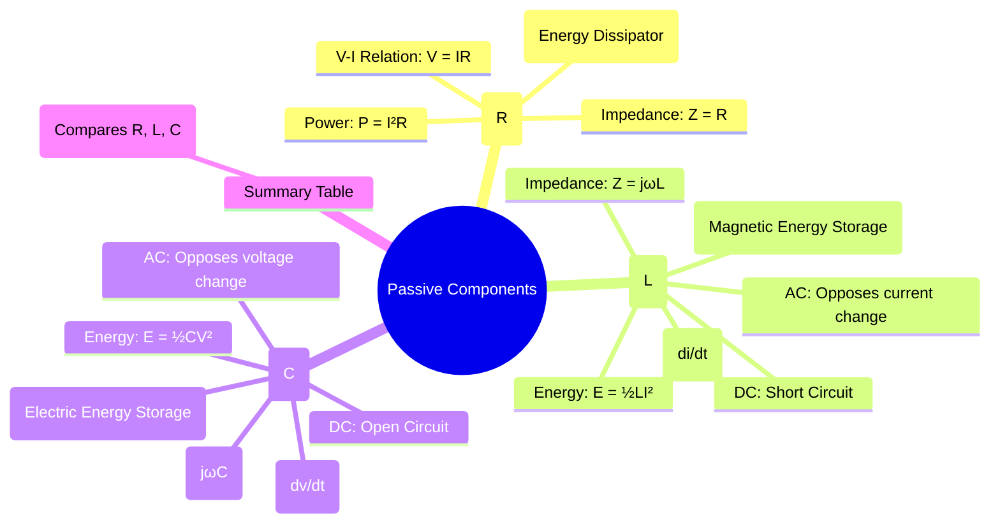

---
tags:
  - electric-circuits
  - passive-components
  - rlc-circuits
  - circuit-elements
created: 2025-08-06
aliases:
  - Passive Elements
  - RLC Components
  - Resistor
  - Inductor
  - Capacitor
subject: "[[Electric Circuits]]"
parent: "[[Circuit Elements]]"
modified: 2026-07-16
---
### Passive Components: Resistor, Inductor, Capacitor
#passive-components #rlc-circuits

> Passive components are the fundamental building blocks of electrical circuits. They are defined as elements that cannot supply net energy to a circuit on a long-term basis; they do not have gain or amplification capabilities. The three primary passive components are the **Resistor (R)**, which dissipates energy; the **Inductor (L)**, which stores energy in a magnetic field; and the **Capacitor (C)**, which stores energy in an electric field.

---
#### Resistor (R)
#resistor

A resistor is a two-terminal component that implements electrical resistance. It opposes the flow of current and dissipates electrical energy in the form of heat.

*   **V-I Relationship (Ohm's Law)**: The voltage across a resistor is directly proportional to the current flowing through it. In the time and frequency domains:
    $$v(t) = i(t)R \quad \Leftrightarrow \quad \mathbf{V} = \mathbf{I}R$$
*   **Power Dissipation**:
    $$\boxed{\quad P = V I = I^2 R = \frac{V^2}{R} \quad}$$
*   **Impedance**: $Z_R = R$. The impedance is purely real, meaning voltage and current are always in phase.
*   **Energy**: A resistor does not store energy; it only dissipates it.

---
#### Inductor (L)
#inductor

An inductor is a two-terminal component that stores energy in a magnetic field when electric current flows through it. It is typically a coil of wire.

*   **V-I Relationship**: The voltage across an inductor is proportional to the rate of change of the current.
    *   **Time Domain**:
        $$\boxed{\quad v(t) = L \frac{di(t)}{dt} \quad}$$
    *   **Frequency (Phasor) Domain**:
        $$\boxed{\quad \mathbf{V} = (j\omega L)\mathbf{I} \quad}$$
*   **Impedance**: $Z_L = j\omega L = \omega L \angle 90^\circ$. The impedance is purely imaginary and positive. The voltage across an inductor **leads** the current by 90°.
*   **Energy Stored**:
    $$\boxed{\quad E_L = \frac{1}{2} L I^2 \quad}$$
*   **Key Behavior**:
    *   An inductor **opposes any instantaneous change in the current** flowing through it.
    *   For DC ($\omega=0$), $Z_L=0$. An inductor acts as a **short circuit**.
    *   For high frequencies ($\omega \to \infty$), $|Z_L| \to \infty$. An inductor acts as an **open circuit**.

---
#### Capacitor (C)
#capacitor

A capacitor is a two-terminal component that stores energy in an electric field created between a pair of conductors.

*   **V-I Relationship**: The current through a capacitor is proportional to the rate of change of the voltage.
    *   **Time Domain**:
        $$\boxed{\quad i(t) = C \frac{dv(t)}{dt} \quad}$$
    *   **Frequency (Phasor) Domain**:
        $$\boxed{\quad \mathbf{I} = (j\omega C)\mathbf{V} \implies \mathbf{V} = \left(\frac{1}{j\omega C}\right)\mathbf{I} \quad}$$
*   **Impedance**: $Z_C = \frac{1}{j\omega C} = -\frac{j}{\omega C} = \frac{1}{\omega C} \angle -90^\circ$. The impedance is purely imaginary and negative. The current through a capacitor **leads** the voltage by 90°.
*   **Energy Stored**:
    $$\boxed{\quad E_C = \frac{1}{2} C V^2 \quad}$$
*   **Key Behavior**:
    *   A capacitor **opposes any instantaneous change in the voltage** across it.
    *   For DC ($\omega=0$), $|Z_C| \to \infty$. A capacitor acts as an **open circuit**.
    *   For high frequencies ($\omega \to \infty$), $Z_C \to 0$. A capacitor acts as a **short circuit**.

---
#### Summary of R, L, and C Properties

| Property | Resistor (R) | Inductor (L) | Capacitor (C) |
| :--- | :--- | :--- | :--- |
| **Energy Role** | Dissipates Energy | Stores Magnetic Energy | Stores Electric Energy |
| **V-I (Time Domain)**| $v = iR$ | $v = L \frac{di}{dt}$ | $i = C \frac{dv}{dt}$ |
| **Impedance (Z)** | $R$ | $j\omega L$ | $\frac{1}{j\omega C}$ |
| **Phase Angle (V vs I)**| 0° (In phase) | +90° (V leads I) | -90° (I leads V) |
| **DC Behavior** | Same as R | Short Circuit | Open Circuit |

---
### Related Concepts
#passive-components/related-concepts

> [[Ohm's Law]]

[[Impedance and Admittance]]
[[Series and Parallel Circuits]]
[[AC Power Analysis]]
[[Transient Analysis]]
[[RL Circuits]], [[RC Circuits]], [[RLC Circuits]]