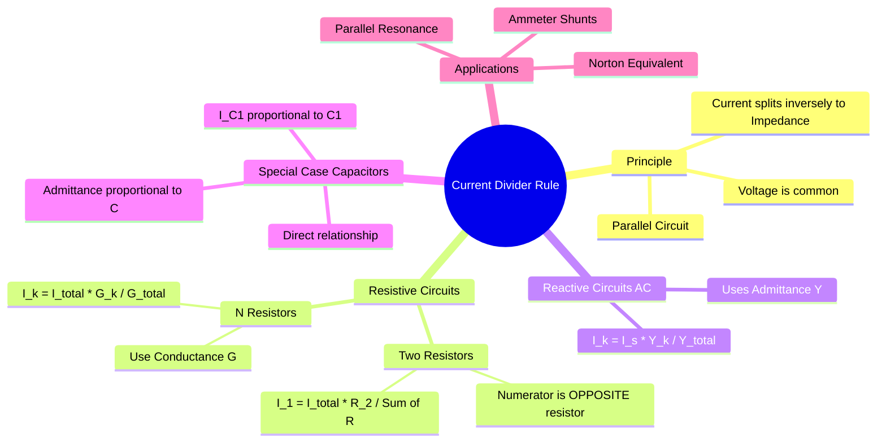

---
tags:
  - circuit-theory
  - basics
  - network-analysis
  - gate
aliases:
  - CDR
  - Parallel Current Split
  - Parallel Circuit Rule
subject: "[[Electric Circuits]]"
parent: "[[Network Theorems]]"
confidence: 10
---

---
### Current Divider Rule (CDR)
#circuit-theory/basics #network-analysis

> The **Current Divider Rule (CDR)** is a simplified analysis technique used to determine the current flowing through a specific branch in a **parallel circuit** without calculating the common voltage first. It is based on the principle that current follows the path of least resistance (or impedance).

#### Resistive Circuits (DC)
#cdr/resistive

Consider a current source $I_s$ connected in parallel with two resistors $R_1$ and $R_2$.
*   Since they are in parallel, the voltage $V$ is the same across both.
*   $V = I_1 R_1 = I_2 R_2 = I_s R_{eq}$.
*   $R_{eq} = \frac{R_1 R_2}{R_1 + R_2}$.

**Standard Formula (Two Resistors):**
The current in branch 1 is proportional to the resistance of branch 2.
$$\boxed{\quad I_1 = I_s \times \frac{R_2}{R_1 + R_2} \quad}$$
Similarly:
$$\boxed{\quad I_2 = I_s \times \frac{R_1}{R_1 + R_2} \quad}$$

> [!warning] GATE Tip
> Notice that the numerator contains the **Opposite Resistance**. For finding current in $R_1$, you multiply Total Current by $R_2$.

**General Formula ($N$ Resistors):**
For more than two resistors, using resistance values directly is clumsy ($\frac{1/R_x}{\sum 1/R}$). It is better to use **Conductance ($G = 1/R$)**.
Current distributes in *direct proportion* to conductance.

$$\boxed{\quad I_k = I_s \times \frac{G_k}{G_{total}} = I_s \times \frac{G_k}{G_1 + G_2 + \dots + G_N} \quad}$$

---
#### General AC Circuits (Admittance)
#cdr/ac

For circuits involving Inductors and Capacitors in steady-state AC, we use **Admittance ($Y = 1/Z$)**.
*   Current is directly proportional to Admittance.

For a branch with admittance $Y_k$ in a parallel bank:
$$\boxed{\quad \mathbf{I}_k = \mathbf{I}_s \times \frac{\mathbf{Y}_k}{\mathbf{Y}_{eq}} \quad}$$

**Two Impedances in Parallel:**
If working with Impedance ($Z$) directly for just two branches:
$$\boxed{\quad \mathbf{I}_1 = \mathbf{I}_s \times \frac{\mathbf{Z}_2}{\mathbf{Z}_1 + \mathbf{Z}_2} \quad}$$

---
#### Special Case: Capacitive Current Divider
#cdr/capacitive

This is the opposite of the resistive/inductive case and often tested.
*   Impedance of capacitor: $Z_C = \frac{1}{j\omega C}$.
*   Admittance of capacitor: $Y_C = j\omega C$.
*   Since $I \propto Y$, current is **directly proportional** to the capacitance.

For two capacitors $C_1$ and $C_2$ in parallel:
$$\mathbf{I}_{C1} = \mathbf{I}_s \times \frac{Y_{C1}}{Y_{C1} + Y_{C2}} = \mathbf{I}_s \times \frac{j\omega C_1}{j\omega C_1 + j\omega C_2}$$

$$\boxed{\quad \mathbf{I}_{C1} = \mathbf{I}_s \times \frac{C_1}{C_1 + C_2} \quad}$$

*   **Logic:** $i = C \frac{dv}{dt}$. Since voltage rate of change is common, larger $C$ draws larger current.

---
#### Special Case: Inductive Current Divider
#cdr/inductive

*   Impedance: $Z_L = j\omega L$.
*   Behaves like resistors (Inverse proportion to inductance).

For two inductors $L_1$ and $L_2$ in parallel (assuming no mutual coupling):
$$\boxed{\quad \mathbf{I}_{L1} = \mathbf{I}_s \times \frac{L_2}{L_1 + L_2} \quad}$$

---
#### Comparison: VDR vs CDR

| Feature | Voltage Divider Rule (VDR) | Current Divider Rule (CDR) |
| :--- | :--- | :--- |
| **Circuit Type** | Series Circuit | Parallel Circuit |
| **Common Quantity**| Current ($I$) | Voltage ($V$) |
| **Variable Found** | Voltage Drop ($V_x$) | Branch Current ($I_x$) |
| **Proportionality**| $V \propto R$ (or $Z$) | $I \propto G$ (or $Y$, $1/Z$) |
| **2-Element Form** | Numerator is **Same** element | Numerator is **Opposite** element |

---
### Related Concepts
#topic/related-concepts

> [[Voltage Divider Rule]] (The dual principle)

[[Kirchhoff's Laws]] (CDR is derived from KCL and Ohm's Law)
[[Phasors and Impedance Concept|Impedance]]
[[Admittance, Conductance, and Susceptance|Admittance]]
[[Norton's Theorem]] (Often results in a parallel circuit suitable for CDR)
[[Dual Networks]]
