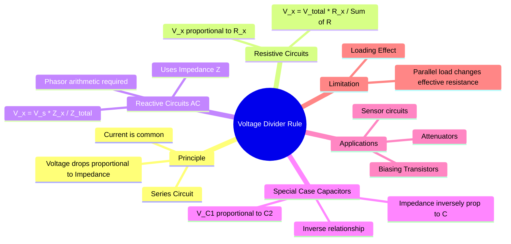

---
tags:
  - circuit-theory
  - basics
  - network-analysis
  - gate
aliases:
  - VDR
  - Series Voltage Split
  - Potential Divider
subject: "[[Electric Circuits]]"
parent: "[[Network Theorems]]"
confidence: 10
---
###### Mind Map

---
### Voltage Divider Rule (VDR)
#circuit-theory/basics #network-analysis

> The **Voltage Divider Rule (VDR)** is a simplified analysis technique used to determine the voltage drop across a specific component in a **series circuit** without first calculating the circuit current. It states that the voltage across a series component is proportional to its impedance relative to the total circuit impedance.

#### Resistive Circuits (DC)
#vdr/resistive

Consider a voltage source $V_s$ connected in series with two resistors $R_1$ and $R_2$.
* Since they are in series, the same current $I$ flows through both.
* Total Resistance: $R_{eq} = R_1 + R_2$.
* Current: $I = \frac{V_s}{R_1 + R_2}$.

The voltage across $R_1$ ($V_1$) is:
$$V_1 = I \cdot R_1 = \left( \frac{V_s}{R_1 + R_2} \right) \cdot R_1$$

**General Formula:**
For $N$ resistors in series, the voltage across the $n$-th resistor $R_n$ is:
$$\boxed{\quad V_n = V_{source} \times \frac{R_n}{R_{total}} = V_{source} \times \frac{R_n}{R_1 + R_2 + \dots + R_N} \quad}$$

> [!important] Insight
> The larger the resistance, the larger the voltage drop across it.

---
#### General AC Circuits (Impedances)
#vdr/ac

For circuits involving Inductors and Capacitors operating in steady-state AC, we use **Impedance ($Z$)** and **Phasors**.
$$V_n(t) \to \mathbf{V}_n \quad \text{(Phasor)}$$
$$R \to \mathbf{Z}$$

The rule remains the same structurally:
$$\boxed{\quad \mathbf{V}_n = \mathbf{V}_s \times \frac{\mathbf{Z}_n}{\mathbf{Z}_{eq}} \quad}$$

> [!success] Note
> The calculations must follow vector (complex number) arithmetic. $\mathbf{V}_n$ will generally have a different phase angle than $\mathbf{V}_s$.

> [!warning] Note (Magnitude-only cases)
> If only peak-to-peak or RMS ratios are given, phase angles are irrelevant.
> Use $|Z|$ instead of full phasors.

---
#### Special Case: Capacitive Voltage Divider
#vdr/capacitive

This is a common trap in GATE.
* Impedance of a capacitor: $Z_C = \frac{1}{j\omega C}$.
* Since $Z \propto \frac{1}{C}$, the voltage drop is **inversely proportional** to the capacitance value.

For two capacitors $C_1$ and $C_2$ in series with source $V_s$:
$$V_{C1} = V_s \times \frac{Z_{C1}}{Z_{C1} + Z_{C2}} = V_s \times \frac{1/j\omega C_1}{1/j\omega C_1 + 1/j\omega C_2}$$

Multiply numerator and denominator by $j\omega C_1 C_2$:
$$\boxed{\quad V_{C1} = V_s \times \frac{C_2}{C_1 + C_2} \quad}$$

> [!important] Logic
> $Q = CV$. In series, charge $Q$ is constant. Thus $V \propto 1/C$. The *smaller* capacitor drops the *larger* voltage.

---
#### Special Case: Inductive Voltage Divider
#vdr/inductive

* Impedance of an inductor: $Z_L = j\omega L$.
* Since $Z \propto L$, the voltage drop is **directly proportional** to the inductance (similar to resistors).

For two inductors $L_1$ and $L_2$ in series:
$$\boxed{\quad V_{L1} = V_s \times \frac{L_1}{L_1 + L_2} \quad}$$
*(Assuming no mutual coupling. If mutual inductance $M$ exists, the effective inductance formulas must be used).*

---
#### Loading Effect
#vdr/loading

The Voltage Divider Rule strictly applies to the unloaded circuit. If a load resistance $R_L$ is connected across the output resistor $R_2$:
1. The effective resistance of the bottom leg becomes $R_2 || R_L$.
2. $R_{eff} < R_2$.
3. The output voltage drops below the calculated unloaded VDR value.
4. **Rigorous Analysis:** To analyze a loaded divider, simplify the divider part to its **Thevenin Equivalent** first.
    * $V_{th} = V_{VDR}$.
    * $R_{th} = R_1 || R_2$.

> [!warning] Exam Trigger
> If a source has internal resistance ($R_s$), any connected element forms a **loaded voltage divider**.
> Always compare $V_{\text{loaded}}$ with $V_{\text{open-circuit}}$ to infer load impedance.

---
### Related Concepts
#topic/related-concepts

> [[Current Divider Rule]] (The dual principle for parallel circuits)

[[Kirchhoff's Laws]] (The foundational law derived from KVL)
[[Series and Parallel Resonance]] (VDR applied to resonant circuits)
[[Thevenin's Theorem]] (Used when the divider is loaded)
[[Phasors and Impedance Concept|Impedance]]
[[Admittance, Conductance, and Susceptance|Admittance]]
