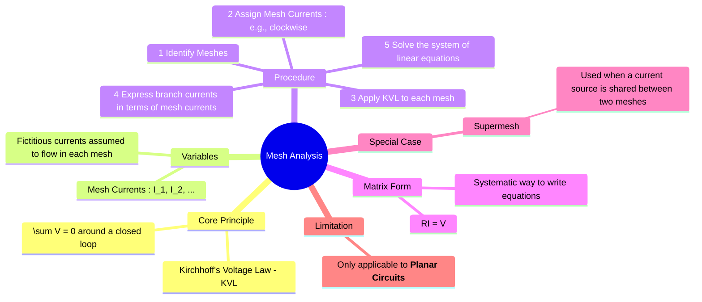

---
tags:
  - electric-circuits
  - network-analysis
  - mesh-analysis
  - kvl
aliases:
  - Mesh Analysis
  - Loop Analysis
  - Mesh Current Method
created: 2025-09-11
subject: "[[Electric Circuits]]"
parent: Network Analysis Techniques
confidence: 9
---

---
### Mesh Analysis
#mesh-analysis #network-analysis #kvl

> **Mesh Analysis** (or the Mesh Current Method) is a systematic technique for analyzing electrical circuits by applying [[Kirchhoff's Laws|Kirchhoff's Voltage Law (KVL)]] to find unknown currents. It simplifies the analysis by introducing "mesh currents" as the circuit variables.

A **mesh** is a loop in a circuit that does not contain any other loops within it.

---
#### Principle: Kirchhoff's Voltage Law (KVL)
#kvl

Mesh analysis is founded on KVL, which states that the algebraic sum of all voltages around any closed loop (or mesh) in a circuit must be equal to zero.
$$\boxed{\quad \sum_{k=1}^{n} V_k = 0 \quad}$$

---
#### Procedure for Mesh Analysis
#mesh-analysis/procedure

1.  **Identify Meshes**: Determine the number of independent meshes in the circuit. For a circuit with $b$ branches and $n$ nodes, the number of mesh equations is $b - (n - 1)$.
2.  **Assign Mesh Currents**: Assign a distinct current variable ($I_1, I_2, ..., I_m$) to each mesh, assuming a consistent direction (typically clockwise). These are the unknowns to be solved.
3.  **Apply KVL**: Write a KVL equation for each mesh.
    *   Start at a point in a mesh and traverse the loop in the direction of the assigned mesh current.
    *   Sum the voltage drops and rises across all elements in that mesh. A voltage drop across a resistor is positive ($+IR$), and a voltage rise from a source is negative (e.g., from - to +).
    *   **Shared Elements**: For a resistor $R$ shared between two meshes (e.g., mesh 1 and mesh 2), the current flowing through it is the algebraic difference of the two mesh currents. The voltage drop in mesh 1's equation would be $R(I_1 - I_2)$.
4.  **Solve the System of Equations**: The previous step results in a system of $m$ linear equations with $m$ unknown mesh currents. This system can be solved using methods from [[Linear Algebra]] (e.g., Cramer's rule, substitution, or matrix inversion).

By inspection, the system of equations can often be written directly in matrix form:
$$[R][I] = [V]$$
$$\begin{bmatrix} R_{11} & R_{12} & \cdots & R_{1m} \\ R_{21} & R_{22} & \cdots & R_{2m} \\ \vdots & \vdots & \ddots & \vdots \\ R_{m1} & R_{m2} & \cdots & R_{mm} \end{bmatrix} \begin{bmatrix} I_1 \\ I_2 \\ \vdots \\ I_m \end{bmatrix} = \begin{bmatrix} V_1 \\ V_2 \\ \vdots \\ V_m \end{bmatrix}$$
*   $R_{kk}$ (diagonal elements) = The **sum of all resistances** in mesh $k$.
*   $R_{kj}$ (off-diagonal elements) = The **negative of the sum of resistances shared** between mesh $k$ and mesh $j$. ($R_{kj} = R_{jk}$).
*   $V_k$ = The algebraic **sum of all voltage sources** in mesh $k$. (A source is positive if it aids the mesh current direction).

---
#### Special Case: The Supermesh
#supermesh-analysis

A supermesh is required when a **current source is located on a branch shared by two meshes**.

**Problem**: It is impossible to determine the voltage drop across the current source to write the individual KVL equations for the two meshes.

**Solution**:
1.  **Create a Supermesh**: Mentally remove the current source and its branch. The larger loop that is formed by combining the two original meshes is the **supermesh**.
2.  **Write KVL for the Supermesh**: Apply KVL around the outer path of the supermesh, just as you would for a regular mesh. This provides one equation.
3.  **Write a Constraint Equation**: The second required equation comes from the current source itself. It relates the two mesh currents. For example, if current source $I_S$ is on the branch between meshes 1 and 2:
    $$I_1 - I_2 = I_S \quad \text{(or } I_2 - I_1 = I_S \text{, depending on directions)}$$
4.  **Solve**: Solve the supermesh KVL equation and the constraint equation simultaneously.

---
#### Applicability and Limitations
#mesh-analysis/limitations

*   Mesh analysis can **only be applied to planar circuits**. A planar circuit is one that can be drawn on a flat surface without any wires crossing each other.
*   It is generally preferred over [[Nodal Analysis]] when the number of meshes is smaller than the number of nodes (minus the reference), especially in circuits with many voltage sources.

---
### Related Concepts
#related-concepts

> [[Kirchhoff's Laws]] (KVL is the basis of this method)
> [[Nodal Analysis]] (The dual method, based on KCL)
> [[Supermesh Analysis]] (The specific technique for handling shared current sources)

[[Linear Algebra]]
[[Planar Circuits]]
[[Source Transformation]]