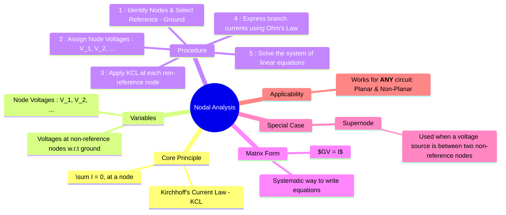

---
tags:
  - electric-circuits
  - network-analysis
  - nodal-analysis
  - kcl
aliases:
  - Nodal Analysis
  - Node Voltage Method
created: 2025-09-11
subject: "[[Electric Circuits]]"
parent:
  - Network Analysis Techniques
modified: 2026-07-16
---
### Nodal Analysis
#nodal-analysis #network-analysis #kcl

> **Nodal Analysis** (or the Node Voltage Method) is a powerful and versatile circuit analysis technique based on [[Kirchhoff's Laws|Kirchhoff's Current Law (KCL)]]. ==It determines the voltage at each node in the circuit relative to a common reference node.==

==A **node** is a point in a circuit where two or more circuit elements meet.==

---
#### Principle: Kirchhoff's Current Law (KCL)
#kcl

Nodal analysis is founded on KCL, which states that the algebraic sum of all currents entering or leaving a node must be zero.
$$\boxed{\quad \sum_{k=1}^{n} I_k = 0 \quad}$$

---
#### 🔥Procedure for Nodal Analysis
#nodal-analysis/procedure

1.  **Identify Nodes and Select a Reference**:
    *   Count the total number of nodes ($n$) in the circuit.
    *   Select one node as the **reference node** (or ground). This node is assigned a potential of 0 Volts. The node with the most connections is often a good choice.
    *   The number of KCL equations to be solved will be ($n-1$).

2.  **Assign Node Voltages**: Assign a voltage variable ($V_1, V_2, ..., V_{n-1}$) to each of the non-reference nodes. These are the unknowns.

3.  **Apply KCL**: For each non-reference node, write a KCL equation. A common convention is to assume all unknown currents are leaving the node.
    (Sum of currents leaving the node) = (Sum of currents entering the node)

4.  **Express Currents using Ohm's Law**: Use Ohm's Law to express the branch currents in terms of the unknown node voltages. The current flowing from a node with voltage $V_a$ to a node with voltage $V_b$ through a resistance $R$ is given by $I = (V_a - V_b)/R$.

5.  **Solve the System of Equations**: Solve the resulting system of ($n-1$) linear equations to find the unknown node voltages.

By inspection, the system of equations can be written directly in matrix form:
$$[G][V] = [I]$$
$$\begin{bmatrix} G_{11} & G_{12} & \cdots & G_{1m} \\ G_{21} & G_{22} & \cdots & G_{2m} \\ \vdots & \vdots & \ddots & \vdots \\ G_{m1} & G_{m2} & \cdots & G_{mm} \end{bmatrix} \begin{bmatrix} V_1 \\ V_2 \\ \vdots \\ V_m \end{bmatrix} = \begin{bmatrix} I_1 \\ I_2 \\ \vdots \\ I_m \end{bmatrix}$$
*   $G_{kk}$ (diagonal elements) = The **sum of all conductances** connected to node $k$.
*   $G_{kj}$ (off-diagonal elements) = The **negative of the sum of conductances** connected between node $k$ and node $j$. ($G_{kj} = G_{jk}$).
*   $I_k$ = The algebraic **sum of all current sources** connected to node $k$. (Current entering the node is taken as positive).

> [!pyq]- PYQ : GATE EE 2019
> ![[ee_2019#^q19]]

---
#### Special Case: The Supernode
#supernode-analysis

A [[Supernode Analysis|supernode]] is required when a **voltage source is connected between two non-reference nodes**.

![[Circuit - Supernode Visualization.png]]

**Problem**: The current flowing through the voltage source is unknown and cannot be directly expressed in terms of the node voltages.

**Solution**:
1.  **Create a Supernode**: Enclose the voltage source and the two nodes it connects within a dashed line, forming a single "supernode".
2.  **Write KCL for the Supernode**: Apply KCL to the entire supernode as if it were a single node. Sum all currents entering and leaving the boundary of the supernode. This provides one equation.
3.  **Write a Constraint Equation**: The second required equation comes from the voltage source itself. It relates the voltages of the two original nodes. For a voltage source $V_S$ between nodes 1 and 2 (with the positive terminal at node 1):
    $$V_1 - V_2 = V_S$$
4.  **Solve**: Solve the supernode KCL equation and the constraint equation simultaneously.

---
#### Applicability
#nodal-analysis/applicability

*   Nodal analysis is a universal method that can be applied to **any circuit**, including both **planar and non-planar circuits**. This is a significant advantage over [[Mesh Analysis]].
*   It is generally the preferred method when the number of nodes is less than the number of meshes, or when the circuit contains many current sources.

---
### Related Concepts
#related-concepts

> [[Kirchhoff's Laws]] (KCL is the basis of this method)
> [[Mesh Analysis]] (The dual method, based on KVL)
> [[Supermesh Analysis]]
> [[Supernode Analysis]] (The specific technique for handling intervening voltage sources)

[[Linear Algebra]]
[[Source Transformation]]
[[Planar Circuits]]