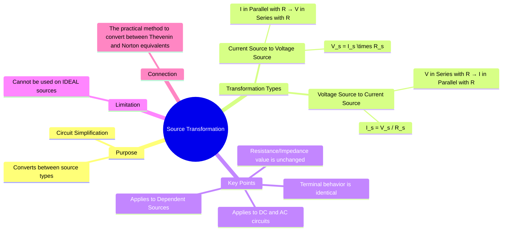

---
tags:
  - electric-circuits
  - network-theorems
  - source-transformation
  - equivalent-circuits
aliases:
  - Source Transformation
  - Source Conversion
created: 2025-09-12
subject: "[[Electric Circuits]]"
parent: "[[Network Theorems]]"
modified: 2026-07-16
---
### Source Transformation
#source-transformation #equivalent-circuits

> ==**Source Transformation** is a circuit analysis technique used to replace a practical voltage source (a voltage source in series with a resistor) with an equivalent practical current source (a current source in parallel with a resistor), or vice versa.== This equivalence allows for the simplification of circuits, often reducing the number of nodes or meshes.

==The key principle is that the two sources are equivalent only from the perspective of their external terminals.== The voltage-current characteristic at the terminals remains identical after the transformation.

---
#### Voltage Source to Current Source Conversion
#source-transformation/voltage-to-current

A practical voltage source, consisting of an ideal voltage source $V_s$ in series with a resistance $R_s$, can be converted into an equivalent practical current source.

![[Source-Transformation-voltage-to-current-source-conversion.png]]

*   The equivalent current source $I_s$ has a value determined by Ohm's Law:
    $$\boxed{\quad I_s = \frac{V_s}{R_s} \quad}$$
*   The resistance $R_s$ is placed in **parallel** with the new current source.
*   The direction of the current source's arrow points towards the **positive** terminal of the original voltage source.

---
#### Current Source to Voltage Source Conversion
#source-transformation/current-to-voltage

A practical current source, consisting of an ideal current source $I_s$ in parallel with a resistance $R_s$, can be converted into an equivalent practical voltage source.

![[source transformation current to voltage.jpg]]

*   The equivalent voltage source $V_s$ has a value determined by Ohm's Law:
    $$\boxed{\quad V_s = I_s \cdot R_s \quad}$$
*   The resistance $R_s$ is placed in **series** with the new voltage source.
*   The **positive** terminal of the new voltage source is on the same side as the arrowhead of the original current source.

---
#### Applicability and Limitations
#source-transformation/applicability

1.  **AC Circuits**: The technique works for AC circuits in the same way, by replacing resistance $R$ with complex impedance $\mathbf{Z}$.
    $\mathbf{V}_s = \mathbf{I}_s \mathbf{Z}_s$ and $\mathbf{I}_s = \mathbf{V}_s / \mathbf{Z}_s$.
2.  **Dependent Sources**: Source transformation can be applied to dependent sources, provided the controlling variable's location and definition are not altered by the transformation.
3.  **Ideal Sources**: The transformation is **not possible** for ideal sources.
    *   An ideal voltage source has $R_s = 0$, so the equivalent current $I_s = V_s/0$ would be infinite.
    *   An ideal current source has $R_s = \infty$, so the equivalent voltage $V_s = I_s \cdot \infty$ would be infinite.

> [!mistake] Non-Linear and Multi-Mode Sources
> ==**Source transformation does NOT apply** to non-linear or multi-mode ideal sources (like [[Constant Voltage and Constant Current (CV-CC) Sources|CV/CC]] benchtop power supplies).==
> 
> ==Source transformation strictly demands a *fixed, linear internal resistance/impedance* ($R_s$ or $Z_s$).== Multi-mode sources dynamically change their internal properties depending on the boundary conditions of the load, making simple $V = I \cdot R$ substitutions invalid.
> 
> See boundary cross-over application at
> > [!pyq]- PYQ : GATE EE 2020
> > ![[ee_2020#^q32]]

---
#### Relationship to Thevenin's and Norton's Theorems
#source-transformation/thevenin-norton

Source transformation is the direct practical method for converting between a [[Thevenin's Theorem|Thevenin equivalent circuit]] and a [[Norton's Theorem|Norton equivalent circuit]].

* A Thevenin equivalent circuit is a voltage source ($V_{Th}$) in series with a resistor ($R_{Th}$).
* A Norton equivalent circuit is a current source ($I_N$) in parallel with a resistor ($R_N$).

Transforming one to the other uses the formulas:
$$\boxed{\quad V_{Th} = I_N R_N \quad \text{and} \quad I_N = \frac{V_{Th}}{R_{Th}} \quad (\text{where } R_{Th}=R_N)}$$

---
### Related Concepts
#related-concepts

> [[Thevenin's Theorem]] (Equivalent voltage source model)
> [[Norton's Theorem]] (Equivalent current source model)
> [[Network Theorems]]

[[Dependent Sources]]
[[Impedance and Admittance]]
[[Phasors and Impedance Concept]]
[[Series and Parallel Circuits]]