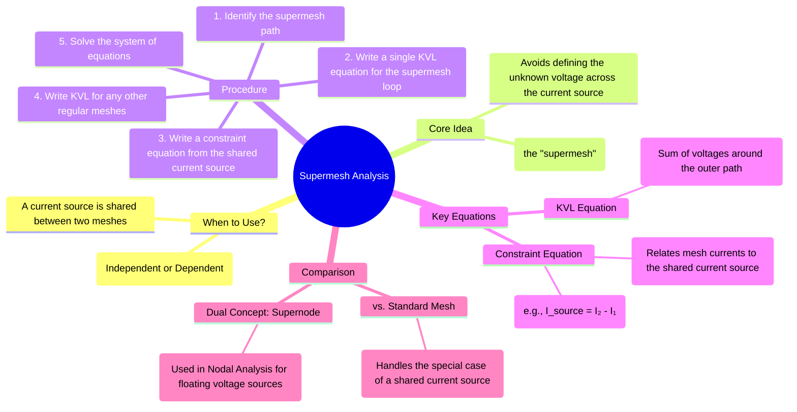

---
tags:
  - electric-circuits
  - mesh-analysis
  - circuit-analysis
  - network-theorems
created: 2025-07-27
aliases:
  - Supermesh
  - Supermesh Analysis
subject: "[[Electric Circuits]]"
parent: "[[Mesh Analysis]]"
confidence: 9
---

---
### Supermesh Analysis
#supermesh #mesh-analysis #circuit-analysis #current-source

> **Supermesh analysis** is a modification of [[Mesh Analysis]] used to solve circuits that contain a **current source** in a branch that is common to two meshes. By creating a larger loop, or "supermesh," that bypasses the problematic current source, we can write a KVL equation without needing to know the voltage across that source.

#### When to Use Supermesh Analysis
#supermesh/condition

A supermesh must be formed when a current source (either independent or dependent) is located on the boundary between two meshes.

**Why is it needed?** Standard mesh analysis requires applying KVL around each mesh, which means we must express the voltage across every element in terms of the mesh currents. The voltage across a current source is unknown and cannot be directly related to its current by Ohm's law. Attempting to assign a variable to this voltage (e.g., $V_{cs}$) would introduce an extra unknown into the system without providing an additional equation, making the system unsolvable. The supermesh technique elegantly sidesteps this problem.

#### The Supermesh Procedure
#supermesh/procedure

1.  **Identify the Supermesh**: Mentally remove the branch containing the shared current source. The larger loop that is formed by the path of the two original meshes is the **supermesh**.
2.  **Write the Supermesh KVL Equation**: Apply KVL around the supermesh loop. This single KVL equation will contain the mesh currents from both of the original meshes.
    \begin{align}
    \sum V_{\text{around supermesh path}} = 0
    \end{align}
3.  **Write the Constraint Equation**: Re-examine the branch that was removed. The value of the current source provides a constraint equation that relates the two mesh currents. For two meshes with currents $I_1$ and $I_2$ sharing a source $I_S$:
    $$\boxed{\quad I_S = I_2 - I_1 \quad \text{(or } I_1 - I_2\text{)} \quad}$$
    The sign depends on the direction of the source relative to the assumed directions of the mesh currents. The current of the mesh that is in the same direction as the source is taken as positive.
4.  **Write KVL for Other Meshes**: If the circuit contains other meshes that are not part of the supermesh, write standard mesh KVL equations for them.
5.  **Solve the System of Equations**: You will now have a complete set of `N` independent equations for the `N` unknown mesh currents. Solve this system of linear equations.

#### Example Scenario
Consider a circuit where an independent current source $I_S$ lies between mesh 1 (current $I_1$) and mesh 2 (current $I_2$).
*   The **supermesh KVL equation** would be written by summing the voltage drops across the elements in the outer path of meshes 1 and 2 combined.
*   The **constraint equation** would be $I_S = I_2 - I_1$ (assuming $I_S$ flows in the same direction as $I_2$ through the common branch).
*   These two equations allow you to solve for $I_1$ and $I_2$.

#### Supermesh with Dependent Sources
The procedure remains exactly the same for dependent current sources. The constraint equation will simply use the value of the dependent source (e.g., $\beta I_x$). This will likely require one additional equation to express the controlling variable ($I_x$ or $V_x$) in terms of the mesh currents.

---
### Related Concepts
#supermesh/related-concepts

> [[Mesh Analysis]] (The parent technique)

[[Supernode Analysis]] (The dual concept used in Nodal Analysis to handle a voltage source between two non-reference nodes)
[[Kirchhoff's Laws]] (KVL is the foundation of the supermesh KVL equation, and KCL is the foundation of the constraint equation)
[[Nodal Analysis]] (The primary alternative method for circuit analysis, which may be simpler for circuits with many current sources)