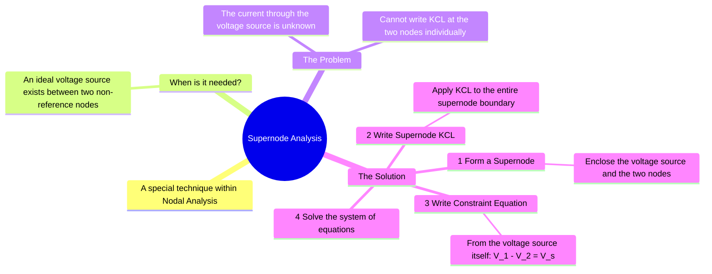

---
tags:
  - electric-circuits
  - network-analysis
  - nodal-analysis
  - supernode
aliases:
  - Supernode
  - Supernode Method
created: 2025-09-11
subject: "[[Electric Circuits]]"
parent: "[[Nodal Analysis]]"
modified: 2026-07-16
---
### Supernode Analysis
#supernode-analysis #nodal-analysis #kcl

> **Supernode Analysis** is a modified approach to [[Nodal Analysis]] used to solve circuits that contain an ideal voltage source (either independent or dependent) connected between two non-reference nodes. It simplifies the analysis by treating the two nodes and the connecting voltage source as a single, larger "supernode."

![[Circuit - Supernode Visualization.png]]

---
#### When to Use Supernode Analysis
#supernode/condition

A supernode must be formed when you have a **voltage source as the only element in a branch connecting two non-reference nodes**.

**The Problem**: When applying KCL at a node, we need to express all currents leaving that node. If a node is connected to a voltage source, the current flowing through that source is unknown and cannot be expressed simply using Ohm's Law (as in $I = V/R$). This prevents us from writing a standard KCL equation at either of the two nodes connected by the voltage source.

---
#### Procedure for Supernode Analysis
#supernode/procedure

Consider a voltage source $V_S$ connected between two non-reference nodes, $V_1$ and $V_2$.

1.  **Step 1: Identify and Form the Supernode**
    *   Mentally group the voltage source and the two nodes it connects ($V_1$ and $V_2$) into a single entity. This combined entity is the **supernode**.

2.  **Step 2: Write the Supernode KCL Equation**
    *   Apply KCL to the entire supernode as if it were one large node.
    *   Write an equation by summing all currents entering or leaving the supernode's boundary. Do not include the current through the voltage source, as it is internal to the supernode.
    $$\text{(Sum of currents leaving node 1)} + \text{(Sum of currents leaving node 2)} = 0$$
    *(Excluding the current in the branch containing the voltage source)*

3.  **Step 3: Write the Constraint Equation**
    *   The supernode KCL provides one equation with two unknowns ($V_1$ and $V_2$). A second equation is needed.
    *   This **constraint equation** is obtained directly from the voltage source itself. It relates the two node voltages.
    *   If the positive terminal of $V_S$ is at node 1 and the negative terminal is at node 2, the equation is:
    $$\boxed{\quad V_1 - V_2 = V_S \quad}$$

4.  **Step 4: Solve the System of Equations**
    *   Solve the supernode KCL equation (from Step 2) and the constraint equation (from Step 3) simultaneously.
    *   If there are other non-reference nodes in the circuit, write standard KCL equations for them. Solve the entire system to find all unknown node voltages.

---
### Related Concepts
#related-concepts

> [[Nodal Analysis]] (Supernode is a technique used within Nodal Analysis)
> [[Kirchhoff's Laws]] (Specifically KCL, which is applied to the supernode boundary)
> [[Supermesh Analysis]] (The dual concept used in Mesh Analysis for shared current sources)

[[Dependent Sources]]
[[Network Analysis Techniques]]