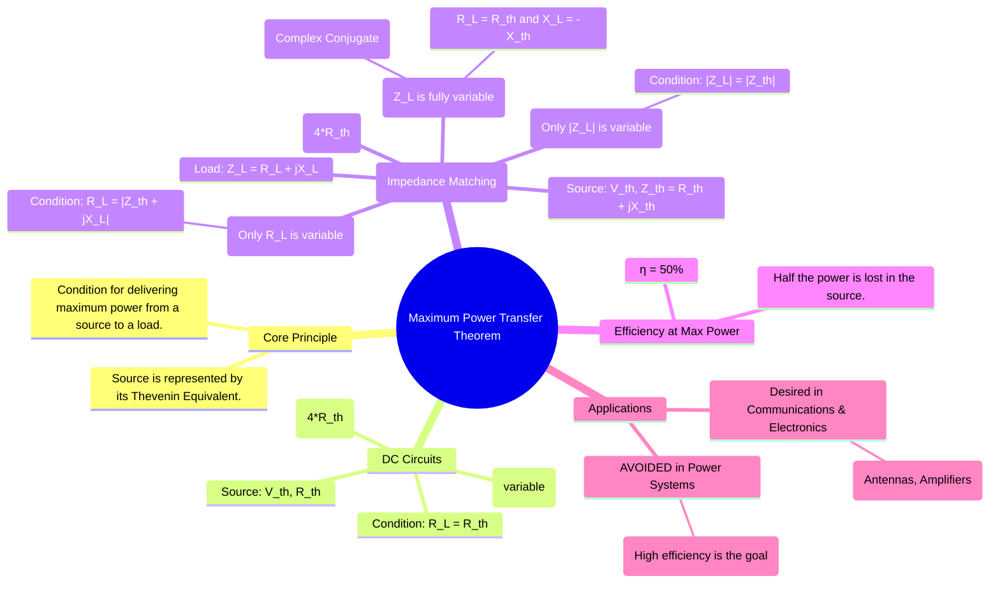

---
tags:
  - circuit-theory
  - network-theorems
  - power-transfer
  - impedance-matching
created: 2025-09-08
aliases:
  - MPTT
  - Maximum Power Transfer
subject: "[[Electric Circuits]]"
parent: "[[Circuit Analysis Techniques|Circuit Analysis Techniques]]"
modified: 2026-07-16
---
### Maximum Power Transfer Theorem
#maximum-power-transfer #impedance-matching

> The Maximum Power Transfer Theorem (MPTT) states the condition under which a load will absorb the maximum possible power from a source. ==For any given linear source, which can be represented by its [[Thevenin's Theorem|Thevenin equivalent]], maximum power is delivered to the load when the load's impedance is the complex conjugate of the source's Thevenin equivalent impedance.==

This theorem is crucial in applications where the goal is to maximize the magnitude of the power delivered, even at the cost of efficiency.

> [!mistake]- Power transfer between two **active** networks (AC or DC)
> #trap/mpt 
> 
> When power is transferred from one circuit containing a source to another circuit that also contains a source, the **Maximum Power Transfer Theorem does NOT apply directly**.
> 
> The correct approach is:
> 1. Define current $I$ flowing from Circuit A to Circuit B.
> 2. Write power **explicitly at the source side**:
>    $$P_{A\to B} = (V_s - I R_s)\, I$$
> 3. Maximize $P$ with respect to $I$ (i.e. $\frac{dP}{dI}=0$).
> 4. After obtaining optimal $I$, relate it to circuit parameters:
>    $$I = \frac{V_A - V_B}{R_s + R}$$
> 5. Solve for the required element (e.g. $R$).
> 
> ❌ Do not use $Z_L = Z_{th}^*$ when the receiving circuit contains an independent source.

> [!concept] **The Isolation Principle in MPT**
> To apply the **Maximum Power Transfer Theorem**, you must first "cut" the load resistor $R$ out of the circuit. This isolates the branch across which you want to calculate power.
> 
> Why Isolate?
> 1. **Fixed Reference:** The Thevenin parameters ($V_{th}$ and $R_{th}$) represent the "strength" and "internal resistance" of the source network *independent* of what you plug into it.
> 2. **Simplification:** Calculating current while $R$ is in the circuit makes the current a function of $R$ ($I = \frac{V_{th}}{R_{th} + R}$), which complicates the power derivative.
> 3. **The Matching Goal:** By isolating, you define the "bottleneck" ($R_{th}$) that the load resistance must match to reach the peak of the power curve.
> 
> > [!derivation] Workflow for PYQs
> > 1. **Step A:** Remove the branch of interest (create an open circuit).
> > 2. **Step B:** Find voltage across the gap ($V_{th}$).
> > 3. **Step C:** Find resistance looking into the gap ($R_{th}$) with sources dead.
> > 4. **Step D:** Apply MPT condition ($R = R_{th}$).
> 
> > [!refer]
> > [[Network Theorems]]
> > [[Thevenin's Theorem]]

---
#### For DC Circuits (Resistive Networks)
#dc-power-transfer

In a DC circuit, the source is represented by a Thevenin voltage $V_{th}$ in series with a Thevenin resistance $R_{th}$. The load is a variable resistance $R_L$.

The power delivered to the load is:
$$P_L = I^2 R_L = \left( \frac{V_{th}}{R_{th} + R_L} \right)^2 R_L$$
To find the value of $R_L$ that maximizes $P_L$, we differentiate $P_L$ with respect to $R_L$ and set the derivative to zero ($\frac{dP_L}{dR_L} = 0$). This yields the condition for maximum power transfer:
$$\boxed{\quad R_L = R_{th} \quad}$$
The value of this maximum power is found by substituting $R_L = R_{th}$ back into the power equation:
$$\boxed{\quad P_{max} = \frac{V_{th}^2}{(R_{th} + R_{th})^2} R_{th} = \frac{V_{th}^2}{4R_{th}} \quad}$$

---
#### For AC Circuits (Impedance Matching)
#ac-power-transfer

In an AC circuit, the source is represented by a Thevenin voltage $V_{th}$ in series with a Thevenin impedance $Z_{th} = R_{th} + jX_{th}$. The load is a variable impedance $Z_L = R_L + jX_L$.

The power delivered to the load (average power) is:
$$P_L = |I|^2 R_L = \frac{|V_{th}|^2 R_L}{(R_{th}+R_L)^2 + (X_{th}+X_L)^2}$$

##### Case 1: $R_L$ and $X_L$ are independently variable (Most common case)

To maximize $P_L$, we must first minimize the denominator. The reactive term $(X_{th}+X_L)^2$ can be made zero by setting:
$$X_L = -X_{th}$$
This cancels out the reactance. The power equation then becomes identical to the DC case. For maximum power, we set:
$$R_L = R_{th}$$
Combining these two conditions, maximum power is transferred when the load impedance is the **complex conjugate** of the Thevenin impedance.
$$\boxed{\quad Z_L = R_L + jX_L = R_{th} - jX_{th} = Z_{th}^* \quad}$$
The maximum power delivered is:
$$\boxed{\quad P_{max} = \frac{|V_{th}|^2}{4R_{th}} \quad}$$
Note that $R_{th}$ is the resistive part of the Thevenin impedance.

---
##### Case 2: Only $R_L$ is variable, $X_L$ is fixed

If only the load resistance can be changed, the condition for maximum power transfer becomes:
$$\boxed{\quad R_L = \sqrt{R_{th}^2 + (X_{th} + X_L)^2} = |Z_{th} + jX_L| \quad}$$

---
#### Efficiency at Maximum Power Transfer
#mptt/efficiency

A crucial aspect of MPTT is the resulting efficiency. The power supplied by the source is $P_S = I^2(R_{th} + R_L)$, while the power delivered to the load is $P_L = I^2 R_L$.
The efficiency $\eta$ is:
$$\eta = \frac{P_L}{P_S} = \frac{R_L}{R_{th} + R_L}$$
Under the condition for maximum power transfer ($R_L = R_{th}$), the efficiency is:
$$\eta = \frac{R_{th}}{R_{th} + R_{th}} = \frac{1}{2} = 50\%$$
This means that when delivering maximum power, an equal amount of power is dissipated as heat within the source.

---
#### Applications
#applications 

* **Use MPTT**: In applications where maximizing the magnitude of received power is critical, and efficiency is a secondary concern. This is common in low-power signal applications like **communications and electronics**.
    * Connecting an antenna to a radio receiver.
    * Connecting an audio amplifier to a speaker.

* **Avoid MPTT**: In **electric power systems**, the goal is to deliver power with the highest possible efficiency, not to deliver the maximum possible power. Therefore, MPTT is undesirable. The internal impedance of generators and transmission lines is kept as low as possible to minimize losses.

> [!refer]
> [[Maximum Power Point Tracking (MPPT)]]
> *(for dynamic tracking in non-linear sources (PV cells))*

> [!examtip] MPT for Constrained Dual-Mode Sources (CV/CC)
> When dealing with a laboratory DC power supply that operates in both **Constant Current (CC)** and **Constant Voltage (CV)** regions:
> * In the CC region ($I_L = I_{max}$): $P_L = I_{max}^2 R_L \implies P_L \propto R_L$ (Power increases linearly with $R_L$).
> * In the CV region ($V_L = V_{max}$): $P_L = \frac{V_{max}^2}{R_L} \implies P_L \propto \frac{1}{R_L}$ (Power decreases inversely with $R_L$).
> 
> ✨ **Key Rule:** Maximum power transfer for a CV/CC limited source always occurs exactly at the **transition (cross-over) point**, where the load resistance matches the characteristic supply boundary:
> $$R_L = \frac{V_{max}}{I_{max}}$$
> 
> > [!pyq]- PYQ : GATE EE 2020
> > ![[ee_2020#^q32]]

---
### Related Concepts
#related-concepts

> [[Thevenin's Theorem]] (The theorem is based on the Thevenin equivalent circuit)

[[Norton's Theorem]]
[[AC Power Analysis]]
[[Circuit Analysis Techniques]]
[[Power Flow through a Transmission Line]] (General Power Flow Equations (Using ABCD Parameters))
