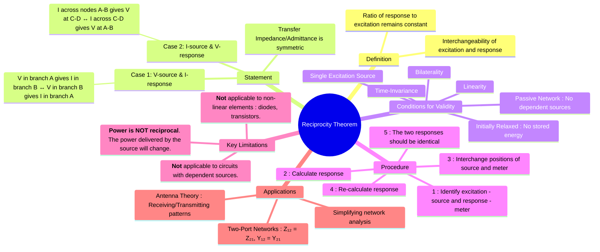

---
tags:
  - electric-circuits
  - network-theorems
  - circuit-analysis
  - linear-circuits
created: 2025-07-26
aliases:
  - Reciprocity Theorem
  - Principle of Reciprocity
  - Reciprocity Theorem Conditions for Applicability
subject: "[[Electric Circuits]]"
parent: "[[Network Theorems]]"
confidence: 9
---

---
### Reciprocity Theorem
#reciprocity-theorem #network-theorem #linear-circuits

> The **Reciprocity Theorem** states that in any linear, [[bilateral]], single-source network, the ratio of the response (a current or a voltage) in one part of the network to the excitation (a voltage or current source) in another part is constant even if the positions of the excitation and response are interchanged.

Essentially, the source and the meter can swap places, and the meter's reading will remain the same.

> [!warning]- Linear two-port inference (==NON RECIPROCAL==)
> For a linear two-port, the port voltage/current relationships are linear even if the network is **nonreciprocal**.
> 
> If load current observations at a port are given for different load resistances, first infer the [[Thevenin's Theorem|Thevenin equivalent]]:
> $$I = \frac{V_{th}}{R_{th}+R_L}$$
> 
> Once $R_{th}$ is fixed, $V_{th}$ varies linearly with the excitation at the other port.
> Reciprocity is **not required** for this inference.

---
#### Statement of the Theorem
#reciprocity-theorem/statement

The theorem can be stated in two primary forms:

1.  **Voltage Source and Current Response**: If a voltage source $V$ placed in branch 'A' of a linear, bilateral network produces a current $I$ in branch 'B', then moving that same voltage source $V$ to branch 'B' will produce the same current $I$ in branch 'A'.
    
    

2.  **Current Source and Voltage Response**: If a current source $I$ connected between two nodes 'A' and 'B' produces a voltage $V$ between nodes 'C' and 'D', then connecting the same current source $I$ between nodes 'C' and 'D' will produce the same voltage $V$ between nodes 'A' and 'B'.

Mathematically, this implies a symmetric transfer function between the two ports or branches.
$$\boxed{\quad \left. \frac{I_2}{V_1} \right|_{\text{case 1}} = \left. \frac{I_1}{V_2} \right|_{\text{case 2, with } V_2=V_1} \quad}$$

---
#### Conditions for Applicability
#reciprocity-theorem/conditions

The Reciprocity Theorem is only valid if the circuit meets the following criteria:
* **Linearity**: All circuit elements (R, L, C) must be linear. Their V-I characteristics must be a straight line through the origin.
* **Bilaterality**: The elements must be bilateral, meaning their impedance is the same for current flowing in either direction. Resistors, inductors, and capacitors are bilateral. Diodes and transistors are not.
* **Passivity**: The theorem is applicable to passive networks. It is **not applicable** to circuits containing **dependent sources**.
* **Single Source**: The circuit must contain only one independent source (the excitation being considered). If multiple sources exist, use the [[Superposition Theorem]] first to find the response due to the source of interest.
* **Initially Relaxed**: The circuit should not have any initial stored energy in its inductors or capacitors.

---
#### Procedure and Example
#reciprocity-theorem/procedure

1. **Step 1**: Identify the excitation source (e.g., $V_S$) in one branch and the response (e.g., current $I_R$) in another branch. Solve the circuit to find $I_R$.
2. **Step 2**: Create a new circuit configuration by interchanging the positions of the source and the response meter. Place the voltage source $V_S$ in the branch where the response was measured, and place an ammeter to measure the new response $I'_R$ in the branch where the source was originally.
3. **Step 3**: Solve the new circuit for $I'_R$.
4. **Step 4**: According to the theorem, the responses must be equal: $I_R = I'_R$.

#### Important Limitation: Power is Not Reciprocal
#reciprocity-theorem/limitation

This is a crucial point for competitive exams. While the voltage and current values can be interchanged as described, the power delivered by the source and dissipated in the rest of the circuit is generally **NOT** the same in the two cases.

$$\boxed{\quad \text{Reciprocity applies to V \& I, but NOT to Power.} \quad}$$

For example, in the first case, power supplied is $P_1 = V \cdot I_{in1}$, and in the second case, it is $P_2 = V \cdot I_{in2}$. In general, $I_{in1} \neq I_{in2}$, so $P_1 \neq P_2$.

#### Relation to Two-Port Networks
#two-port-networks

For a two-port network, reciprocity is directly related to the symmetry of its parameter matrices. A two-port network is reciprocal if and only if:
* **Z-parameters**: $Z_{12} = Z_{21}$
* **Y-parameters**: $Y_{12} = Y_{21}$
* **h-parameters**: $h_{12} = -h_{21}$
* **g-parameters**: $g_{12} = -g_{21}$
* **ABCD-parameters**: $AD - BC = 1$

---
### Related Concepts
#reciprocity-theorem/related-concepts

> [[Network Theorems]] (Parent topic)

[[Superposition Theorem]] (Can be used to handle multi-source circuits before applying reciprocity)
[[Linearity in Electric Circuits]] and Bilaterality (The fundamental properties required for the theorem)
[[Two-Port Networks]] (Where reciprocity has a precise mathematical definition in terms of matrix parameters)