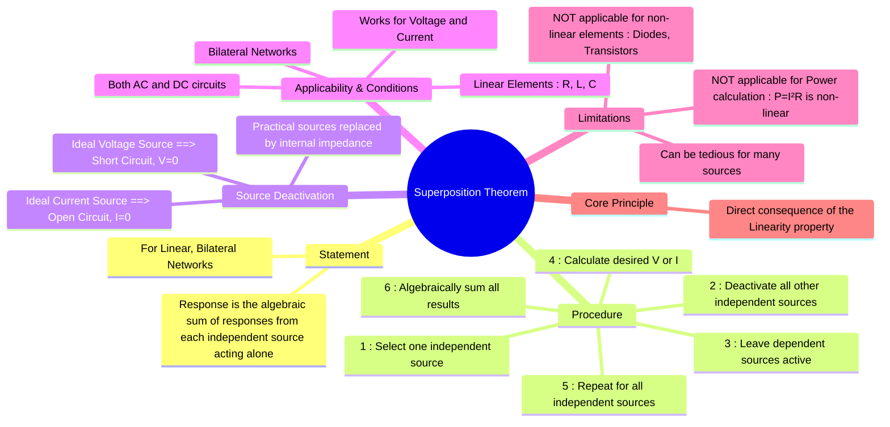

---
tags:
  - electric-circuits
  - network-theorems
  - superposition
created: 2025-09-11
aliases:
  - Superposition Principle
  - Superposition Theorem
subject: "[[Electric Circuits]]"
parent: "[[Network Theorems]]"
modified: 2026-07-16
---
### Superposition Theorem
#superposition-theorem #network-analysis #linearity

> The Superposition Theorem is a fundamental circuit analysis technique used to determine the voltage across or current through an element in a **linear, bilateral circuit** that has multiple independent sources. It simplifies the analysis by considering the effect of each independent source one at a time.

---
#### Statement
#superposition/statement 

> [!definition] Statement
> "In any linear, bilateral network containing two or more independent sources, the response (current or voltage) in any element is the **algebraic sum** of the responses caused by each independent source acting alone, while all other independent sources are deactivated (replaced by their internal impedances)."

If a circuit has 'n' independent sources, the total response $R$ (which can be a voltage $V$ or a current $I$) is given by:
$$\boxed{\quad R = R_1 + R_2 + R_3 + \dots + R_n \quad}$$
where $R_k$ is the response caused by the k-th independent source acting alone.

---
#### Conditions for Applicability
#superposition/applicability 

1.  **Linearity**: All circuit elements (resistors, inductors, capacitors) must be linear. Their V-I relationship must be a straight line passing through the origin. The principle of homogeneity and additivity must hold.
2.  **Bilateral Elements**: The elements must conduct equally well in both directions.
3.  The theorem is applicable to both DC and AC circuits. For AC circuits, it requires phasor addition.

---
#### Procedure for Applying the Theorem
#superposition/procedure 

1.  **Select One Source**: Choose only one independent source to be active.
2.  **Deactivate Other Sources**: Deactivate all other *independent* sources in the circuit.
    *   **Ideal Voltage Sources** are replaced by a **short circuit** ($V=0$).
    *   **Ideal Current Sources** are replaced by an **open circuit** ($I=0$).
    *   (Practical sources are replaced by their internal impedances).
3.  **Leave Dependent Sources**: **Dependent sources are never deactivated**. They remain active in the circuit at all times.
4.  **Calculate Response**: Calculate the required voltage or current (the response) in the element due to the single active source using standard circuit analysis techniques (e.g., Ohm's law, KVL/KCL, mesh/nodal analysis).
5.  **Repeat**: Repeat steps 1-4 for each independent source in the circuit.
6.  **Algebraic Sum**: The total response is the algebraic sum of all the individual responses calculated in the previous steps. Care must be taken to account for the direction of currents and the polarity of voltages.

---
#### Limitations
#superposition/limitations 

This is a frequently tested area in GATE.

1.  **Not Applicable for Power Calculation**: Power is a non-linear quantity ($P = I^2R$ or $P = V^2/R$). The total power dissipated in an element is **NOT** the sum of the powers dissipated due to each source acting alone.
    $$\boxed{\quad P_{Total} \neq P_1 + P_2 + \dots + P_n \quad}$$
    To find the total power, first find the total current $I_{Total}$ (or total voltage $V_{Total}$) using superposition, and then calculate the power using $P_{Total} = (I_{Total})^2 R$ or $P_{Total} = (V_{Total})^2 / R$.

2.  **Not Applicable for Non-linear Circuits**: The theorem cannot be applied to circuits containing non-linear elements such as diodes, transistors, SCRs, etc., because their V-I characteristics are not linear.

3.  **Can be Cumbersome**: For circuits with a large number of independent sources, the process of analyzing the circuit for each source can become lengthy and tedious compared to methods like mesh or nodal analysis.

---
### Related Concepts
#related-concepts 

> [[Linearity in Electric Circuits]] (The fundamental property upon which this theorem is built)

[[Thevenin's Theorem]]
[[Norton's Theorem]]
[[Source Transformation]]
[[Dependent Sources]]
[[Network Theorems]]
[[Linearity|Superposition Principle]] (in Signal & Systems)
