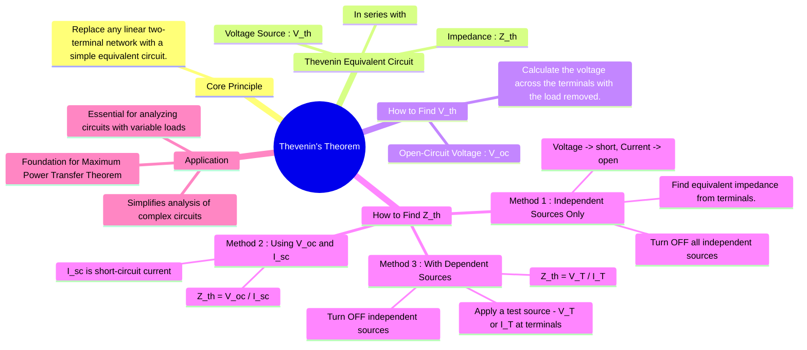

---
tags:
  - circuit-theory
  - network-theorems
  - circuit-simplification
  - equivalent-circuit
created: 2025-09-08
aliases:
  - Thevenin Equivalent
  - Thevenin's Equivalence
  - Thevenin Impedance
  - Thevenin Voltage
subject: "[[Electric Circuits]]"
parent: "[[Circuit Analysis Techniques|Circuit Analysis Techniques]]"
confidence: 9
trends: "[[trends - Thevenin]]"
---
### Thevenin's Theorem
#thevenin-theorem #circuit-simplification #equivalent-circuit

> ==Thevenin's theorem states that any [[Linearity in Electric Circuits|linear]], two-terminal electrical network can be replaced by an equivalent circuit consisting of a single voltage source ($V_{th}$) in series with a single impedance ($Z_{th}$).== This simplified equivalent circuit behaves identically to the original complex network with respect to any load connected to its terminals.

This theorem is incredibly powerful for simplifying circuit analysis, especially when analyzing the behavior of a circuit with a variable load.

---
#### The Thevenin Equivalent Circuit
#thevenin-equivalent

The equivalent circuit consists of:
* **Thevenin Voltage ($V_{th}$)**: An ideal voltage source.
* **Thevenin Impedance ($Z_{th}$)**: A series impedance. For DC circuits, this is the Thevenin Resistance ($R_{th}$).

Once the Thevenin equivalent for a network is found, the current and voltage for any load ($Z_L$) can be easily calculated:
$$I_L = \frac{V_{th}}{Z_{th} + Z_L}$$

---
#### Finding the Thevenin Voltage
#thevenin-voltage #open-circuit-voltage

The Thevenin voltage is the **open-circuit voltage ($V_{oc}$)** measured or calculated across the two terminals of interest (let's call them A and B), with the load resistor removed.
$$\boxed{\quad V_{th} = V_{oc} \quad}$$
This voltage can be found using any standard circuit analysis technique, such as [[Nodal Analysis]], [[Mesh Analysis]], or [[Kirchhoff's Laws#Kirchhoff's Voltage Law (KVL)|KVL]]/[[Kirchhoff's Laws#Kirchhoff's Current Law (KCL)|KCL]].

> [!examtip] Thevenin Voltage ($V_{th}$) — **Open-Circuit Rule**
> $V_{th}$ is the **open-circuit voltage** at the load terminals.
> 
> **Key implication:**  
> Since the load is removed, **no current flows through the load branch**.
> 
> **What this means in practice:**
> - The load resistor is **completely disconnected** (infinite resistance).
> - Any element **in series only with the load carries zero current**.
> - KCL/KVL must be written **only for the remaining active network**.
> 
> > [!fail] Common mistake to avoid
> > Do **not** assume current through the load or use load current equations while finding $V_{th}$.

---
#### Finding the Thevenin Impedance
#thevenin-impedance

There are three common methods to find the Thevenin impedance.

##### Method 1: For Circuits with Independent Sources Only
#thevenin-impedance/method-1 #method-1/Z-th

This is the most direct method when no dependent sources are present.
1. Remove the load from the terminals A and B.
2. **Turn off all independent sources**:
	* Replace independent voltage sources with a **short circuit** (0 V).
	* Replace independent current sources with an **open circuit** (0 A).
3. Calculate the equivalent impedance ($Z_{eq}$) looking into the terminals A and B. This is the Thevenin impedance.
$$\boxed{\quad Z_{th} = Z_{eq} \quad \text{(with sources off)}}$$

---
##### Method 2: Using the Short-Circuit Current
#thevenin-impedance/method-2 #method-2/Z-th

This method is useful for any linear circuit.
1. Calculate the open-circuit voltage $V_{oc}$ (which is $V_{th}$).
2. Place a short circuit across the terminals A and B.
3. Calculate the current flowing through this short circuit, which is the **short-circuit current ($I_{sc}$)**.
4. The Thevenin impedance is the ratio of the open-circuit voltage to the short-circuit current.
$$\boxed{\quad Z_{th} = \frac{V_{oc}}{I_{sc}} \quad}$$

> [!mistake] Note
> The short-circuit current $I_{sc}$ is the same as the Norton current $I_N$.

---
##### Method 3: For Circuits with Dependent Sources
#thevenin-impedance/method-3 #method-3/Z-th

[[Dependent Sources]] cannot be "turned off" like independent sources. Therefore, [[#Method 1 For Circuits with Independent Sources Only|Method 1]] cannot be used directly.
1. Turn off all **independent** sources.
2. Apply an external **test voltage source ($V_T$)** across the terminals A and B and calculate the resulting current ($I_T$) flowing from the source.
3. The Thevenin impedance is the ratio of this test voltage to the test current.
$$\boxed{\quad Z_{th} = \frac{V_T}{I_T} \quad}$$
Alternatively, one can apply a test current source ($I_T$) and find the resulting voltage ($V_T$).

> [!examtip]- Always-True Rule: Source Suppression vs Grounding
> While forming Thevenin impedance, **source suppression replaces only the source element** (voltage source → short, current source → open).
> **Physical grounding of the source is NOT carried into $Z_1$ or $Z_2$**. ($Z_1$ and $Z_2$ are sequence impedance often discussed in [[Fault Calculations|fault analysis]])
> 
> Grounding is considered **only in the zero-sequence network**, and **only when $I_0 \neq 0$**.  
> Therefore, any apparent “ground” seen after source suppression is merely a **reference node**, not neutral or earth grounding.

---
### Related Concepts
#related-concepts

> [[Norton's Theorem]] (The dual of Thevenin's theorem, providing a current source equivalent)

[[Test Source Method]]
[[2. Electric Circuits/2. Network Theorems/1. DC & AC Network Theorems/Maximum Power Transfer Theorem|Maximum Power Transfer Theorem]] (Directly uses the Thevenin equivalent to find the condition for maximum power)
[[Source Transformation]] (The technique to convert between Thevenin and Norton equivalents)
[[Circuit Analysis Techniques|Circuit Analysis Techniques]] (The parent category of network theorems)
[[Superposition Theorem]]
[[Ideal Independent Sources]]