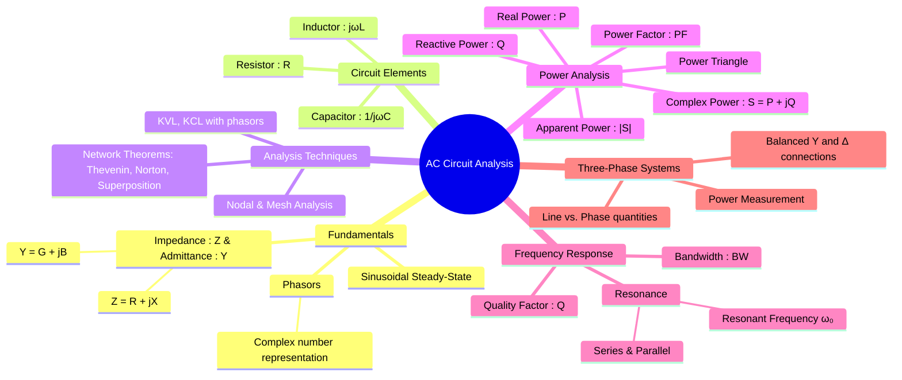

---
tags:
  - circuits
  - ac-analysis
  - phasors
  - impedance
  - power-factor
  - resonance
created: 2025-09-10
aliases:
  - AC Analysis
  - Steady-State Sinusoidal Analysis
  - Phasor Analysis
subject: "[[Electric Circuits]]"
parent: "[[Electric Circuits]]"
confidence: 9
---

---
### AC Circuit Analysis
#ac-analysis #phasor-analysis

> **AC Circuit Analysis** involves determining the steady-state response (voltages and currents) of a circuit when it is driven by sinusoidal sources. The primary tool for this analysis is the **phasor**, which transforms the time-domain differential equations into frequency-domain algebraic equations, simplifying the calculations significantly.

#### Phasors and Sinusoidal Representation
#phasors

A sinusoidal signal of the form $v(t) = V_m \cos(\omega t + \phi)$ is represented in the frequency domain by a phasor, which is a complex number capturing the magnitude and phase of the sinusoid.

The standard convention in circuit analysis is to use the **RMS value** for the magnitude:
$$\boxed{\quad \vec{V} = V_{rms} \angle \phi = \left(\frac{V_m}{\sqrt{2}}\right)e^{j\phi} \quad}$$

---
#### Impedance and Admittance
#impedance #admittance

**Impedance ($\vec{Z}$)** is the complex ratio of the phasor voltage to the phasor current, representing the total opposition to current flow in an AC circuit. It is the AC equivalent of resistance.
$$\vec{Z} = \frac{\vec{V}}{\vec{I}} = R + jX \quad (\text{in } \Omega)$$
* $R$ is the Resistance.
* $X$ is the **Reactance**. If $X > 0$, it is inductive. If $X < 0$, it is capacitive.

**Admittance ($\vec{Y}$)** is the reciprocal of impedance and is the AC equivalent of conductance.
$$\vec{Y} = \frac{1}{\vec{Z}} = G + jB \quad (\text{in Siemens, S})$$
* $G$ is the Conductance.
* $B$ is the **Susceptance**.

##### Impedance of Basic Elements:
* **Resistor**: $$\boxed{\quad \vec{Z}_R = R \quad}$$ (Voltage and current are in phase)
* **Inductor**: $$\boxed{\quad \vec{Z}_L = j\omega L = jX_L \quad}$$ (Voltage leads current by 90°)
* **Capacitor**: $$\boxed{\quad \vec{Z}_C = \frac{1}{j\omega C} = -j\frac{1}{\omega C} = -jX_C \quad}$$ (Current leads voltage by 90°)

---
#### [[AC Power Analysis]]
#ac-power #power-triangle #power-factor

In AC circuits, power is a complex quantity.
**Complex Power ($\vec{S}$)** is the phasor sum of real and reactive power.
$$\boxed{\quad \vec{S} = \vec{V}_{rms} \vec{I}_{rms}^* = P + jQ \quad}$$
where $\vec{I}_{rms}^*$ is the complex conjugate of the RMS current phasor.

* **Average (Real) Power ($P$)**: The actual power dissipated by the circuit, primarily by resistors. Measured in **Watts (W)**.
    $$\boxed{\quad P = |\vec{V}_{rms}| |\vec{I}_{rms}| \cos(\phi) \quad}$$
* **Reactive Power ($Q$)**: The power that oscillates between the source and the reactive components (inductors and capacitors). Measured in **Volt-Ampere Reactive (VAR)**.
    $$\boxed{\quad Q = |\vec{V}_{rms}| |\vec{I}_{rms}| \sin(\phi) \quad}$$
* **Apparent Power ($|S|$)**: The magnitude of the complex power. It is the "total" power that appears to be supplied to the circuit. Measured in **Volt-Amperes (VA)**.
    $$|S| = \sqrt{P^2 + Q^2} = |\vec{V}_{rms}| |\vec{I}_{rms}|$$
* **Power Factor (PF)**: The ratio of real power to apparent power. It indicates how effectively the current is being converted into useful work.
    $$\boxed{\quad PF = \cos(\phi) = \frac{P}{|S|} \quad}$$
    * **Lagging PF**: Inductive load, current lags voltage ($\phi > 0$).
    * **Leading PF**: Capacitive load, current leads voltage ($\phi < 0$).

---
#### [[Resonance]]
#resonance #quality-factor #bandwidth 

Resonance is a condition in an RLC circuit where the inductive and capacitive reactances cancel each other out, causing the circuit to behave purely resistively.
The **resonant frequency ($\omega_0$)** for both series and parallel circuits is:
$$\boxed{\quad \omega_0 = \frac{1}{\sqrt{LC}} \quad (\text{rad/s}) \quad \text{or} \quad f_0 = \frac{1}{2\pi\sqrt{LC}} \quad (\text{Hz}) \quad}$$
* **Series Resonance**: Total impedance is minimum ($Z=R$), and current is maximum.
* **Parallel Resonance**: Total impedance is maximum, and line current is minimum.

**Quality Factor ($Q$)** is a measure of how "sharp" the resonance peak is. A high Q-factor implies a narrow bandwidth and high selectivity.
* For a series RLC circuit: $$\boxed{\quad Q = \frac{\omega_0 L}{R} = \frac{1}{\omega_0 CR} \quad}$$
**Bandwidth (BW)** is the range of frequencies over which the power delivered is at least half of the maximum power.
$$\boxed{\quad BW = \frac{\omega_0}{Q} = \frac{R}{L} \quad (\text{for series RLC})}$$

---
#### [[Three-Phase Circuits]]
#three-phase-circuits #star-connection #delta-connection #real-power #reactive-power #apparent-power 

For balanced three-phase systems:
* **Star (Y) Connection**:
    * Line Voltage: $V_L = \sqrt{3} V_{ph}$
    * Line Current: $I_L = I_{ph}$
* **Delta ($\Delta$) Connection**:
    * Line Voltage: $V_L = V_{ph}$
    * Line Current: $I_L = \sqrt{3} I_{ph}$

Total three-phase power is given by:
* **Real Power**: $$\boxed{\quad P_{3\phi} = \sqrt{3} V_L I_L \cos(\phi) \quad}$$
* **Reactive Power**: $$\boxed{\quad Q_{3\phi} = \sqrt{3} V_L I_L \sin(\phi) \quad}$$
* **Apparent Power**: $$\boxed{\quad S_{3\phi} = \sqrt{3} V_L I_L \quad}$$

---
### Related Concepts
#related-concepts

> [[RMS and Average Values]]

[[Network Theorems]] (Thevenin, Norton, etc., applied with impedances)
[[Transient Analysis]] (Contrasts with steady-state analysis)
[[Magnetically Coupled Circuits]]
[[Two-Port Networks]]
[[Filters]] (Application of frequency response)
