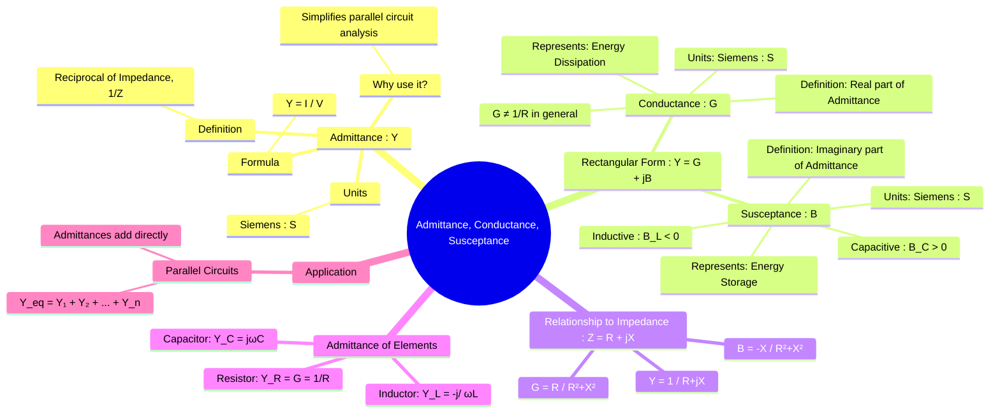

---
tags:
  - ac-circuits
  - admittance
  - conductance
  - susceptance
  - network-analysis
created: 2025-09-23
aliases:
  - Admittance
  - Conductance
  - Susceptance
subject: "[[Electric Circuits]]"
parent:
  - Sinusoidal Steady-State Analysis (AC Circuits)
confidence: 9
formula:
  - "Admittance (reciprocal of Imedance): $$Y=\\frac{1}{Z}$$"
  - "Admittance : $$Y = G + jB = \\text{(Conductance)} + j\\text{(Susceptance)}$$"
  - "Susceptance (B > 0) : Capacitive"
  - "Susceptance (B < 0) : Inductive"
---
###### Mind Map

---
### Admittance, Conductance, and Susceptance
#admittance #conductance #susceptance #parallel-circuits #ac-analysis

> While impedance ($\mathbf{Z}$) is analogous to resistance in AC circuits, **admittance ($\mathbf{Y}$)** is the analogous concept to conductance. It is the reciprocal of impedance and represents the ease with which a circuit allows current to flow. Admittance is particularly powerful for simplifying the analysis of parallel AC circuits. It is a complex quantity composed of a real part, **conductance ($\mathbf{G}$)**, and an imaginary part, **susceptance ($\mathbf{B}$)**.

#### Admittance (Y)
#admittance

Admittance ($\mathbf{Y}$) is ==defined as the ratio of the current phasor to the voltage phasor==
$$\boxed{\quad \mathbf{Y} = \frac{1}{\mathbf{Z}} = \frac{\mathbf{I}}{\mathbf{V}} \quad}$$
The ==unit of admittance is the **Siemens (S)**==, which is the reciprocal of the Ohm ($\Omega^{-1}$), also known as the "mho" ($\mho$).

Like impedance, ==admittance is a complex number that can be expressed in rectangular form==:
$$\boxed{\quad \mathbf{Y} = G + jB \quad}$$

- ==**G** is the **Conductance**: The real part of admittance. It is a measure of the energy dissipated in a circuit element.==
- ==**B** is the **Susceptance**: The imaginary part of admittance. It is a measure of the energy stored in a circuit element.==
    - ==If $B > 0$, the susceptance is **capacitive**.==
    - ==If $B < 0$, the susceptance is **inductive**.== (Note that this is the opposite sign convention of reactance $X$).

---
#### Relationship between Impedance and Admittance Components
#admittance-impedance-conversion

Given an impedance $\mathbf{Z} = R + jX$, we can find the corresponding conductance $G$ and susceptance $B$ by taking the reciprocal:
$$\begin{align}
\mathbf{Y} &= \frac{1}{\mathbf{Z}} = \frac{1}{R + jX} \\
 &= \frac{1}{R + jX} \cdot \frac{R - jX}{R - jX} \\
 &= \frac{R - jX}{R^2 + X^2} = \frac{R}{R^2 + X^2} - j\frac{X}{R^2 + X^2}
\end{align}$$
By comparing this with $\mathbf{Y} = G + jB$, we get the conversion formulas:
$$\boxed{\quad G = \frac{R}{R^2 + X^2} = \frac{R}{|\mathbf{Z}|^2} \quad}$$
$$\boxed{\quad B = \frac{-X}{R^2 + X^2} = \frac{-X}{|\mathbf{Z}|^2} \quad}$$

> [!danger] Important Note
> In a general AC circuit containing both resistance and reactance, the conductance $G$ is **not** simply $1/R$. It is only $1/R$ for a purely resistive element.

---
#### Admittance of Passive Elements
#admittance/elements

1.  **Resistor (R)**:
    -   $\mathbf{Y}_R = \frac{1}{\mathbf{Z}_R} = \frac{1}{R}$.
    -   Here, $G = 1/R$ and $B = 0$.
2.  **Inductor (L)**:
    -   $\mathbf{Y}_L = \frac{1}{\mathbf{Z}_L} = \frac{1}{j\omega L} = -\frac{j}{\omega L}$.
    -   Here, $G = 0$ and the inductive susceptance is $\boxed{\quad B_L = -\frac{1}{\omega L} \quad}$.
3.  **Capacitor (C)**:
    -   $\mathbf{Y}_C = \frac{1}{\mathbf{Z}_C} = \frac{1}{1/(j\omega C)} = j\omega C$.
    -   Here, $G = 0$ and the capacitive susceptance is $\boxed{\quad B_C = \omega C \quad}$.

---
#### Parallel Circuit Analysis
#parallel-circuits/admittance

The primary advantage of using admittance is in the analysis of parallel circuits. ==Just as resistances in series add, **admittances in parallel add directly**.==
For a set of parallel components:
$$\boxed{\quad \mathbf{Y}_{\text{eq}} = \mathbf{Y}_1 + \mathbf{Y}_2 + \dots + \mathbf{Y}_n \quad}$$
==This means the equivalent conductance is the sum of the individual conductances, and the equivalent susceptance is the sum of the individual susceptances==:
$$G_{\text{eq}} = G_1 + G_2 + \dots + G_n$$
$$B_{\text{eq}} = B_1 + B_2 + \dots + B_n$$
This is algebraically much simpler than using the formula for parallel impedances: $\frac{1}{\mathbf{Z}_{\text{eq}}} = \frac{1}{\mathbf{Z}_1} + \frac{1}{\mathbf{Z}_2} + \dots + \frac{1}{\mathbf{Z}_n}$.

---
### Related Concepts
#admittance/related-concepts

> [[Phasors and Impedance Concept]] (The foundational concept from which admittance is derived)

[[Parallel Resonance in RLC Circuits]] (Occurs when the net susceptance of the parallel circuit is zero, $B_{eq}=0$)
[[Complex Power and the Power Triangle]] (Complex power can be expressed as $\mathbf{S} = |\mathbf{V}|^2 \mathbf{Y}^*$)
[[Admittance Parameters (Y-parameters)]] (Extends the admittance concept to two-port networks)
[[Series and Parallel AC Circuits]]