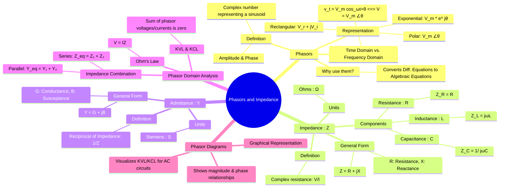

---
tags:
  - ac-circuits
  - phasors
  - impedance
  - network-analysis
  - frequency-domain
created: 2025-09-23
aliases:
  - Phasors
  - Impedance
  - Phasor Analysis
  - Frequency Domain Analysis
  - Resistance and Reactance
  - Equivalent Impedance
subject: "[[Electric Circuits]]"
parent:
  - Sinusoidal Steady-State Analysis (AC Circuits)
confidence: 9
formula:
  - "Impedance : $$\\mathbf{Z} = R + jX = \\text{(Resistance)} + j\\text{(Reactance)}$$"
---
###### Mind Map

---
### Phasors and Impedance Concept
#phasor-analysis #impedance #ac-circuits #frequency-domain

> Phasor and impedance concepts are the cornerstone of sinusoidal steady-state analysis. They transform complex time-domain differential equations into simpler algebraic equations in the frequency domain, making AC circuit analysis significantly easier. A **phasor** is a complex number representing a sinusoid's amplitude and phase, while **impedance** is the complex generalization of resistance for AC circuits.

#### Phasors
#phasor #sinusoid-representation

==A phasor is a complex number that represents the amplitude and phase angle of a sinusoidal function.== For a sinusoidal voltage or current given in the time domain:
$$v(t) = V_m \cos(\omega t + \phi)$$
==The corresponding phasor representation in the frequency domain is:==
$$\boxed{\quad \mathbf{V} = V_m \angle \phi = V_m e^{j\phi} = V_m(\cos\phi + j\sin\phi) \quad}$$
-   $V_m$ is the peak amplitude of the sinusoid.
-   $\phi$ is the phase angle.
-   $\omega$ is the angular frequency, which is assumed to be constant and known for the entire circuit.
==This transformation simplifies analysis by removing the time dependence ($t$) and focusing only on amplitude and phase relationships.==

> [!refer]
> [[Algebra of Complex Numbers#Euler's Formula & Conversions|Euler's Formula & Conversions]]

---
#### Impedance (Z)
#impedance #reactance #complex-resistance

**Impedance ($\mathbf{Z}$)** is the ==frequency-domain ratio of the voltage phasor to the current phasor==. It is the complex resistance of a circuit element to the flow of sinusoidal current.
$$\boxed{\quad \mathbf{Z} = \frac{\mathbf{V}}{\mathbf{I}} \quad (\text{Units: Ohms, } \Omega) \quad}$$
Impedance is generally a complex quantity, ==expressed in rectangular form as:==
$$\boxed{\quad \mathbf{Z} = R + jX \quad}$$
- ==**R** is the **Resistance**: The real part of impedance, which dissipates energy.==
- ==**X** is the **Reactance**: The imaginary part of impedance, which stores and returns energy.==
    - ==If $X > 0$, the reactance is **inductive**.==
    - ==If $X < 0$, the reactance is **capacitive**.==

##### Impedance of Passive Elements
#impedance/elements

1.  **Resistor (R)**:
    -   The voltage and current are in phase.
    -   $\mathbf{Z}_R = R \angle 0^\circ = R$
2.  **Inductor (L)**:
    -   Voltage leads current by 90°. This is because $v(t) = L \frac{di(t)}{dt}$, which in the phasor domain becomes $\mathbf{V} = L(j\omega\mathbf{I})$.
    -   $$\boxed{\quad \mathbf{Z}_L = j\omega L = \omega L \angle 90^\circ \quad}$$
    -   Inductive reactance is $X_L = \omega L$.
3.  **Capacitor (C)**:
    -   Current leads voltage by 90° (or voltage lags current by 90°). This is because $i(t) = C \frac{dv(t)}{dt}$, which in the phasor domain becomes $\mathbf{I} = C(j\omega\mathbf{V})$.
    -   $$\boxed{\quad \mathbf{Z}_C = \frac{1}{j\omega C} = -\frac{j}{\omega C} = \frac{1}{\omega C} \angle -90^\circ \quad}$$
    -   Capacitive reactance is $X_C = -\frac{1}{\omega C}$.

> [!memory] Impedance in $s$-domain (Universal Rule)
> Convert energy storage elements to $s$-domain impedances.
> $$R \to R$$
> $$L \to sL$$
> $$C \to 1/(sC)$$

---
#### Admittance (Y)
#admittance #susceptance

**Admittance ($\mathbf{Y}$)** is the reciprocal of impedance and is a measure of how easily a circuit allows current to flow. It is particularly useful for analyzing parallel circuits.
$$\boxed{\quad \mathbf{Y} = \frac{1}{\mathbf{Z}} = \frac{\mathbf{I}}{\mathbf{V}} \quad (\text{Units: Siemens, S}) \quad}$$
Admittance is also a complex quantity, expressed in rectangular form as:
$$\boxed{\quad \mathbf{Y} = G + jB \quad}$$
-   **G** is the **Conductance**: The real part of admittance.
-   **B** is the **Susceptance**: The imaginary part of admittance.

> [!refer]
> [[Admittance, Conductance, and Susceptance]]

---
#### Circuit Analysis in the Phasor Domain
#phasor-analysis/circuit-laws

By transforming a circuit into the phasor or frequency domain, all the fundamental circuit laws and analysis techniques (KVL, KCL, Nodal, Mesh) apply directly, but with complex numbers.

- **Ohm's Law**: $\mathbf{V} = \mathbf{I}\mathbf{Z}$
- **Kirchhoff's Voltage Law (KVL)**: The algebraic sum of phasor voltages around any closed loop is zero. $\sum \mathbf{V}_k = 0$.
- **Kirchhoff's Current Law (KCL)**: The algebraic sum of phasor currents entering a node is zero. $\sum \mathbf{I}_k = 0$.

##### Combining Impedances
#combining-impedances 

- **Series Connection**: Impedances in series add up.
    $$\mathbf{Z}_{\text{eq}} = \mathbf{Z}_1 + \mathbf{Z}_2 + \dots + \mathbf{Z}_n$$
- **Parallel Connection**: The reciprocal of the equivalent impedance is the sum of the reciprocals of individual impedances. It's often easier to work with admittances.
    $$\frac{1}{\mathbf{Z}_{\text{eq}}} = \frac{1}{\mathbf{Z}_1} + \frac{1}{\mathbf{Z}_2} + \dots + \frac{1}{\mathbf{Z}_n} \quad \text{or} \quad \mathbf{Y}_{\text{eq}} = \mathbf{Y}_1 + \mathbf{Y}_2 + \dots + \mathbf{Y}_n$$

> [!concept] Infinite Ladder Impedance
> #infinite-ladder-networks #infinite-ladder-impedance 
> 
> Let the input impedance of the infinite ladder be $Z$.
> Because the network is infinite, removing the first section leaves the same impedance $Z$.
> 
> Hence, by self-similarity: $$Z = Z_1 + (Z_2 \parallel Z)$$
> Writing the parallel combination explicitly: $$Z = Z_1 + \frac{Z_2 Z}{Z_2 + Z}$$
> 
> Rearranging: $$Z(Z_2 + Z) = Z_1(Z_2 + Z) + Z_2 Z$$
> 
> This reduces to the quadratic: $$Z^2 - Z_1 Z - Z_1 Z_2 = 0$$
> Solve for $Z$ and choose the physically meaningful root.
> 
> > [!pyq]- PYQ : 2018
> > ![[ee_2018#^q32]]

---
#### Phasor Diagrams
#phasor-diagram

A phasor diagram is a graphical representation of the phasors (voltages and currents) in a circuit. It plots these complex numbers as vectors on the complex plane, allowing for a visual understanding of the phase relationships between different quantities. For a series RLC circuit, a phasor diagram can graphically represent KVL as the vector sum $\mathbf{V}_R + \mathbf{V}_L + \mathbf{V}_C = \mathbf{V}_{\text{source}}$.

---
### Related Concepts
#phasors/related-concepts

> [[Admittance, Conductance, and Susceptance]] (A deeper dive into the reciprocal concept of impedance)

[[AC Circuit Analysis with KCL, KVL, Nodal, and Mesh]]
[[Complex Power and the Power Triangle]] (Applies phasor concepts to power calculations)
[[Series Resonance in RLC Circuits]] (A special case where impedance becomes purely real)
[[Complex Numbers]] (The mathematical foundation for phasors)
