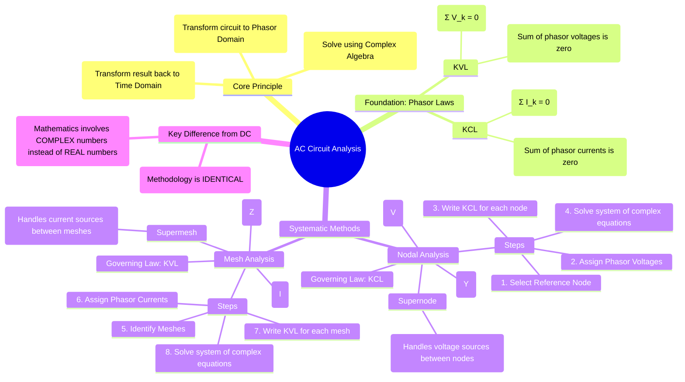

---
tags:
  - ac-circuits
  - network-analysis
  - kcl
  - kvl
  - nodal-analysis
  - mesh-analysis
  - phasors
created: 2025-09-23
aliases:
  - AC Nodal Analysis
  - AC Mesh Analysis
  - AC Circuit Laws
subject: "[[2. Electric Circuits/Electric Circuits|Electric Circuits]]"
parent: "[[3. Sinusoidal Steady-State Analysis (AC Circuits)]]"
confidence: 9
---

---
### AC Circuit Analysis with KCL, KVL, Nodal, and Mesh
#ac-analysis #kcl-kvl #nodal-analysis #mesh-analysis

> The fundamental circuit analysis techniques learned for DC circuits—Kirchhoff's Laws, Nodal Analysis, and Mesh Analysis—are fully applicable to AC circuits in sinusoidal steady-state. The key is to first transform the entire circuit from the time domain into the **phasor domain**. This process converts the circuit's integro-differential equations into a system of linear algebraic equations involving complex numbers, which are significantly easier to manipulate and solve.

#### The Three-Step Analysis Process
#phasor-domain-analysis

1.  **Transform to Phasor Domain**: Convert all time-domain elements into their frequency-domain equivalents.
    -   Sinusoidal sources: $v(t) = V_m \cos(\omega t + \phi) \rightarrow \mathbf{V} = V_m \angle \phi$.
    -   Resistors, Inductors, Capacitors: $R, L, C \rightarrow R, j\omega L, \frac{1}{j\omega C}$ (Impedances).
2.  **Solve in Phasor Domain**: Apply standard circuit analysis techniques (KVL, KCL, Nodal, Mesh, Superposition, etc.) to the phasor circuit. The variables being solved for will be phasor voltages and currents ($\mathbf{V}, \mathbf{I}$). This step requires proficiency in complex number arithmetic.
3.  **Transform to Time Domain**: Convert the resulting phasor solution back into its time-domain sinusoidal form.
    -   $\mathbf{V} = V_m \angle \phi \rightarrow v(t) = V_m \cos(\omega t + \phi)$.

#### KVL and KCL in the Phasor Domain
#phasor-kvl #phasor-kcl

The fundamental laws of circuit theory hold true for phasors.
-   **Kirchhoff's Voltage Law (KVL)**: The algebraic sum of the phasor voltages around any closed loop is zero.
    $$\boxed{\quad \sum_{k=1}^{n} \mathbf{V}_k = 0 \quad}$$
-   **Kirchhoff's Current Law (KCL)**: The algebraic sum of the phasor currents entering any node is zero.
    $$\boxed{\quad \sum_{k=1}^{n} \mathbf{I}_k = 0 \quad}$$

#### Nodal Analysis in AC Circuits
#ac-nodal-analysis
The procedure is identical to DC nodal analysis, but with complex quantities. Using admittances ($\mathbf{Y} = 1/\mathbf{Z}$) often simplifies the equations.

**Procedure**:
1.  Transform the circuit to the phasor domain.
2.  Select a reference node and assign phasor voltage variables ($\mathbf{V}_1, \mathbf{V}_2, \dots$) to the other nodes.
3.  Apply KCL at each non-reference node. Express the currents leaving the node using the phasor form of Ohm's Law: $\mathbf{I} = \frac{\Delta \mathbf{V}}{\mathbf{Z}} = \Delta \mathbf{V} \cdot \mathbf{Y}$.
    For a node $k$:
    $$\sum_{\substack{j=1 \\ j \neq k}}^{N} \frac{\mathbf{V}_k - \mathbf{V}_j}{\mathbf{Z}_{kj}} = \sum \mathbf{I}_{\text{sources entering}}$$
4.  Solve the resulting system of linear equations to find the unknown node phasor voltages.
5.  The **Supernode** technique is used in the same way as in DC circuits to handle voltage sources between two non-reference nodes.

#### Mesh Analysis in AC Circuits
#ac-mesh-analysis
The procedure is identical to DC mesh analysis, using impedances.

**Procedure**:
1.  Transform the circuit to the phasor domain. Ensure the circuit is planar.
2.  Assign clockwise phasor mesh currents ($\mathbf{I}_1, \mathbf{I}_2, \dots$) to each mesh.
3.  Apply KVL around each mesh. Express voltages across elements using the phasor form of Ohm's Law: $\mathbf{V} = \mathbf{I}\mathbf{Z}$.
    For a mesh $k$:
    $$\mathbf{I}_k(\sum \mathbf{Z}_{\text{in mesh k}}) - \sum_{\substack{j=1 \\ j \neq k}}^{M} \mathbf{I}_j(\mathbf{Z}_{\text{shared with mesh j}}) = \sum \mathbf{V}_{\text{sources in mesh k}}$$
4.  Solve the resulting system of linear equations for the unknown mesh phasor currents.
5.  The **Supermesh** technique is used in the same way as in DC circuits to handle current sources that are part of two meshes.

---
### Related Concepts
#ac-analysis/related-concepts

> [[Phasors and Impedance Concept]] (The prerequisite for all AC analysis)

[[Admittance, Conductance, and Susceptance]] (Especially useful for Nodal Analysis)
[[Nodal Analysis]] and [[Mesh Analysis]] (The DC counterparts)
[[Supernode Analysis]] and [[Supermesh Analysis]]
[[Thevenin's Theorem]] and [[Norton's Theorem]] (Also applicable in the phasor domain)
[[Calculus - Complex Numbers]] (The mathematical foundation)