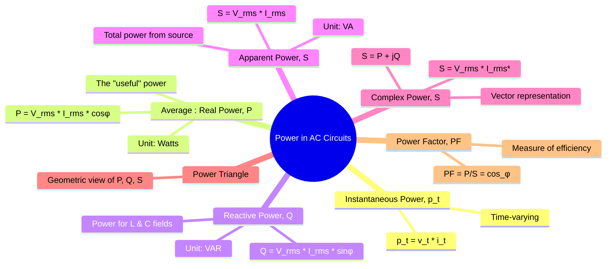

---
tags:
  - circuits
  - ac-power
  - power-systems
  - power-triangle
  - power-factor
created: 2025-09-15
aliases:
  - AC Power
  - Complex Power
  - Power Triangle
  - Real Power, P
  - Reactive Power, Q
  - Apparent Power, S
  - Power in Synchronous Motor
  - Power in Synchronous Machine
  - Average Power
  - True Power
  - Three-Phase AC Power
subject: "[[Electric Circuits]]"
parent: "[[AC Circuit Analysis]]"
confidence: 9
formula:
  - "Instantaneous Power : $$p(t) = v(t) \\cdot i(t)$$"
---
### Power in AC Circuits
#ac-power #complex-power #power-analysis 

> Unlike in DC circuits where power is simply $P = VI$, in AC circuits, <u>the presence of reactive elements (inductors and capacitors) causes a phase shift between voltage and current</u>. ==This phase difference makes the analysis of power more complex, leading to the concepts of real, reactive, and apparent power.==

---
#### Instantaneous Power, $p(t)$
#instantaneous-power 

The power at any instant in time is the ==product of the instantaneous voltage and current==.
$$p(t) = v(t) \cdot i(t)$$
==This value fluctuates throughout the cycle and is not typically used for analysis, but it is the fundamental definition from which other power quantities are derived.==

> [!refer]
> [[Instantaneous and Average Power#Instantaneous Power|Instantaneous Power (Derivation)]]

---
#### Average (Real or True) Power, P
#real-power #true-power #average-power 

Average power is the average of the [[#Instantaneous Power, $p(t)$|instantaneous power]] over one complete cycle. ==It represents the actual energy that is converted into another form, such as heat or mechanical work.== It is the power dissipated by the resistive elements of a circuit.
$$\boxed{\quad P = V_{rms} I_{rms} \cos(\phi) \quad}$$
* **Unit**: **Watts (W)**
* $V_{rms}$ and $I_{rms}$ are the RMS values of voltage and current.
* $\phi$ is the phase angle difference between the voltage and current ($\phi = \theta_v - \theta_i$).
* $\cos(\phi)$ is the [[Power Factor#Power Factor (PF)|power factor]].

> [!refer]
> [[Instantaneous and Average Power#Average Power (P)|Average Power (Derivation)]]

> [!pyq]- PYQ : 2018
> ![[ee_2018#^q48]]

> [!examtip] Source interaction in AC networks
>
> In a sinusoidal steady-state network with multiple AC voltage sources:
> - A voltage source can **absorb** or **deliver** average power
> - Sign of power is given by $P = \tfrac{1}{2}\Re\{VI^*\}$
> - In networks where $R \ll \omega L$:
>   - Inductors exchange zero average power
>   - **Phase differences decide power flow**
>   - A source directly connected to a node (zero series impedance) can **supply real power to other sources**
>  
> ---
> > [!refer]
> > See [[Algebra of Complex Numbers#^important-notation]] for complex notation $(\Re)$

> [!important] Important Notes
> In AC networks, voltage sources are not guaranteed to supply power; phase and network constraints decide the sign of average power.

> [!memory]- **Average Power: Non-Sinusoidal Waveforms**
> **Rule:** Average power is the sum of the powers of individual harmonic components.
> $$P_{avg} = V_0 I_0 + \sum_{n=1}^{\infty} V_{n,rms} I_{n,rms} \cos(\theta_n - \phi_n)$$
> 
> > [!concept] Key Insight
> > If a harmonic is present in the current but NOT in the voltage (or vice versa), it contributes **zero** to the average power.

---
#### Reactive Power, Q
#reactive-power

Reactive power ==represents the energy that is stored and returned to the source by the reactive components of the circuit (inductors and capacitors)==. It is the power that oscillates between the source and the load, sustaining the magnetic field in an inductor or the electric field in a capacitor. ==It performs no useful work.==
$$\boxed{\quad Q = V_{rms} I_{rms} \sin(\phi) \quad}$$
* **Unit**: **Volt-Amperes Reactive (VAR)**
* **Sign Convention**:
    * $Q > 0$ for an **inductive load** (consumes/absorbs VARs).
    * $Q < 0$ for a **capacitive load** (supplies/delivers VARs).

---
#### Apparent Power, S
#apparent-power

Apparent power is the ==magnitude of the vector sum of real and reactive power==. It is the ==product of the RMS voltage and RMS current==, <u>without regard to the phase angle</u>. It represents the total power that the utility must supply to the load. Electrical equipment like transformers and generators are rated in VA or kVA because the conductors must be sized to handle the total current, regardless of how much of it is doing useful work.
$$\boxed{\quad S = V_{rms} I_{rms} = \sqrt{P^2 + Q^2} \quad}$$
* **Unit**: **Volt-Amperes (VA)**
* It is the magnitude of the [[#Complex Power, $ vec{S}$|complex power]].

---
#### Complex Power, $\vec{S}$
#complex-power

> [!refer]
> [[Algebra of Complex Numbers#Complex Conjugate]]

Complex power provides a complete description of AC power by combining real and reactive power into a single complex number. It is the most comprehensive way to perform power calculations.
$$\boxed{\quad \vec{S} = \vec{V}_{rms} \vec{I}_{rms}^* = P + jQ \quad}$$
$$\vec{S} = I_{rms}^2 Z = \frac{V_{rms}^2}{Z^*}$$
* $\vec{V}_{rms}$ is the RMS voltage phasor.
* $\vec{I}_{rms}^*$ is the **complex conjugate** of the RMS current phasor.
From the complex power $\vec{S}$:
* **Real Power ($P$)** is the real part: $P = \text{Re}\{\vec{S}\}$
* **Reactive Power ($Q$)** is the imaginary part: $Q = \text{Im}\{\vec{S}\}$
* **Apparent Power ($S$)** is the magnitude: $S = |\vec{S}| = \sqrt{P^2+Q^2}$

---
#### The Power Triangle
#power-triangle

The power triangle is a geometric representation of the relationship between $P$, $Q$, and $S$.
* The real power ($P$) is the adjacent side.
* The reactive power ($Q$) is the opposite side.
* The apparent power ($S$) is the hypotenuse.
* The angle between $P$ and $S$ is the power factor angle, $\phi$.

![[Power Triangle.png]]

This visualization reinforces the relationships:
$$S^2 = P^2 + Q^2 \quad \text{and} \quad \phi = \tan^{-1}\left(\frac{Q}{P}\right)$$
$$\begin{align}
S^2 &= P^2 + Q^2 \\
P &= S \cos(\theta) \\
Q &= S \sin(\theta) \\
\text{Power Factor (PF)} &= \cos(\theta) = \frac{P}{S}
\end{align}$$

> [!pyq]- PYQ : 2019
> ![[ee_2019#^q45]]

> [!formula] Three-Phase AC Power Formulas
> When calculating total active ($P$), reactive ($Q$), and apparent ($S$) power in a balanced 3-phase system, the formulas depend heavily on whether you use **Line-to-Line** or **Phase** variables. 
> 
> *All values are assumed to be **RMS** unless explicitly stated otherwise.*
> 
> ###### 1. Using Phase Values (Universal for $\text{Y}$ and $\Delta$)
> Total power is simply $3 \times$ the power of a single phase:
> $$P_{\text{total}} = 3 \, V_{ph} \, I_{ph} \cos\theta$$
> $$Q_{\text{total}} = 3 \, V_{ph} \, I_{ph} \sin\theta$$
> $$S_{\text{total}} = 3 \, V_{ph} \, I_{ph} = \sqrt{P_{\text{total}}^2 + Q_{\text{total}}^2}$$
> $$\mathbf{S}_{\text{total}} = 3 \, \mathbf{V}_{ph} \, \mathbf{I}_{ph}^*$$
> 
> ###### 2. Using Line Values (Universal for $\text{Y}$ and $\Delta$)
> Substituting connection constraints yields the most common power system calculation format:
> $$\boxed{\quad P_{\text{total}} = \sqrt{3} \, V_L \, I_L \cos\theta \quad}$$
> $$\boxed{\quad Q_{\text{total}} = \sqrt{3} \, V_L \, I_L \sin\theta \quad}$$
> $$\boxed{\quad S_{\text{total}} = \sqrt{3} \, V_L \, I_L \quad}$$
> 
> > [!mistake] **The $\theta$ Parameter Trap**
> > In both line and phase formulas, **$\theta$ is ALWAYS the phase angle (angle between $V_{ph}$ and $I_{ph}$)**. It is **NOT** the angle between line voltage and line current.
^three-phase-ac-power

---
#### Connection Conversion Reference Table

| Connection Type | Voltage Relationship | Current Relationship |
| :--- | :--- | :--- |
| **Star ($\text{Y}$)** | $V_L = \sqrt{3} \, V_{ph} \angle 30^\circ$ | $I_L = I_{ph}$ |
| **Delta ($\Delta$)** | $V_L = V_{ph}$ | $I_L = \sqrt{3} \, I_{ph} \angle -30^\circ$ |

---
### Related Concepts
#related-concepts

> [[Power Factor]] (A crucial concept derived from AC power)
> [[Distortion Power and True Power Factor]] (in context of Power Electronics)

[[Instantaneous and Average Power]]
[[AC Circuit Analysis]] (The parent topic)
[[RMS and Average Values]] (The basis for power calculations)
[[Phasors and Impedance Concept|Impedance]] (The cause of the phase shift, $\phi$)
[[Phasors and Impedance Concept|Phasors]] (The mathematical tool used to calculate complex power)
[[Three-Phase Circuits]]