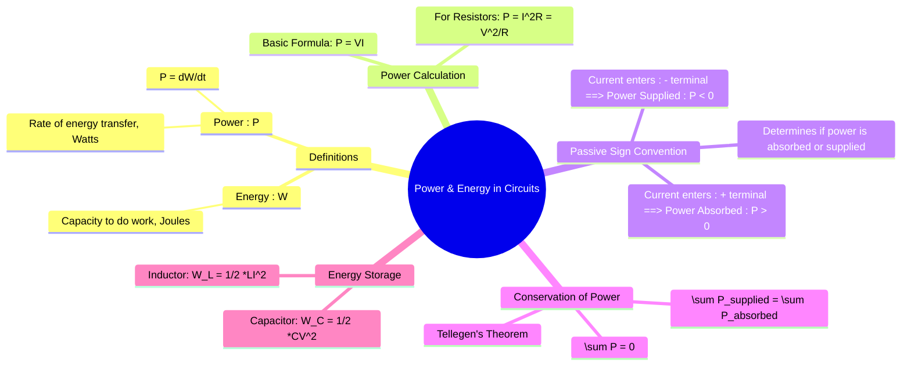

---
tags:
  - electric-circuits
  - fundamental-concepts
  - power-energy
  - passive-sign-convention
aliases:
  - Power and Energy
  - Electrical Power
  - Electrical Energy
  - electrical energy and power
created: 2025-09-11
subject: "[[Electric Circuits]]"
parent:
  - Fundamental Concepts
confidence: 9
---
###### Mind Map

---
### Power and Energy in Circuits
#power-energy #circuit-analysis

> **Energy** ($W$) is the fundamental capacity to perform work, while **Power** ($P$) is the rate at which energy is expended or absorbed. Understanding power and energy is crucial for analyzing circuit behavior and efficiency.

#### Definitions
#power-definition #energy-definition

*   **Energy ($W$)**: The total work done over a period of time. The SI unit is the **Joule (J)**. A common commercial unit is the kilowatt-hour (kWh), where $1 \ kWh = 3.6 \times 10^6 \ J$.
*   **Power ($P$)**: The rate of energy transfer. The SI unit is the **Watt (W)**, which is one Joule per second (J/s).
    $$\boxed{\quad P = \frac{dW}{dt} \quad}$$
    Conversely, the energy transferred over an interval from $t_1$ to $t_2$ is the integral of power:
    $$W = \int_{t_1}^{t_2} P(t) dt$$

---
#### Electric Power Calculation
#electric-power

The instantaneous electric power delivered to or absorbed by any circuit element is the product of the voltage across it and the current flowing through it.
$$\boxed{\quad P = V \cdot I \quad}$$
For a **[[Resistors|resistor]]**, we can combine this with [[Ohm's Law]] ($V=IR$) to get two other common forms:
$$\boxed{\quad P_{dissipated} = I^2R = \frac{V^2}{R} \quad}$$
Since $I^2$ and $R$ are always positive, the power in a resistor is always positive, meaning it **always absorbs or dissipates power** (as heat).

---
#### Passive Sign Convention
#passive-sign-convention

This convention is a critical standard for determining whether power is being **absorbed** or **supplied** by a circuit element.

1.  **Power Absorbed (P > 0)**: If the current $I$ enters the element through its **positive voltage terminal** and leaves through the negative terminal, the element is absorbing power. This is the case for passive elements like resistors.
    *   $P = +VI$

2.  **Power Supplied (P < 0)**: If the current $I$ enters the element through its **negative voltage terminal** and leaves through the positive terminal, the element is supplying power to the circuit. This is the case for active sources like batteries or generators.
    *   $P = -VI$

![[Pasted image 202509112000.png]]

---
#### Law of Conservation of Power
#conservation-of-power #tellegens-theorem

Based on the principle of conservation of energy, the total power in any electrical circuit must be conserved.
> In any given circuit, the algebraic sum of the power of all elements is zero at any instant.
$$\boxed{\quad \sum_{k=1}^{n} P_k = 0 \quad}$$
  This implies that the total power supplied by the active elements must be equal to the total power absorbed by the [[Passive Circuit Elements|passive elements]].
$$\boxed{\quad \sum P_{supplied} = \sum P_{absorbed} \quad}$$
This principle is a valuable tool for verifying circuit analysis results.

---
#### Energy Stored in Passive Elements
#energy-storage

Ideal inductors and capacitors do not dissipate energy but store it in their respective fields.

##### Energy in a Capacitor
A [[Capacitors|capacitor]] stores energy in its **electric field**.
$$\boxed{\quad W_C = \frac{1}{2} C V^2 \quad}$$

##### Energy in an Inductor
An [[Inductors|inductor]] stores energy in its **magnetic field**.
$$\boxed{\quad W_L = \frac{1}{2} L I^2 \quad}$$

---
### Related Concepts
#related-concepts

> [[Ohm's Law]]
> [[Kirchhoff's Laws]]
> [[Resistors]], [[Inductors]], [[Capacitors]] (The elements that absorb, store, or dissipate power)

[[AC Power Analysis]] (Expands these concepts to average power, reactive power, and complex power)
[[Circuit Elements]]