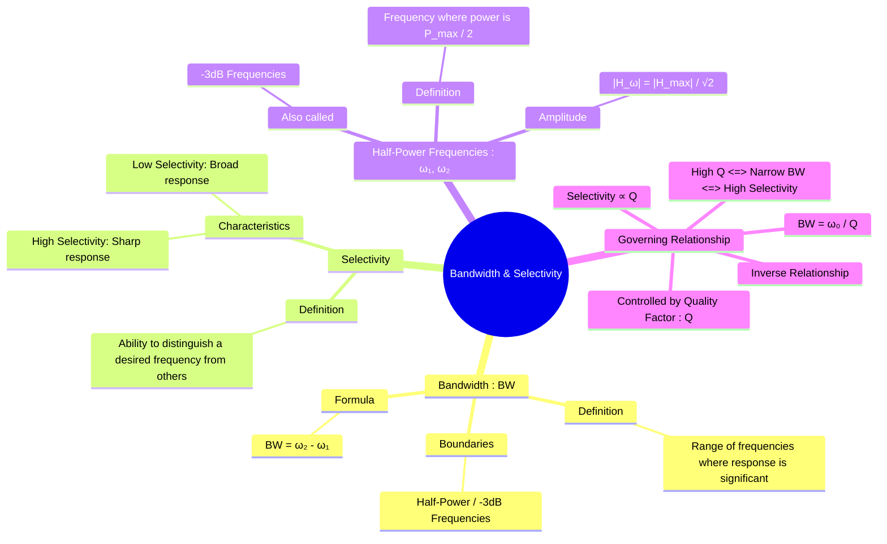

---
tags:
  - bandwidth
  - selectivity
  - resonance
  - quality-factor
  - filters
created: 2025-09-23
aliases:
  - Bandwidth
  - Selectivity
  - Half-Power Frequencies
  - -3dB Bandwidth
subject: "[[2. Electric Circuits/Electric Circuits|Electric Circuits]]"
parent:
  - "[[Resonance]]"
confidence: 9
---
###### Mind Map

---
### Bandwidth and Selectivity
#bandwidth #selectivity #resonance

> **Bandwidth** and **Selectivity** are two fundamental, inversely related concepts that characterize the frequency response of resonant circuits and filters. ==**Bandwidth** measures the range of frequencies over which the circuit has a significant response==, while ==**Selectivity** describes the circuit's ability to "select" a desired frequency and reject others==.

#### Half-Power Frequencies (-3dB Frequencies)
#half-power-frequency

![[Half-Power Frequency (-3dB)#Mathematical Derivation of -3dB]]

![[Half-Power Frequency (-3dB)#2. Resonance & Selectivity]]

#### Bandwidth (BW)
#bandwidth

The bandwidth is simply the difference between the upper and lower half-power frequencies. It represents the "width" of the resonance peak.
$$\boxed{\quad BW = \omega_2 - \omega_1 \quad \text{(in rad/s)} \quad}$$
The formula for bandwidth depends on the circuit's components:
-   **For a Series RLC Circuit**:
    $$\boxed{\quad BW = \frac{R}{L} \quad}$$
-   **For a Parallel RLC Circuit**:
    $$\boxed{\quad BW = \frac{1}{RC} \quad}$$

---
#### Selectivity
#selectivity

Selectivity is a qualitative measure of a circuit's ability to differentiate between signals at different frequencies.
- A **highly selective** circuit has a very sharp and narrow frequency response. It passes a small band of frequencies while strongly rejecting all others. This is ideal for applications like tuning into a specific radio station.
- A **poorly selective** circuit has a broad and flat frequency response, allowing a wide band of frequencies to pass through.

---
#### The Relationship via Quality Factor (Q)
#quality-factor #bandwidth-selectivity-relation

The [[Quality Factor (Q-Factor)]] provides the direct mathematical link between bandwidth, resonant frequency, and selectivity.
$$\boxed{\quad BW = \frac{\omega_0}{Q} \quad}$$
This fundamental relationship shows that:
- **Selectivity is directly proportional to Q**. A high Q-factor means the circuit is highly selective.
- **Bandwidth is inversely proportional to Q**. A high Q-factor results in a narrow bandwidth.

This leads to the core trade-off in filter design:
- **High Q $\implies$ High Selectivity $\implies$ Narrow Bandwidth**
- **Low Q $\implies$ Low Selectivity $\implies$ Wide Bandwidth**

---
### Related Concepts
#bandwidth/related-concepts

> [[Quality Factor (Q-Factor)]] (The parameter that governs both bandwidth and selectivity)

[[Series Resonance in RLC Circuits]]
[[Parallel Resonance in RLC Circuits]]
[[Filters]] (Where these concepts are applied to design band-pass and band-stop filters)
[[Frequency Response Analysis]] (The -3dB frequency is used to define the bandwidth of control systems)