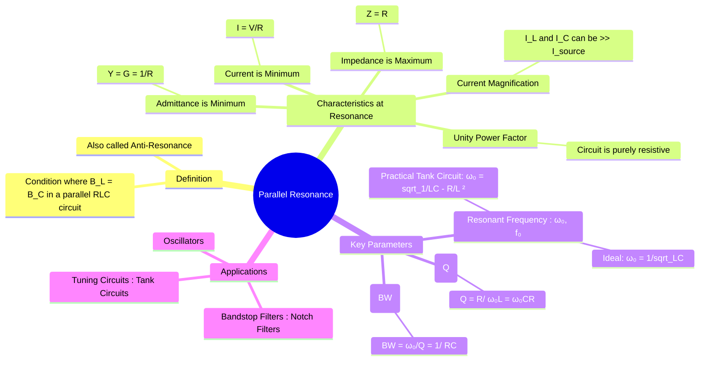

---
tags:
  - ac-circuits
  - resonance
  - rlc-circuits
  - bandstop-filter
  - quality-factor
created: 2025-09-23
aliases:
  - Parallel Resonance
  - RLC Parallel Resonance
  - Anti-resonance
  - Tank Circuit
subject: "[[2. Electric Circuits/Electric Circuits|Electric Circuits]]"
parent:
  - "[[Resonance]]"
confidence: 9
---
###### Mind Map

---
### Parallel Resonance in RLC Circuits
#parallel-resonance #rlc-circuit #anti-resonance #tank-circuit

> ==**Parallel Resonance** (also known as anti-resonance) is the dual of series resonance.== ==It occurs in a parallel RLC circuit when the susceptance of the inductor and capacitor are equal and cancel each other out==. At the resonant frequency, the circuit's impedance is at its **maximum**, causing the total current drawn from the source to be at its **minimum**. This high-impedance state is used in band-stop filters and as the "tank circuit" in oscillators.

#### Condition for Resonance
#resonance/condition

For an ideal parallel RLC circuit, the total admittance $\mathbf{Y}$ is given by:
$$\mathbf{Y} = G + jB = \frac{1}{R} + j\left(\omega C - \frac{1}{\omega L}\right)$$
Resonance occurs when the imaginary part (the total susceptance) is zero, making the circuit purely resistive.
$$B_C - B_L = 0 \implies \omega C = \frac{1}{\omega L}$$

> [!pyq]- PYQ : 2018
> ![[ee_2018#^q55]]

---
#### Resonant Frequency ($\omega_0$)
#resonant-frequency

![[Resonance#Resonant Frequency]]

#### Characteristics at Resonance
#resonance/characteristics

At the resonant frequency $\omega_0$:
1.  **Minimum Admittance**: The total admittance is minimum and purely real.
    $$\mathbf{Y}_{min} = G = \frac{1}{R}$$
2.  **Maximum Impedance**: The impedance is maximum and purely resistive.
    $$\mathbf{Z}_{max} = R$$
3.  **Minimum Current**: The total current from the source is at its minimum value.
    $$\mathbf{I}_{min} = \frac{\mathbf{V}}{R}$$
4.  **Unity Power Factor**: Since the admittance/impedance is purely real, the total voltage and current are in phase.
    $$\text{Power Factor} = \cos(0^\circ) = 1$$
5.  **Current Magnification**: The magnitudes of the currents circulating through the inductor ($I_L$) and capacitor ($I_C$) can be much larger than the source current ($I_{min}$).
    $$|\mathbf{I}_L| = |\frac{\mathbf{V}}{j\omega_0 L}| = \frac{V}{\omega_0 L} = Q I_{min}$$
    $$|\mathbf{I}_C| = |j\omega_0 C \mathbf{V}| = \omega_0 C V = Q I_{min}$$

> [!memory] Tank Circuit
> This large circulating current between L and C, representing stored energy transfer, is why this configuration is often called a **tank circuit**.

---
#### Quality Factor (Q)
#quality-factor 

![[Quality Factor (Q-Factor)#2. Parallel RLC Circuit (Ideal)]]

#### Bandwidth and Half-Power Frequencies
#bandwidth #half-power-frequency

-   **Half-Power Frequencies ($\omega_1, \omega_2$)**: Frequencies where the power dissipated is half the maximum, which occurs when the magnitude of the impedance drops to $\mathbf{Z}_{max}/\sqrt{2}$.
-   **Bandwidth (BW)**: The range of frequencies between the half-power points.
    $$\boxed{\quad BW = \omega_2 - \omega_1 = \frac{1}{RC} = \frac{\omega_0}{Q} \quad}$$

---
#### Practical Tank Circuit
#tank-circuit #practical-resonance

A more realistic model considers the winding resistance ($R_s$) of the inductor in series with its inductance (L). This combination is then in parallel with the capacitor (C). For this practical tank circuit, the condition for unity power factor (resonance) is when the imaginary part of the total admittance is zero.
The resonant frequency $\omega_r$ is slightly different:
$$\boxed{\quad \omega_r = \sqrt{\frac{1}{LC} - \frac{R_s^2}{L^2}} \quad}$$
For high-Q circuits ($Q = \omega_0 L / R_s \gg 1$), $R_s$ is small, and $\omega_r$ is very close to the ideal resonant frequency $\omega_0$.

---
### Related Concepts
#parallel-resonance/related-concepts

> [[Series Resonance in RLC Circuits]] (The dual concept with minimum impedance at resonance)

[[Quality Factor (Q-Factor)]]
[[Bandwidth and Selectivity]]
[[Admittance, Conductance, and Susceptance]] (The natural framework for analyzing parallel circuits)