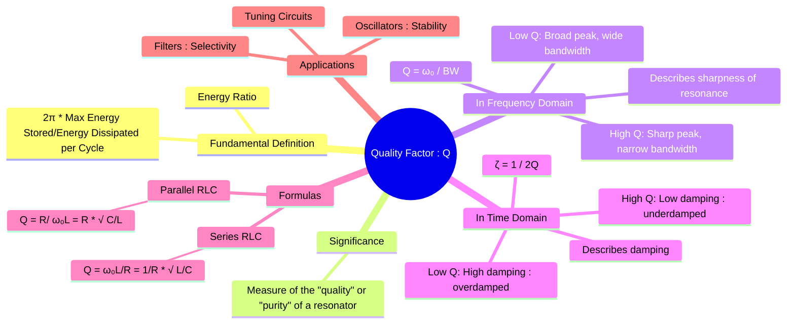

---
tags:
  - quality-factor
  - resonance
  - selectivity
  - damping
  - q-factor
created: 2025-09-23
aliases:
  - Q-Factor
  - Q factor
  - Relationship between Quality Factor (Q-Factor) and Damping Ratio
subject: "[[2. Electric Circuits/Electric Circuits|Electric Circuits]]"
parent:
  - "[[Resonance]]"
confidence: 9
formula:
  - "Quality Factor (Q-Factor) : $$Q = 2\\pi \\times \\frac{\\text{Maximum Energy Stored}}{\\text{Energy Dissipated per Cycle}}$$"
  - "Relationship between Damping Ratio and Quality Factor (Q-Factor) (Second-Order System) : $$\\zeta = \\frac{1}{2Q}$$"
---
##### Mind Map

---
### Quality Factor (Q-Factor)
#quality-factor #resonance #selectivity #damping

> The **Quality Factor (Q-factor)** is a dimensionless parameter that describes how underdamped an oscillator or resonator is. ==In the context of RLC circuits, it quantifies the "sharpness" of the resonance peak.== A high Q-factor indicates a lower rate of energy loss relative to the stored energy, resulting in a more selective, narrowly tuned circuit.

#### Fundamental Definition
#quality-factor/definition

The most general definition of the Q-factor relates the energy stored in a resonator to the energy it dissipates.
$$\boxed{\quad Q = 2\pi \times \frac{\text{Maximum Energy Stored}}{\text{Energy Dissipated per Cycle}} \quad}$$
- A **high Q-factor** means the circuit stores much more energy than it dissipates per cycle, leading to long-lasting oscillations (low damping).
- A **low Q-factor** means a significant fraction of the stored energy is lost each cycle, causing oscillations to die out quickly (high damping).

---
#### Q-Factor in Resonant Circuits
#quality-factor/resonance

In the frequency domain, the Q-factor is a direct measure of the **selectivity** or sharpness of the resonance curve. It is defined as the ratio of the resonant frequency to the bandwidth.
$$\boxed{\quad Q = \frac{\omega_0}{BW} = \frac{\text{Resonant Frequency}}{\text{Bandwidth}} \quad}$$
- **High Q**: Implies a small bandwidth ($BW$). The circuit responds strongly to a very narrow range of frequencies and effectively rejects others. This is desirable for tuning circuits (e.g., selecting a radio station).
- **Low Q**: Implies a large bandwidth ($BW$). The circuit responds to a wider range of frequencies.

---
#### Formulas for RLC Circuits
#quality-factor/formulas

The specific formula for Q depends on the circuit configuration.

##### 1. Series RLC Circuit
#quality-factor/series-rlc-circuit

- A low series resistance $R$ leads to low energy dissipation and thus a high $Q$.
$$\boxed{\quad Q_{series} = \frac{\omega_0 L}{R} = \frac{1}{\omega_0 C R} = \frac{1}{R}\sqrt{\frac{L}{C}} \quad}$$
- At resonance, the voltage across $L$ and $C$ is magnified by $Q$: $|\mathbf{V}_L| = |\mathbf{V}_C| = Q \cdot |\mathbf{V}_{source}|$.

> [!memory]- Series RLC Circuit — Losses Add
> Each element contributes **series resistance**, so dissipation adds directly.
>
> **Inductor**
> $$Q_L = \frac{\omega_0 L}{R_L} \;\;\Rightarrow\;\; R_L = \frac{\omega_0 L}{Q_L}$$
>
> **Capacitor**
> $$Q_C = \frac{1}{\omega_0 C R_C} \;\;\Rightarrow\;\; R_C = \frac{1}{\omega_0 C Q_C}$$
>
> **Equivalent series resistance**
> $$R_{\text{eq}} = R_L + R_C$$
>
> Using resonance condition
> $$\omega_0^2 = \frac{1}{LC}$$
>
> **Overall series quality factor**
> $$Q_{\text{series}} = \frac{1}{\displaystyle \frac{1}{Q_L} + \frac{1}{Q_C}}$$
> 
> > [!examtip] Rule 🔑
> > Inverse Q’s add in series

---
##### 2. Parallel RLC Circuit (Ideal)
#quality-factor/parallel-rlc-circuit

- A high parallel resistance $R$ provides a path of low energy dissipation (since most current circulates in the LC tank), leading to a high $Q$.
$$\boxed{\quad Q_{parallel} = \frac{R}{\omega_0 L} = \omega_0 C R = R\sqrt{\frac{C}{L}} \quad}$$
- At resonance, the current circulating in the LC tank is magnified by $Q$: $|\mathbf{I}_L| = |\mathbf{I}_C| = Q \cdot |\mathbf{I}_{source}|$.

> [!important] Quality Factor of Practical RLC Circuits (Series vs Parallel)
> Real inductors and capacitors have losses (ESR / winding resistance).  
> Overall circuit $Q$ is determined by **total loss**, not by ideal reactances.

> [!memory]- Parallel RLC Circuit — Losses Add as Conductance
> Losses appear as **parallel resistances** → conductances add.
>
> **Inductor**
> $$Q_L = \frac{R_L}{\omega_0 L} \;\;\Rightarrow\;\; R_L = Q_L \omega_0 L$$
>
> **Capacitor**
> $$Q_C = \omega_0 C R_C \;\;\Rightarrow\;\; R_C = \frac{Q_C}{\omega_0 C}$$
>
> **Equivalent parallel resistance**
> $$\frac{1}{R_{\text{eq}}} = \frac{1}{R_L} + \frac{1}{R_C}$$
>
> Using
> $$\omega_0^2 = \frac{1}{LC}$$
>
> **Overall parallel quality factor**
> $$Q_{\text{parallel}} = Q_L + Q_C$$
> 
> > [!examtip] Rule 🔑
> > Q’s add directly in parallel

> [!examtip]- Exam Memory Shortcut
> - **Series RLC:** $\displaystyle \frac{1}{Q} = \frac{1}{Q_L} + \frac{1}{Q_C}$
> - **Parallel RLC:** $\displaystyle Q = Q_L + Q_C$
>
> ==Lowest-$Q$ element dominates selectivity.==

---
#### Relationship with Damping Ratio ($\zeta$)
#damping-ratio #second-order-systems

The Q-factor is directly related to the **damping ratio ($\zeta$)** used in the analysis of second-order systems (like control systems and mechanical vibrations). This provides the link between the frequency-domain (Q-factor) and time-domain (damping) response.
$$\boxed{\quad \zeta = \frac{1}{2Q} \quad}$$
This relationship defines the nature of the circuit's transient (step) response:
- **High Q ($Q > 0.5$) $\implies$ Low Damping ($\zeta < 1$)**: The system is **underdamped**. It will oscillate before settling to its final value.
- **Q = 0.5 $\implies$ $\zeta = 1$**: The system is **critically damped**. It provides the fastest possible response without overshoot.
- **Low Q ($Q < 0.5$) $\implies$ High Damping ($\zeta > 1$)**: The system is **overdamped**. The response is sluggish and approaches the final value without oscillation.

---
### Related Concepts
#quality-factor/related-concepts

> [[Series Resonance in RLC Circuits]]

[[Parallel Resonance in RLC Circuits]]
[[Bandwidth and Selectivity]] (Directly determined by the Q-factor)
[[Step Response of Series and Parallel RLC Circuits]] (The time-domain manifestation of Q)
[[Second-Order System Response]] (Where Q-factor is analyzed as the damping ratio)