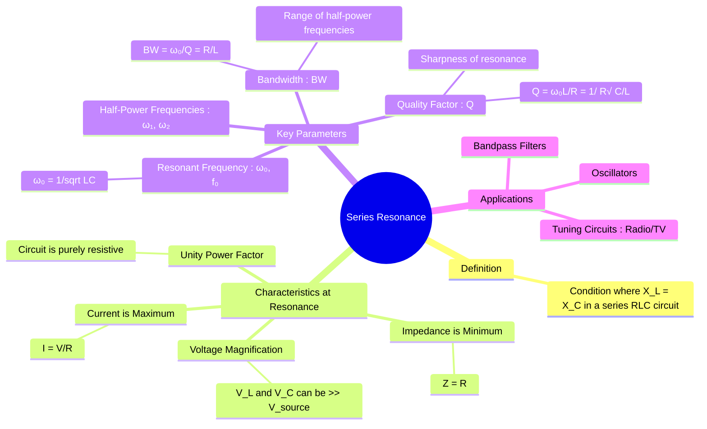

---
tags:
  - ac-circuits
  - resonance
  - rlc-circuits
  - bandpass-filter
  - quality-factor
created: 2025-09-23
aliases:
  - Series Resonance
  - RLC Series Resonance
subject: "[[2. Electric Circuits/Electric Circuits|Electric Circuits]]"
parent:
  - "[[Resonance]]"
confidence: 9
---
###### Mind Map 

---
### Series Resonance in RLC Circuits
#series-resonance #rlc-circuit #resonance

> **Series Resonance** is a fundamental phenomenon that ==occurs in a series RLC circuit at a specific frequency where the inductive reactance ($X_L$) and capacitive reactance ($X_C$) are equal in magnitude and cancel each other out==. ==At this resonant frequency, the circuit's impedance is at its minimum, causing the current to be at its maximum.== This property is extensively used in tuning circuits and filters.

#### Condition for Resonance
#resonance/condition

For a series RLC circuit, the total impedance $\mathbf{Z}$ is given by:
$$\mathbf{Z} = R + j(\omega L - \frac{1}{\omega C})$$
==Resonance occurs when the imaginary part of the impedance is zero, making the circuit purely resistive.==
$$X_L - X_C = 0 \implies \omega L = \frac{1}{\omega C}$$

---
#### Resonant Frequency ($\omega_0$)
#resonant-frequency

![[Resonance#Resonant Frequency]]

#### Characteristics at Resonance
#resonance/characteristics

At the resonant frequency $\omega_0$:
1.  **Minimum Impedance**: The total impedance is minimum and purely real.
    $$\mathbf{Z}_{min} = R$$
2.  **Maximum Current**: The current flowing through the circuit reaches its maximum value.
    $$\mathbf{I}_{max} = \frac{\mathbf{V}}{R}$$
3.  **Unity Power Factor**: Since the impedance is purely resistive, the voltage and current are in phase.
    $$\text{Power Factor} = \cos(0^\circ) = 1$$
4.  **Voltage Magnification**: The magnitudes of the voltage across the inductor ($V_L$) and the capacitor ($V_C$) are equal and can be much larger than the source voltage ($V$).
    $$|\mathbf{V}_L| = |\mathbf{I}_{max} (j\omega_0 L)| = \frac{V}{R} \omega_0 L = Q V$$
    $$|\mathbf{V}_C| = |\mathbf{I}_{max} (\frac{1}{j\omega_0 C})| = \frac{V}{R} \frac{1}{\omega_0 C} = Q V$$
    Here, $Q$ is the [[Quality Factor (Q-Factor)]]. Note that $\mathbf{V}_L$ and $\mathbf{V}_C$ are 180° out of phase and cancel each other out in the KVL equation.

---
#### Quality Factor (Q)
#quality-factor

![[Quality Factor (Q-Factor)#1. Series RLC Circuit]]

#### Bandwidth and Half-Power Frequencies
#bandwidth #half-power-frequency

- **Half-Power Frequencies ($\omega_1, \omega_2$)**: These are the frequencies on either side of $\omega_0$ at which the power dissipated in the circuit is half the maximum power at resonance ($P_{max} = I_{max}^2 R$). This occurs when the current is $I = I_{max}/\sqrt{2}$.
- **Bandwidth (BW)**: The bandwidth is the range of frequencies between the half-power points. It measures the selectivity of the circuit.
    $$\boxed{\quad BW = \omega_2 - \omega_1 = \frac{R}{L} = \frac{\omega_0}{Q} \quad}$$
    A high Q-factor corresponds to a small bandwidth (high selectivity), while a low Q-factor corresponds to a large bandwidth (low selectivity).

The resonant frequency is the geometric mean of the half-power frequencies:
$$\omega_0 = \sqrt{\omega_1 \omega_2}$$

---
### Related Concepts
#series-resonance/related-concepts

> [[Parallel Resonance in RLC Circuits]] (The dual of series resonance with opposite characteristics)

[[Quality Factor (Q-Factor)]] (A detailed look at the Q-factor)
[[Bandwidth and Selectivity]] (Explores the relationship between Q and bandwidth in detail)
[[Phasors and Impedance Concept]]