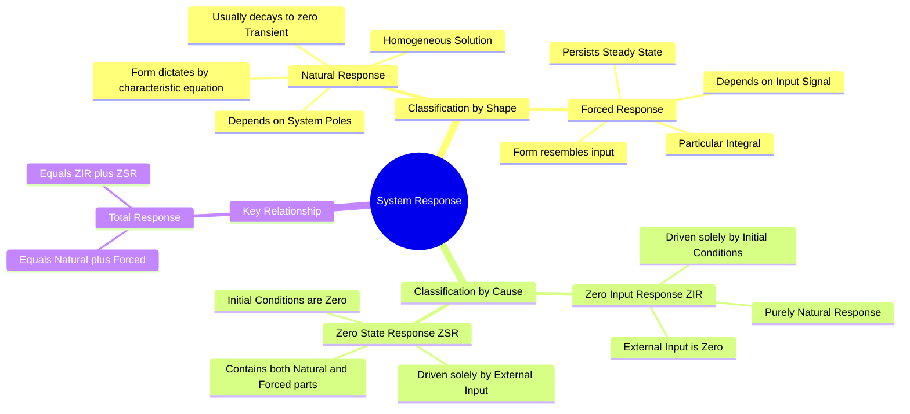

---
tags:
  - circuit-theory
  - signals-and-systems
  - transient-response
  - differential-equations
  - gate
aliases:
  - Homogeneous and Particular Solutions
  - Zero Input Response and Zero State Response
  - ZIR and ZSR
subject:
  - "[[Electric Circuits]]"
  - "[[Signals & Systems]]"
parent:
  - Transient Response Analysis
  - "[[Transient Analysis]]"
confidence: 10
---
###### Mind Map

---
### Natural and Forced Response
#circuit-theory/transients #signals-and-systems 

> The complete response of a linear time-invariant (LTI) system to an external excitation can be analyzed from two different perspectives: **Shape of the waveform** (Natural vs. Forced Response) or **Cause of the response** (Zero-Input vs. Zero-State Response). Understanding both classifications and how they interrelate is essential for solving differential equations and Laplace transform problems in GATE.

#### 1. Classification by Waveform Shape (Mathematical Form)
#transients/mathematical-form

This classification stems from the classical solution to linear differential equations:
$$\text{Total Response } y(t) = \text{Homogeneous Solution } y_h(t) + \text{Particular Solution } y_p(t)$$

**A. Natural Response ($y_n(t)$ or Homogeneous Solution):**
*   **Definition:** The system's response to the initial stored energy, assuming the external input is suddenly removed ($f(t) = 0$). 
*   **Characteristics:** Its shape depends **entirely on the system itself** (the passive components R, L, C) and is independent of the input waveform.
*   **Determination:** Found by solving the Characteristic Equation (roots/poles of the system). For stable circuits, it consists of decaying exponentials (e.g., $Ae^{-t/\tau}$) or damped sinusoids.
*   **Role:** It allows the total solution to satisfy the specific initial conditions of the circuit. Over time, it usually decays, forming the **Transient Response**.

**B. Forced Response ($y_f(t)$ or Particular Solution):**
*   **Definition:** The system's response dictated entirely by the external forcing function (the input source).
*   **Characteristics:** Its shape **mimics the input signal**. If the input is a constant DC, the forced response is a constant. If the input is a sinusoid at frequency $\omega$, the forced response is a sinusoid at frequency $\omega$.
*   **Role:** It represents what the system will do long after the switch is thrown. It is generally synonymous with the **Steady-State Response**.

$$\boxed{\quad \text{Total Response } x(t) = x_{natural}(t) + x_{forced}(t) \quad}$$

---
#### 2. Classification by Cause (Source of Excitation)
#transients/zir-zsr

In modern control theory and Signals & Systems, we often split the response based on what is driving it, invoking the Principle of Superposition.

**A. Zero-Input Response (ZIR):**
*   **Definition:** The response when the external input is zero ($u(t) = 0$), but initial conditions are non-zero.
*   **Nature:** Since there is no input, the ZIR is formed *entirely* of natural response terms.

**B. Zero-State Response (ZSR):**
*   **Definition:** The response when initial conditions are zero (the system is "relaxed" or in a zero state), but an external input $u(t)$ is applied.
*   **Nature:** The ZSR contains **both** the Forced Response (due to the input) **and** a portion of the Natural Response (to ensure the total response starts at zero at $t=0$).

$$\boxed{\quad \text{Total Response } x(t) = \text{ZIR} + \text{ZSR} \quad}$$

---
#### 3. The GATE Trap: How They Intersect
#gate/concept

A common conceptual trap is assuming Natural Response = ZIR and Forced Response = ZSR. **This is false.**

*   $\text{ZIR} = \text{Natural Response due to Initial Conditions}$
*   $\text{ZSR} = \text{Forced Response} + \text{Natural Response due to Input Application}$

Therefore:
$$\text{Total Natural Response} = \text{ZIR} + (\text{Natural part of ZSR})$$
$$\text{Total Forced Response} = \text{Forced part of ZSR}$$

---
#### 4. Example: First-Order Step Response
#circuit-theory/example

Consider an RC circuit with initial capacitor voltage $V_0$, subjected to a DC step input $V_s u(t)$ at $t=0$.

The standard time-domain solution is:
$$v_c(t) = V_s + (V_0 - V_s) e^{-t/RC} \quad \text{for } t \ge 0$$

**Breakdown 1: Natural vs Forced**
*   **Forced Response ($v_f$):** $V_s$ (This is the steady-state, matching the DC input).
*   **Natural Response ($v_n$):** $(V_0 - V_s) e^{-t/RC}$ (This has the exponential shape dictated by the circuit's pole at $s = -1/RC$).

**Breakdown 2: ZIR vs ZSR**
*   **Zero-Input Response (ZIR):** Set $V_s = 0$.
    $$ZIR = V_0 e^{-t/RC}$$
*   **Zero-State Response (ZSR):** Set $V_0 = 0$.
    $$ZSR = V_s - V_s e^{-t/RC} = V_s(1 - e^{-t/RC})$$
*   *Notice that the ZSR contains both the forced part ($V_s$) and a natural part ($-V_s e^{-t/RC}$).*

---
#### 5. Laplace Transform Perspective
#signals-and-systems/laplace

When taking the Laplace transform of a differential equation, the initial conditions generate terms that add to the numerator.

$$Y(s) = \underbrace{H(s) X(s)}_{\text{ZSR}} + \underbrace{\frac{\text{I.C. Terms}}{\text{Characteristic Polynomial}}}_{\text{ZIR}}$$

*   The poles of $H(s)$ (denominator roots) dictate the form of the **Natural Response**.
*   The poles of $X(s)$ (input signal roots) dictate the form of the **Forced Response**.

---
### Related Concepts
#topic/related-concepts

> [[Switching Transients]] (Application of these concepts in circuits)

[[State Variable Analysis and Design]] (State Transition Matrix handles ZIR, Convolution Integral handles ZSR)
[[Calculus - Differential Equations]] (Homogeneous and Particular solutions)
[[Transfer Function]] (Strictly defines the ZSR for an impulse input)
[[Poles and Zeros]]
[[Characteristic Equation]]