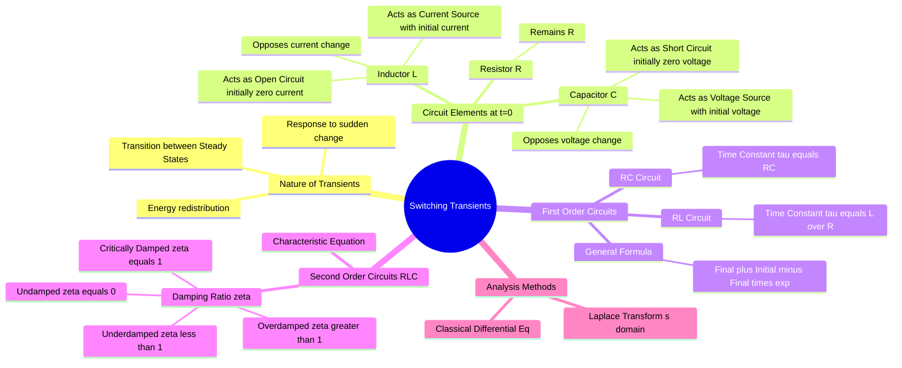

---
tags:
  - circuit-theory
  - power-system
  - transients
  - gate
  - differential-equations
aliases:
  - Transient Response
  - RL RC RLC Transients
  - Initial Conditions
subject: "[[Electric Circuits]]"
parent:
  - "[[Transient Analysis]]"
confidence: 10
---

---
### Switching Transients
#circuit-theory/transients #power-system/switching

> **Switching Transients** refer to the temporary surges in voltage and current that occur in an electrical circuit when the network state is suddenly changed (e.g., closing/opening a switch, a fault occurrence, or a sudden change in excitation). This period represents the transition from one steady-state condition to another, governed by the energy storage elements (Inductors and Capacitors) which cannot change their energy state instantaneously.

#### Behavior of Passive Elements at Switching Instant ($t=0^+$)
#transients/initial-conditions

The key to solving transient problems is determining the initial conditions immediately after switching.

1.  **Resistor ($R$):**
    *   Behavior is instantaneous. $v_R(t) = i_R(t)R$ holds for all $t$.
2.  **Inductor ($L$):**
    *   **Principle:** Current through an inductor cannot change instantaneously (Flux linkage is continuous).
    *   Condition: $i_L(0^-) = i_L(0^+)$.
    *   **At $t=0^+$:**
        *   If uncharged ($i_L(0^-)=0$): Acts as an **Open Circuit**.
        *   If charged ($i_L(0^-)=I_0$): Acts as a **Current Source** of value $I_0$.
    *   **At $t \to \infty$ (DC Steady State):** Acts as a **Short Circuit**.
3.  **Capacitor ($C$):**
    *   **Principle:** Voltage across a capacitor cannot change instantaneously (Charge is continuous).
    *   Condition: $v_C(0^-) = v_C(0^+)$.
    *   **At $t=0^+$:**
        *   If uncharged ($v_C(0^-)=0$): Acts as a **Short Circuit**.
        *   If charged ($v_C(0^-)=V_0$): Acts as a **Voltage Source** of value $V_0$.
    *   **At $t \to \infty$ (DC Steady State):** Acts as an **Open Circuit**.

---
#### First-Order Circuits (RL and RC)
#transients/first-order

For DC excitation, the response $x(t)$ (current or voltage) of a first-order circuit follows a standard exponential form.

**The Universal Formula (Shortcut):**
$$\boxed{\quad x(t) = x(\infty) + \left[ x(0^+) - x(\infty) \right] e^{-t/\tau} \quad}$$
Where:
*   $x(t)$: The variable of interest ($i_L$ or $v_C$).
*   $x(0^+)$: Initial value immediately after switching.
*   $x(\infty)$: Final steady-state value.
*   $\tau$: **Time Constant**.

**Time Constants ($\tau$):**
*   **RL Circuit:** $\tau = \frac{L}{R_{eq}}$
*   **RC Circuit:** $\tau = R_{eq}C$
    *(Note: $R_{eq}$ is the Thevenin equivalent resistance seen from the terminals of the storage element).*

**Example: Charging of Series RL Circuit (Step Input $V$):**
*   $i(0^+) = 0$
*   $i(\infty) = V/R$
*   Result: $i(t) = \frac{V}{R} (1 - e^{-(R/L)t})$

---
#### Second-Order Circuits (RLC)
#transients/second-order

The transient response is governed by a second-order linear differential equation:
$$\frac{d^2x}{dt^2} + 2\zeta\omega_n \frac{dx}{dt} + \omega_n^2 x = f(t)$$

**Key Parameters:**
1.  **Undamped Natural Frequency ($\omega_n$):**
    $$\omega_n = \frac{1}{\sqrt{LC}}$$
2.  **Damping Ratio ($\zeta$):**
    *   For Series RLC: $\zeta = \frac{R}{2} \sqrt{\frac{C}{L}}$
    *   For Parallel RLC: $\zeta = \frac{1}{2R} \sqrt{\frac{L}{C}}$

**Nature of Response based on $\zeta$:**
*   **$\zeta > 1$ (Overdamped):** Two distinct real roots. Slow, non-oscillatory approach to steady state.
*   **$\zeta = 1$ (Critically Damped):** Two equal real roots. Fastest non-oscillatory response.
*   **$\zeta < 1$ (Underdamped):** Complex conjugate roots. Oscillatory response (decays with envelope $e^{-\zeta\omega_n t}$).
    $$\text{Frequency of oscillation: } \omega_d = \omega_n \sqrt{1 - \zeta^2}$$
*   **$\zeta = 0$ (Undamped):** Purely imaginary roots. Sustained oscillations at $\omega_n$.

---
#### Laplace Transform Approach (Analysis Method)
#transients/laplace

For complex switching or non-standard inputs, the Laplace domain (s-domain) is preferred.

1.  **Transform the Circuit:**
    *   $R \to R$
    *   $L \to sL$ (Series voltage source $-Li(0)$ if initial current exists).
    *   $C \to 1/sC$ (Series voltage source $v(0)/s$ if initial voltage exists).
    *   Sources: DC $V \to V/s$, Step $u(t) \to 1/s$.
2.  **Solve Algebraically:** Find $I(s)$ or $V(s)$.
3.  **Inverse Laplace:** Apply partial fractions and take $\mathcal{L}^{-1}$ to find time domain response.

**Initial and Final Value Theorems:**
*   Initial Value: $f(0^+) = \lim_{s \to \infty} sF(s)$
*   Final Value: $f(\infty) = \lim_{s \to 0} sF(s)$ (Valid only if poles are in LHP).

---
#### Switching Transients in Power Systems
#power-system/switching-transients

Specific phenomena occurring in high-voltage power systems during switching:

* **Resistance Switching:** Connecting a resistor in parallel with circuit breaker contacts to dampen the restriking voltage transients.
* **Current Chopping:** Sudden interruption of current before natural zero crossing (common in vacuum circuit breakers), leading to high transient over-voltages ($V = i_{chop}\sqrt{L/C}$).
* **Restriking Voltage / TRV:** The transient voltage appearing across breaker contacts immediately after arc extinction. High frequency oscillations determined by system $L$ and $C$.

---
### Related Concepts
#topic/related-concepts

> [[Transient Response Analysis]]

[[LC Circuit Transients]]
[[The Laplace Transform]]
[[Series Resonance in RLC Circuits]]
[[Circuit Breakers]] (Application of TRV)
[[Natural and Forced Response]]
[[Time Constant]]
[[Natural Frequency and Damping Ratio|Damping Ratio]]
