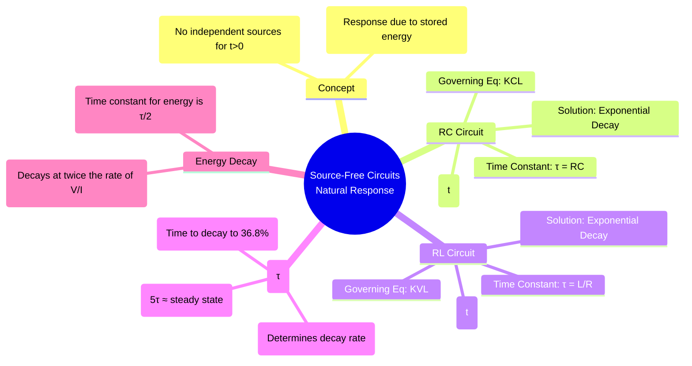

---
tags:
  - transient-analysis
  - source-free
  - natural-response
  - rc-circuit
  - rl-circuit
  - time-constant
created: 2025-09-23
aliases:
  - Source-Free Circuits
  - Natural Response
  - Source-Free Transients
subject: "[[Electric Circuits]]"
parent: "[[Transient Analysis]]"
confidence: 9
---
###### Mind Map

---
### Source-Free RL and RC Circuits
#natural-response #source-free #first-order-circuits

> A source-free circuit is one where all independent voltage and current sources have been turned off or disconnected after a switching event (i.e., for $t>0$). The circuit's subsequent behavior, driven solely by the energy initially stored in its capacitors and inductors, is known as its **natural response**. This response is always a decaying exponential in first-order circuits.

#### Source-Free RC Circuit
#rc-circuit

Consider a capacitor with an initial voltage $V_0$ connected in parallel with a resistor R at $t=0$.
Applying KCL at the top node for $t>0$:
$$i_C + i_R = 0 \implies C \frac{dv_C}{dt} + \frac{v_C}{R} = 0$$
This is a first-order homogeneous differential equation. The solution is of the form $v_C(t) = A e^{st}$. Substituting this into the equation yields the characteristic equation $s = -1/RC$.
The constant $A$ is the initial voltage $v_C(0^+) = V_0$.

The voltage across the capacitor decays exponentially to zero with a time constant $\tau = RC$.
$$\boxed{\quad v_C(t) = V_0 e^{-t/\tau}, \quad \text{where } \tau = RC \quad}$$
All other quantities, such as the current $i_C(t) = -\frac{V_0}{R}e^{-t/\tau}$, also decay with the same time constant.

#### Source-Free RL Circuit
#rl-circuit

Consider an inductor with an initial current $I_0$ connected in series with a resistor R at $t=0$.
Applying KVL for the loop for $t>0$:
$$v_L + v_R = 0 \implies L \frac{di_L}{dt} + i_L R = 0$$
This is also a first-order homogeneous differential equation. The solution is of the form $i_L(t) = A e^{st}$, which yields the characteristic equation $s = -R/L$.
The constant $A$ is the initial current $i_L(0^+) = I_0$.

The current through the inductor decays exponentially to zero with a time constant $\tau = L/R$.
$$\boxed{\quad i_L(t) = I_0 e^{-t/\tau}, \quad \text{where } \tau = L/R \quad}$$
All other quantities, such as the voltage $v_L(t) = -I_0 R e^{-t/\tau}$, also decay with the same time constant.

#### The Time Constant ($\tau$)
#time-constant

The time constant is a fundamental parameter that characterizes the rate of decay of the natural response in a first-order circuit.
-   **Definition**: $\tau$ is the time required for the response to decay to $e^{-1}$ (approximately 36.8%) of its initial value.
-   **Significance**: A smaller time constant means a faster decay, while a larger time constant indicates a slower decay.
-   **Rule of Thumb**: After 5 time constants ($t=5\tau$), the response has decayed to less than 1% of its initial value ($e^{-5} \approx 0.0067$), and the transient is considered to be effectively over.

#### Energy Decay
#energy-decay

The energy stored in the reactive element also decays over time.
-   **Capacitor**:
    $W_C(t) = \frac{1}{2} C v_C^2(t) = \frac{1}{2} C (V_0 e^{-t/\tau})^2 = (\frac{1}{2} C V_0^2) e^{-2t/\tau}$
-   **Inductor**:
    $W_L(t) = \frac{1}{2} L i_L^2(t) = \frac{1}{2} L (I_0 e^{-t/\tau})^2 = (\frac{1}{2} L I_0^2) e^{-2t/\tau}$

In both cases, the energy decays with a time constant of $\mathbf{\tau/2}$.
$$\boxed{\quad W(t) = W_0 e^{-2t/\tau} \quad}$$
The stored energy decays twice as fast as the voltage or current.

---
### Related Concepts
#natural-response/related-concepts

> [[Initial and Final Conditions in Inductors and Capacitors]] (Essential for finding $V_0$ and $I_0$)

[[Step Response of RL and RC Circuits]] (The response of a circuit *with* sources, which includes a forced response in addition to the natural response)
[[Time Constant]]
[[Calculus - Differential Equations]] (The mathematical foundation for solving these circuits)