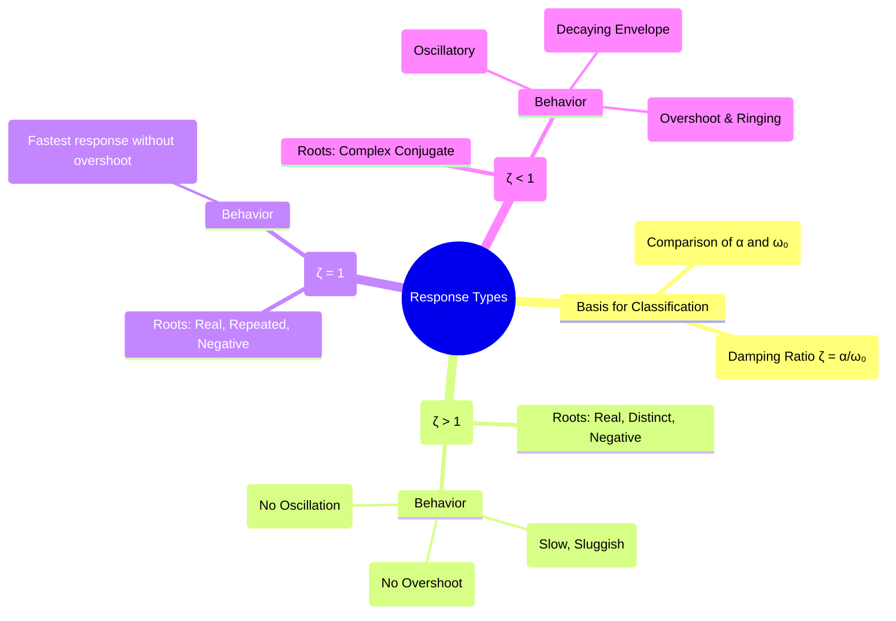

---
tags:
  - transient-analysis
  - second-order-systems
  - damping
  - rlc-circuits
  - control-systems
created: 2025-09-23
aliases:
  - Damping Types
  - Second-Order Response Types
  - Damped Response
subject: "[[2. Electric Circuits/Electric Circuits|Electric Circuits]]"
parent: "[[4. Transient Analysis]]"
confidence: 9
---

---
### Overdamped, Critically Damped, and Underdamped Responses
#damping #second-order-systems #transient-response #rlc-circuit

> The natural response of a second-order system, such as an RLC circuit, is categorized into three distinct types based on the level of damping present. The damping, determined by the circuit's resistance, dictates whether the system returns to its steady-state smoothly, quickly, or with oscillations. This classification is fundamental to understanding the transient behavior of circuits and control systems.

#### Classification Criteria
#damping-ratio #natural-frequency
The type of response is determined by comparing the **damping factor ($\alpha$)** to the **undamped natural frequency ($\omega_0$)**. An equivalent and more universal parameter is the **damping ratio ($\zeta$)**:

$$\boxed{\quad \zeta = \frac{\alpha}{\omega_0} \quad}$$

| Response Type | Condition (ζ) | Condition (α, ω₀) | Roots of Characteristic Equation |
| :--- | :--- | :--- | :--- |
| **Overdamped** | $\zeta > 1$ | $\alpha > \omega_0$ | Two real, distinct, negative roots ($s_1, s_2$) |
| **Critically Damped** | $\zeta = 1$ | $\alpha = \omega_0$ | Two real, repeated, negative roots ($-\alpha$) |
| **Underdamped** | $\zeta < 1$ | $\alpha < \omega_0$ | Complex conjugate pair ($-\alpha \pm j\omega_d$) |

---
#### 1. Overdamped Response ($\zeta > 1$)
#overdamped
-   **Description**: This occurs when the damping in the circuit is very high (e.g., a large resistance in a series RLC circuit). The system responds slowly and sluggishly to a change.
-   **Natural Response Form**:
    $$x_n(t) = A_1 e^{s_1 t} + A_2 e^{s_2 t}$$
-   **Characteristics**:
    -   The response approaches the final value without any oscillation or overshoot.
    -   It is a sum of two decaying exponentials, with the slower one (the root closer to zero) dominating the response time.
    -   **Analogy**: A door closer that is set too strong, causing the door to shut very slowly.

---
#### 2. Critically Damped Response ($\zeta = 1$)
#critically-damped
-   **Description**: This is the special case that represents the boundary between the overdamped and underdamped regions. The damping is at an optimal level to prevent oscillation while achieving the fastest possible response time.
-   **Natural Response Form**:
    $$x_n(t) = (A_1 + A_2 t) e^{-\alpha t}$$
-   **Characteristics**:
    -   The response reaches its final value in the minimum possible time without any overshoot.
    -   This is often the desired response in systems where fast settling time is important (e.g., control systems, shock absorbers).

---
#### 3. Underdamped Response ($\zeta < 1$)
#underdamped
-   **Description**: This occurs when the damping is low. The energy storage elements (L and C) exchange energy, causing the response to oscillate.
-   **Natural Response Form**: The response is a sinusoid with an exponentially decaying envelope.
    $$x_n(t) = e^{-\alpha t} (A_1 \cos(\omega_d t) + A_2 \sin(\omega_d t))$$
    where $\omega_d = \omega_0\sqrt{1-\zeta^2}$ is the **damped natural frequency**.
-   **Characteristics**:
    -   The response **overshoots** its final value and then **rings** (oscillates with decreasing amplitude) before settling.
    -   The rate of decay is set by the damping factor $\alpha$.
    -   The frequency of oscillation is the damped frequency $\omega_d$, which is always less than the undamped frequency $\omega_0$.
    -   **Analogy**: A pendulum swinging in the air; its oscillations gradually die out due to air resistance.

#### Graphical Comparison of Step Responses
A visual comparison of the step response for the three types is highly illustrative. For a system starting at 0 and moving to a final value of 1:
-   The **underdamped** response rises fastest, overshoots 1, dips below it, and oscillates towards 1.
-   The **critically damped** response rises quickly to 1 without any overshoot.
-   The **overdamped** response rises more slowly than the other two and smoothly approaches 1 from below.

---
### Related Concepts
#damping/related-concepts

> [[Source-Free Series and Parallel RLC Circuits]] (Where these response types are derived)

[[Step Response of Series and Parallel RLC Circuits]] (Where these responses appear as the transient part)
[[Natural Frequency and Damping Ratio]] (A more detailed look at the defining parameters)
[[Control System - Second-Order Systems]] (The exact same principles and mathematical forms apply)