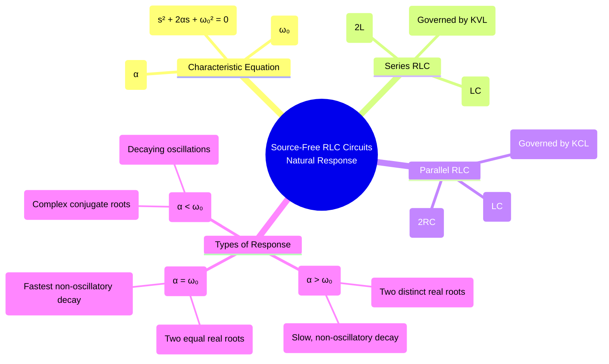

---
tags:
  - transient-analysis
  - rlc-circuits
  - second-order-circuits
  - natural-response
  - damping
created: 2025-09-23
aliases:
  - Source-Free RLC
  - Natural Response of RLC
  - Second-Order Natural Response
subject: "[[2. Electric Circuits/Electric Circuits|Electric Circuits]]"
parent: "[[4. Transient Analysis]]"
confidence: 9
---

---
### Source-Free Series and Parallel RLC Circuits
#natural-response #second-order-circuits #rlc-circuit

> The **natural response** of an RLC circuit describes its behavior for $t>0$ without any independent sources, driven only by the initial energy stored in the inductor and capacitor. As second-order systems, their response is more complex than first-order circuits and can be categorized into three distinct types: overdamped, critically damped, and underdamped.

#### The Characteristic Equation
#characteristic-equation #damping-factor #natural-frequency
The behavior of any source-free RLC circuit is described by a second-order homogeneous linear differential equation of the form:
$$\frac{d^2x(t)}{dt^2} + 2\alpha \frac{dx(t)}{dt} + \omega_0^2 x(t) = 0$$
-   $x(t)$ can be a voltage or current.
-   $\alpha$ is the **Neper frequency** or **damping factor**, which determines the rate of decay of the response.
-   $\omega_0$ is the **undamped natural frequency** or **resonant frequency**, which is the frequency at which the circuit would oscillate without damping.

The corresponding characteristic equation is:
$$s^2 + 2\alpha s + \omega_0^2 = 0$$
The roots of this equation determine the nature of the response:
$$\boxed{\quad s_{1,2} = -\alpha \pm \sqrt{\alpha^2 - \omega_0^2} \quad}$$

#### Source-Free Series RLC Circuit
#series-rlc
Applying KVL to a source-free series RLC circuit gives $L\frac{di}{dt} + Ri + v_C = 0$. Differentiating and substituting $i = C\frac{dv_C}{dt}$ eventually leads to a differential equation whose characteristic equation is $s^2 + \frac{R}{L}s + \frac{1}{LC} = 0$.
By comparison, the parameters are:
$$\boxed{\quad \alpha = \frac{R}{2L} \quad \text{and} \quad \omega_0 = \frac{1}{\sqrt{LC}} \quad}$$

#### Source-Free Parallel RLC Circuit
#parallel-rlc
Applying KCL to a source-free parallel RLC circuit gives $\frac{v}{R} + C\frac{dv}{dt} + i_L = 0$. Differentiating and substituting $v = L\frac{di_L}{dt}$ leads to a characteristic equation $s^2 + \frac{1}{RC}s + \frac{1}{LC} = 0$.
By comparison, the parameters are:
$$\boxed{\quad \alpha = \frac{1}{2RC} \quad \text{and} \quad \omega_0 = \frac{1}{\sqrt{LC}} \quad}$$

#### Types of Natural Response
#overdamped #critically-damped #underdamped
The form of the solution depends on the relationship between $\alpha$ and $\omega_0$.

1.  **Overdamped Response ($\alpha > \omega_0$)**
    -   **Condition**: The damping is large ($R^2 > 4L/C$ for series, $R^2 < L/(4C)$ for parallel).
    -   **Roots**: $s_1$ and $s_2$ are real, negative, and distinct.
    -   **Response Form**: The response is a sum of two decaying exponentials and is non-oscillatory.
        $$\boxed{\quad x(t) = A_1 e^{s_1 t} + A_2 e^{s_2 t} \quad}$$
    -   **Behavior**: The circuit returns to zero slowly without oscillating.

2.  **Critically Damped Response ($\alpha = \omega_0$)**
    -   **Condition**: The damping is at a critical level ($R^2 = 4L/C$ for series).
    -   **Roots**: $s_1 = s_2 = -\alpha$. The roots are real and repeated.
    -   **Response Form**:
        $$\boxed{\quad x(t) = (A_1 + A_2 t) e^{-\alpha t} \quad}$$
    -   **Behavior**: The circuit returns to zero as fast as possible without any oscillation.

3.  **Underdamped Response ($\alpha < \omega_0$)**
    -   **Condition**: The damping is small ($R^2 < 4L/C$ for series).
    -   **Roots**: The roots are complex conjugates: $s_{1,2} = -\alpha \pm j\omega_d$.
    -   **Damped Natural Frequency ($\omega_d$)**: This is the frequency of the oscillations.
        $$\boxed{\quad \omega_d = \sqrt{\omega_0^2 - \alpha^2} \quad}$$
    -   **Response Form**: The response is a sinusoid with an exponentially decaying amplitude.
        $$\boxed{\quad x(t) = e^{-\alpha t} (A_1 \cos(\omega_d t) + A_2 \sin(\omega_d t)) \quad}$$
    -   **Behavior**: The circuit oscillates as the energy is exchanged between the inductor and capacitor, with the oscillations gradually dying out due to the resistor.

#### Finding the Constants ($A_1, A_2$)
To solve for the two unknown constants ($A_1, A_2$) in the solution, two initial conditions are required: the value of the variable at $t=0^+$ and the value of its first derivative at $t=0^+$.
1.  **Find $x(0^+)$**: Use the continuity principles $v_C(0^+) = v_C(0^-)$ and $i_L(0^+) = i_L(0^-)$.
2.  **Find $\frac{dx}{dt}|_{t=0^+}$**: Use the fundamental circuit equations (KVL/KCL) at $t=0^+$. For example, in a series circuit, $v_L(0^+) = L\frac{di_L}{dt}|_{t=0^+}$, and from KVL, $v_L(0^+) = -v_R(0^+) - v_C(0^+)$.

---
### Related Concepts
#natural-response/related-concepts

> [[Step Response of Series and Parallel RLC Circuits]] (The complete response, including the forced response)

[[Initial and Final Conditions in Inductors and Capacitors]] (Crucial for finding the solution constants)
[[Natural Frequency and Damping Ratio]] (A more detailed look at the parameters governing the response type)
[[Control System - Second-Order Systems]] (The mathematical model is identical)
[[Calculus - Differential Equations]]