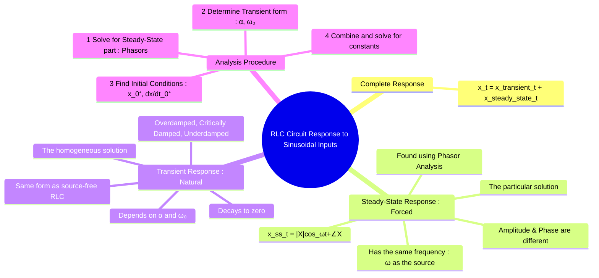

---
tags:
  - transient-analysis
  - rlc-circuits
  - sinusoidal-response
  - ac-transients
  - forced-response
  - steady-state
created: 2025-09-23
aliases:
  - RLC Sinusoidal Response
  - AC Transients
subject: "[[2. Electric Circuits/Electric Circuits|Electric Circuits]]"
parent:
  - "[[Transient Analysis]]"
confidence: 9
---

---
### RLC Circuit Response to Sinusoidal Inputs
#rlc-circuit #sinusoidal-response #ac-transients

> When a sinusoidal source is suddenly connected to an RLC circuit, the total response is a combination of a temporary **transient response** (the circuit's natural behavior) and a permanent **steady-state response** (the circuit's forced behavior at the source frequency). The transient response ensures that the circuit's state variables ($v_C, i_L$) transition smoothly from their initial values to the final sinusoidal steady state.

#### The Complete Response
#complete-response

The total response for any voltage or current $x(t)$ in the circuit is the sum of the transient and steady-state components:
$$\boxed{\quad x(t) = x_t(t) + x_{ss}(t) \quad}$$
- **$x_{ss}(t)$ (Steady-State Response)**: Also called the forced response or the particular solution. This is the sinusoidal response that remains after all transients have decayed. It has the same frequency as the input source.
- **$x_t(t)$ (Transient Response)**: Also called the natural response or the homogeneous solution. This is the circuit's own inherent response, which depends on its R, L, and C values. It decays to zero over time.

> [!warning] Notes (RL Circuit)
> In RL circuits excited by sinusoidal sources, the transient term may introduce a DC offset in current depending on the switching instant.
> > See [[Transient Analysis]]

---
#### Steady-State Response
#forced-response #phasor-analysis

This part of the solution is found using the standard AC steady-state analysis techniques with **phasors**.
1.  Represent the sinusoidal source and the circuit elements in the phasor domain at the source frequency $\omega$.
2.  Solve for the desired phasor variable $\mathbf{X}$ (e.g., $\mathbf{V_o}$ or $\mathbf{I_o}$) using methods like KVL, KCL, voltage/current division, etc.
3.  Convert the resulting phasor $\mathbf{X} = |\mathbf{X}| \angle \phi$ back to the time domain.
$$\boxed{\quad x_{ss}(t) = |\mathbf{X}| \cos(\omega t + \phi) \quad}$$
This steady-state response depends on the source frequency but **not** on the initial conditions of the circuit.

---
#### Transient Response
#natural-response #damping

This part of the solution is identical in form to the response of a source-free RLC circuit.
1.  Determine the damping factor $\alpha$ and the undamped natural frequency $\omega_0$ from the circuit configuration for $t>0$.
2.  The form of the transient response depends on the type of damping:
    -   **Overdamped ($\alpha > \omega_0$)**: $x_t(t) = A_1 e^{s_1 t} + A_2 e^{s_2 t}$
    -   **Critically Damped ($\alpha = \omega_0$)**: $x_t(t) = (A_1 + A_2 t) e^{-\alpha t}$
    -   **Underdamped ($\alpha < \omega_0$)**: $x_t(t) = e^{-\alpha t} (A_1 \cos(\omega_d t) + A_2 \sin(\omega_d t))$
The constants $A_1$ and $A_2$ are determined by the initial conditions.

---
#### Procedure for Finding the Complete Response
#transient-analysis/procedure

1.  **Find the Steady-State Response $x_{ss}(t)$**: Use phasor analysis at the source frequency $\omega$.
2.  **Determine the Transient Response Form $x_t(t)$**: Find $\alpha$ and $\omega_0$ for the circuit for $t>0$ and choose the appropriate form for $x_t(t)$ with unknown constants $A_1, A_2$.
3.  **Find Initial Conditions**: Determine the values of the variable $x(0^+)$ and its derivative $\frac{dx}{dt}|_{t=0^+}$ by analyzing the circuit at $t=0^-$ and $t=0^+$.
4.  **Solve for the Constants**:
    -   Use the complete response equation $x(t) = x_{ss}(t) + x_t(t)$ at $t=0^+$.
        $$x(0^+) = x_{ss}(0^+) + x_t(0^+)$$
        Since you know $x(0^+)$ and can calculate $x_{ss}(0^+)$, you can find $x_t(0^+)$. This gives the first equation for $A_1, A_2$.
    -   Differentiate the complete response and evaluate at $t=0^+$.
        $$\frac{dx}{dt}|_{t=0^+} = \frac{dx_{ss}}{dt}|_{t=0^+} + \frac{dx_t}{dt}|_{t=0^+}$$
        This provides the second equation to solve for $A_1, A_2$.

---
### Related Concepts
#ac-transients/related-concepts

> [[Step Response of Series and Parallel RLC Circuits]] (A similar process, but for a DC input where the steady-state part is a constant)

[[Source-Free Series and Parallel RLC Circuits]] (This defines the transient part of the solution)
[[Phasors and Impedance Concept]] (The method for finding the steady-state part)
[[Overdamped, Critically Damped, and Underdamped Responses]]
[[Calculus - Differential Equations]] (The mathematical theory of combining particular and homogeneous solutions)