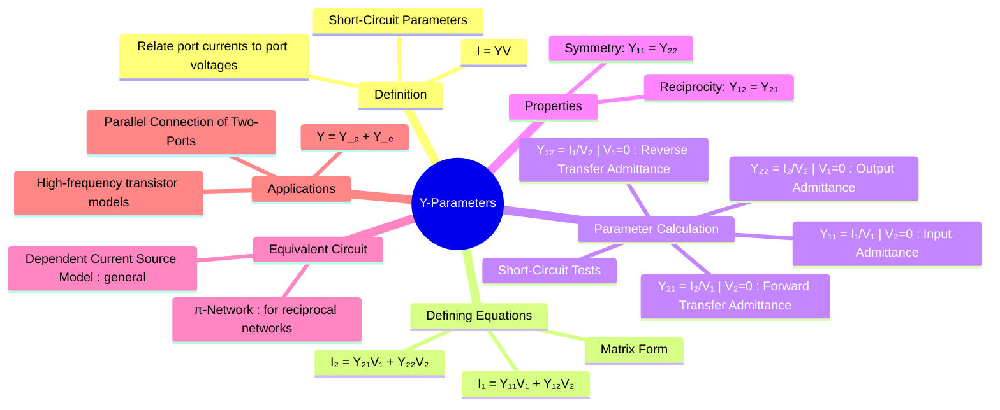

---
tags:
  - electric-circuits
  - two-port-networks
  - network-analysis
  - admittance
  - y-parameters
created: 2025-07-29
aliases:
  - Y-parameters
  - Admittance Parameters
  - Short-Circuit Parameters
subject: "[[Electric Circuits]]"
parent: "[[Two-Port Networks]]"
confidence: 9
---

---
### Admittance Parameters (Y-parameters)
#y-parameters #two-port-networks #short-circuit-parameters

> **Admittance parameters**, or **Y-parameters**, are a set of properties used to describe the electrical behavior of linear two-port networks. They relate the port currents ($I_1, I_2$) to the port voltages ($V_1, V_2$) with the voltages as the independent variables. They are also known as **short-circuit parameters** because they are calculated under short-circuit conditions ($V=0$).

Y-parameters are the dual of [[Impedance Parameters (Z-parameters)]].

#### Defining Equations
#y-parameters/definition

The relationship between the port currents and voltages is defined by the following pair of linear equations:

$$
\begin{align}
I_1 &= Y_{11}V_1 + Y_{12}V_2 \\
I_2 &= Y_{21}V_1 + Y_{22}V_2
\end{align}
$$

In matrix form, this is expressed as:

$$\boxed{\quad \begin{bmatrix} I_1 \\ I_2 \end{bmatrix} = \begin{bmatrix} Y_{11} & Y_{12} \\ Y_{21} & Y_{22} \end{bmatrix} \begin{bmatrix} V_1 \\ V_2 \end{bmatrix} \quad \text{or} \quad [I] = [Y][V] \quad}$$

By convention, currents $I_1$ and $I_2$ are assumed to be flowing **into** the network. All parameters ($Y_{11}, Y_{12}, Y_{21}, Y_{22}$) have units of Siemens (S).

---
#### Parameter Calculation (Short-Circuit Tests)
#y-parameters/calculation

The individual Y-parameters are determined by setting one of the port voltages to zero (i.e., short-circuiting the port) and then measuring the current-to-voltage ratios.

1.  **To find $Y_{11}$ and $Y_{21}$ (Short-circuit Port 2, i.e., $V_2=0$)**:
    *   **$Y_{11}$ (Short-Circuit Input Admittance)**:
        $$\boxed{\quad Y_{11} = \left. \frac{I_1}{V_1} \right|_{V_2=0} \quad}$$
    *   **$Y_{21}$ (Short-Circuit Forward Transfer Admittance)**:
        $$\boxed{\quad Y_{21} = \left. \frac{I_2}{V_1} \right|_{V_2=0} \quad}$$

2.  **To find $Y_{22}$ and $Y_{12}$ (Short-circuit Port 1, i.e., $V_1=0$)**:
    *   **$Y_{22}$ (Short-Circuit Output Admittance)**:
        $$\boxed{\quad Y_{22} = \left. \frac{I_2}{V_2} \right|_{V_1=0} \quad}$$
    *   **$Y_{12}$ (Short-Circuit Reverse Transfer Admittance)**:
        $$\boxed{\quad Y_{12} = \left. \frac{I_1}{V_2} \right|_{V_1=0} \quad}$$

---
#### Conditions for Reciprocity and Symmetry
#reciprocity #symmetry

1.  **Reciprocity**: A network is **reciprocal** if the ratio of the response current at one port to the excitation voltage at another port is the same if the excitation and response ports are interchanged.
    $$\boxed{\quad Y_{12} = Y_{21} \quad}$$
2.  **Symmetry**: A network is **symmetrical** if its electrical properties are the same when viewed from either port.
    $$\boxed{\quad Y_{11} = Y_{22} \quad}$$

---
#### Equivalent Circuit
#y-parameters/equivalent-circuit

For a **reciprocal** network, a simple passive **Pi-network (π-network)** is a common equivalent circuit.
The component admittance values are:
*   $Y_a = Y_{11} + Y_{12}$
*   $Y_b = Y_{22} + Y_{12}$
*   $Y_c = -Y_{12}$ (since $Y_{12} = Y_{21}$)

For a general (non-reciprocal) network, the equivalent circuit includes dependent current sources.

---
#### Application: Parallel Connection
#parallel-connection

Y-parameters are particularly useful for analyzing two-port networks connected in **parallel**. When two networks, A and B, are connected in parallel, the overall Y-parameter matrix of the combined network is simply the sum of the individual Y-parameter matrices.
$$\boxed{\quad [Y]_{\text{total}} = [Y]_A + [Y]_B \quad}$$
$$\begin{bmatrix} Y_{11} & Y_{12} \\ Y_{21} & Y_{22} \end{bmatrix}_{\text{total}} = \begin{bmatrix} Y_{11A} & Y_{12A} \\ Y_{21A} & Y_{22A} \end{bmatrix} + \begin{bmatrix} Y_{11B} & Y_{12B} \\ Y_{21B} & Y_{22B} \end{bmatrix}$$

---
### Related Concepts
#y-parameters/related-concepts

> [[Two-Port Networks]] (The parent category of network parameters)

[[Impedance Parameters (Z-parameters)]] (The dual of Y-parameters, related by $[Y] = [Z]^{-1}$)
[[Hybrid Parameters (h-parameters)]] and [[Transmission Parameters (ABCD-parameters)]] (Other common two-port representations)
[[Reciprocity Theorem]] (The underlying principle for the condition $Y_{12} = Y_{21}$)
[[Network Theorems]]