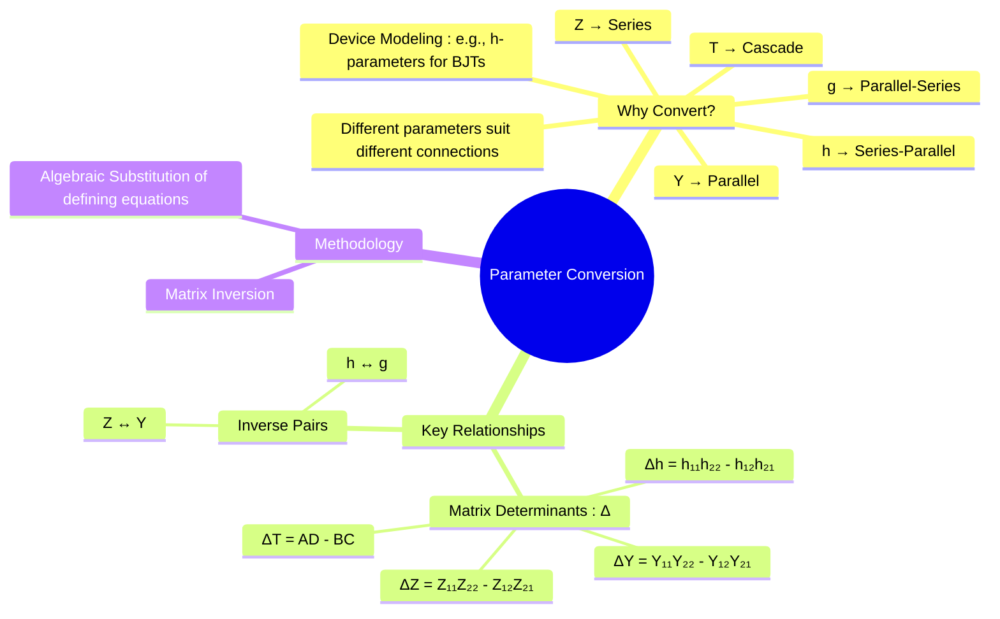

---
tags:
  - electric-circuits
  - two-port-networks
  - network-analysis
  - parameter-conversion
created: 2025-07-30
aliases:
  - Two-Port Parameter Conversion
  - Parameter Interrelations
subject: "[[Electric Circuits]]"
parent: "[[Two-Port Networks]]"
confidence: 9
---

---
### Conversion Between Two-Port Parameters
#parameter-conversion #two-port-networks

> Since all two-port parameter sets describe the same linear network, it is always possible to convert from one set of parameters to another, provided the parameters exist. This conversion is crucial when analyzing circuits with different types of interconnections or when a device is characterized by one parameter set (like [[Hybrid Parameters (h-parameters)|h-parameters]] for a transistor) but the analysis requires another (like [[Impedance Parameters (Z-parameters)|Z-parameters]] for series feedback).

The conversion can be performed either by algebraic manipulation of the defining equations or by using a standard conversion table.

#### The Determinant (Δ)
#matrix-determinant

The determinant of the parameter matrix is a recurring quantity in conversion formulas. It's useful to define it for each set.
$$\boxed{\quad \Delta_Z = Z_{11}Z_{22} - Z_{12}Z_{21} \quad}$$
$$\boxed{\quad \Delta_Y = Y_{11}Y_{22} - Y_{12}Y_{21} \quad}$$
$$\boxed{\quad \Delta_h = h_{11}h_{22} - h_{12}h_{21} \quad}$$
$$\boxed{\quad \Delta_g = g_{11}g_{22} - g_{12}g_{21} \quad}$$
$$\boxed{\quad \Delta_T = AD - BC \quad}$$

#### Inverse Relationships
#inverse-parameters

The simplest conversions are between inverse pairs:
*   **Z and Y parameters**: The impedance matrix is the inverse of the admittance matrix.
    $$\boxed{\quad [Y] = [Z]^{-1} \quad \text{and} \quad [Z] = [Y]^{-1} \quad}$$
*   **h and g parameters**: The hybrid matrix is the inverse of the inverse hybrid matrix.
    $$\boxed{\quad [g] = [h]^{-1} \quad \text{and} \quad [h] = [g]^{-1} \quad}$$

#### Two-Port Parameter Conversion Table
#parameter-conversion/table

This table provides the formulas to convert from any parameter set (in the columns) to any other parameter set (in the rows).

| To →    | From [Z]                                                                                                                   | From [Y]                                                                                                                   | From [h]                                                                                                          | From [T]                                                                          |
| :------ | :------------------------------------------------------------------------------------------------------------------------- | :------------------------------------------------------------------------------------------------------------------------- | :---------------------------------------------------------------------------------------------------------------- | :-------------------------------------------------------------------------------- |
| **[Z]** | $$Z_{11}$$ $$Z_{12}$$ $$Z_{21}$$ $$Z_{22}$$                                                                       | $$\frac{Y_{22}}{\Delta_Y}$$ $$\frac{-Y_{12}}{\Delta_Y}$$ $$\frac{-Y_{21}}{\Delta_Y}$$ $$\frac{Y_{11}}{\Delta_Y}$$ | $$\frac{\Delta_h}{h_{22}}$$ $$\frac{h_{12}}{h_{22}}$$ $$\frac{-h_{21}}{h_{22}}$$ $$\frac{1}{h_{22}}$$    | $$\frac{A}{C}$$ $$\frac{\Delta_T}{C}$$ $$\frac{1}{C}$$ $$\frac{D}{C}$$   |
| **[Y]** | $$\frac{Z_{22}}{\Delta_Z}$$ $$\frac{-Z_{12}}{\Delta_Z}$$ $$\frac{-Z_{21}}{\Delta_Z}$$ $$\frac{Z_{11}}{\Delta_Z}$$ | $$Y_{11}$$ $$Y_{12}$$ $$Y_{21}$$ $$Y_{22}$$                                                                       | $$\frac{1}{h_{11}}$$ $$\frac{-h_{12}}{h_{11}}$$ $$\frac{h_{21}}{h_{11}}$$ $$\frac{\Delta_h}{h_{11}}$$    | $$\frac{D}{B}$$ $$\frac{-\Delta_T}{B}$$ $$\frac{-1}{B}$$ $$\frac{A}{B}$$ |
| **[h]** | $$\frac{\Delta_Z}{Z_{22}}$$ $$\frac{Z_{12}}{Z_{22}}$$ $$\frac{-Z_{21}}{Z_{22}}$$ $$\frac{1}{Z_{22}}$$                     | $$\frac{1}{Y_{11}}$$ $$\frac{-Y_{12}}{Y_{11}}$$ $$\frac{Y_{21}}{Y_{11}}$$ $$\frac{\Delta_Y}{Y_{11}}$$                     | $$h_{11}$$ $$h_{12}$$ $$h_{21}$$ $$h_{22}$$                                                                      | $$\frac{B}{D}$$ $$\frac{\Delta_T}{D}$$ $$\frac{-1}{D}$$ $$\frac{C}{D}$$  |
| **[T]** | $$\frac{Z_{11}}{Z_{21}}$$ $$\frac{\Delta_Z}{Z_{21}}$$ $$\frac{1}{Z_{21}}$$ $$\frac{Z_{22}}{Z_{21}}$$                      | $$\frac{-Y_{22}}{Y_{21}}$$ $$\frac{-1}{Y_{21}}$$ $$\frac{-\Delta_Y}{Y_{21}}$$ $$\frac{-Y_{11}}{Y_{21}}$$                | $$\frac{-\Delta_h}{h_{21}}$$ $$\frac{-h_{11}}{h_{21}}$$ $$\frac{-h_{22}}{h_{21}}$$ $$\frac{-1}{h_{21}}$$ | $$A$$ $$B$$ $$C$$ $$D$$                                                  |

---
### Related Concepts
#parameter-conversion/related-concepts

> [[Two-Port Networks]] (Parent Topic)

[[Impedance Parameters (Z-parameters)]]
[[Admittance Parameters (Y-parameters)]]
[[Hybrid Parameters (h-parameters)]]
[[Inverse Hybrid Parameters (g-parameters)]]
[[Transmission Parameters (ABCD-parameters)]]
[[Matrix Operations|Matrix Algebra]]
