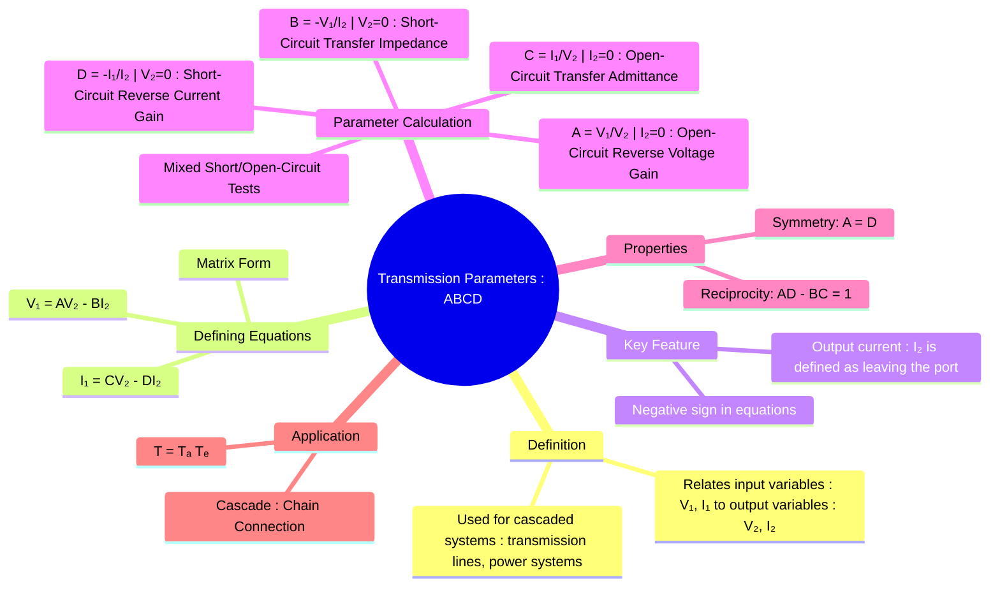

---
tags:
  - electric-circuits
  - two-port-networks
  - network-analysis
  - transmission-lines
  - abcd-parameters
created: 2025-07-29
aliases:
  - Transmission Parameters
  - T-parameters
  - Chain Parameters
  - ABCD Parameters in Electric Circuits
  - T-matrix
subject: "[[Electric Circuits]]"
parent: "[[Two-Port Networks]]"
confidence: 9
---

---
### Transmission Parameters (ABCD-parameters)
#abcd-parameters #two-port-networks #transmission-lines #cascade-connection

> **Transmission parameters**, also known as **ABCD-parameters**, **T-parameters**, or **chain parameters**, are a set of properties for two-port networks that relate the input voltage and current ($V_1, I_1$) to the output voltage and current ($V_2, I_2$). They are exceptionally useful for analyzing systems where networks are connected in **cascade** (end-to-end), such as in power transmission lines, telephone systems, and microwave engineering.

#### Defining Equations
#abcd-parameters/definition

The key feature of ABCD-parameters is that they express the input (sending-end) variables in terms of the output (receiving-end) variables. The defining equations are:
$$\begin{align}
V_1 &= AV_2 - BI_2 \\
I_1 &= CV_2 - DI_2
\end{align}$$
In matrix form, this is expressed as:
$$\boxed{\quad \begin{bmatrix} V_1 \\ I_1 \end{bmatrix} = \begin{bmatrix} A & B \\ C & D \end{bmatrix} \begin{bmatrix} V_2 \\ -I_2 \end{bmatrix} \quad}$$
**Important Note on Current Direction**: Unlike other parameter sets, the output current $I_2$ is conventionally defined as flowing **out of** Port 2. This is why a negative sign appears in the standard equations, making them suitable for transmission line analysis where current flows from the source to the load.

#### Parameter Calculation
#abcd-parameters/calculation

The parameters are found using open-circuit and short-circuit tests on the output port (Port 2).

1.  **From Open-Circuiting Port 2 ($I_2=0$)**:
    *   **A (Reverse Voltage Gain)**: A is the ratio of input voltage to output voltage.
        $$\boxed{\quad A = \left. \frac{V_1}{V_2} \right|_{I_2=0} \quad \text{(dimensionless)}}$$
    *   **C (Transfer Admittance)**: C is the ratio of input current to output voltage.
        $$\boxed{\quad C = \left. \frac{I_1}{V_2} \right|_{I_2=0} \quad (S)}$$

2.  **From Short-Circuiting Port 2 ($V_2=0$)**:
    *   **B (Transfer Impedance)**: B is the negative ratio of input voltage to output current.
        $$\boxed{\quad B = \left. -\frac{V_1}{I_2} \right|_{V_2=0} \quad (\Omega)}$$
    *   **D (Reverse Current Gain)**: D is the negative ratio of input current to output current.
        $$\boxed{\quad D = \left. -\frac{I_1}{I_2} \right|_{V_2=0} \quad \text{(dimensionless)}}$$

#### Conditions for Reciprocity and Symmetry
#reciprocity #symmetry

1.  **Reciprocity**: A network is reciprocal if the determinant of the T-matrix is equal to one.
    $$\boxed{\quad AD - BC = 1 \quad}$$
2.  **Symmetry**: A network is symmetrical if its input and output ports can be interchanged without changing the network's behavior.
    $$\boxed{\quad A = D \quad}$$

#### Application: Cascade Connection
#cascade-connection

The primary advantage of ABCD-parameters is the ease with which they handle cascaded networks. If two networks, A and B, are connected in cascade, the overall transmission matrix $[T]$ for the combined network is the **matrix product** of the individual matrices.
$$\boxed{\quad [T]_{\text{total}} = [T]_A \cdot [T]_B \quad}$$
$$\begin{bmatrix} A & B \\ C & D \end{bmatrix}_{\text{total}} = \begin{bmatrix} A_A & B_A \\ C_A & D_A \end{bmatrix} \begin{bmatrix} A_B & B_B \\ C_B & D_B \end{bmatrix}$$
This property simplifies the analysis of complex systems like multi-stage amplifiers or long transmission lines modeled as a series of shorter segments.

---
### Related Concepts
#abcd-parameters/related-concepts

> [[Two-Port Networks]] (The parent category of network parameters)

[[Impedance Parameters (Z-parameters)]] and [[Admittance Parameters (Y-parameters)]]
[[Hybrid Parameters (h-parameters)]]
[[Reciprocity Theorem]]
[[ABCD Parameters (Generalized Circuit Constants)]]
[[Power System]] (Major application area)