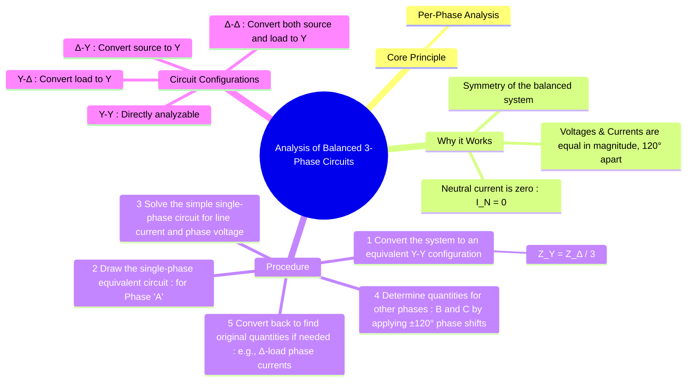

---
tags:
  - three-phase
  - ac-circuits
  - power-systems
  - per-phase-analysis
  - balanced-circuits
created: 2025-08-04
aliases:
  - Per-Phase Analysis
  - Balanced 3-Phase Analysis
subject: "[[Electric Circuits]]"
parent: "[[Three-Phase Circuits]]"
confidence: 9
---

---
### Analysis of Balanced Three-Phase Circuits
#per-phase-analysis #three-phase #balanced-circuits

> The analysis of balanced three-phase circuits is dramatically simplified by converting the entire system into a **per-phase equivalent circuit**. Because the system is perfectly symmetrical (equal source magnitudes 120° apart, equal line impedances, and equal load impedances), we only need to solve a simple single-phase AC circuit. The results for the other two phases can then be found by applying the appropriate 120° phase shifts.

#### The Per-Phase Equivalent Circuit
#per-phase-equivalent-circuit

The foundation of this method rests on the fact that in a balanced system, the currents in the three phases sum to zero at the neutral point.
$$I_A + I_B + I_C = 0 \implies I_N = 0$$
Since no current flows in the neutral line (even if one doesn't physically exist), the source neutral and load neutral are at the same potential. This allows us to create a simple series circuit for one phase (conventionally Phase 'A') that includes:
1.  The phase 'A' source voltage ($V_{AN}$).
2.  The line impedance for line 'A' ($Z_{line}$).
3.  The phase 'A' load impedance ($Z_{Y}$).
4.  A zero-impedance return path representing the neutral connection.

---
#### General Procedure for Analysis
#per-phase-analysis/procedure

##### Step 1: Convert the entire system to an equivalent Y-Y structure

This is the most critical step. A Y-Y system is the easiest to analyze because the line current is the same as the phase current.
*   **If the load is Delta-connected ($Z_\Delta$)**: Convert it to an equivalent Star load ($Z_Y$).
    $$\boxed{\quad Z_Y = \frac{Z_\Delta}{3} \quad}$$
*   **If the source is Delta-connected**: Convert it to an equivalent Star source. Find the line voltage $V_L$ and then the equivalent phase voltage $V_{ph(Y)} = V_L / \sqrt{3}$ with the appropriate 30° phase shift. Most problems, however, provide a Y-connected source.

##### Step 2: Draw the single-phase (or per-phase) equivalent circuit for Phase A

This will be a simple series circuit.

##### Step 3: Solve the single-phase circuit

Calculate the line current for phase A ($I_A$) using Ohm's Law.
$$\boxed{\quad I_A = \frac{V_{AN}}{Z_{total}} = \frac{V_{AN}}{Z_{source} + Z_{line} + Z_{Y,load}} \quad}$$
Then, find the voltage across the load phase A, $V_{AN(load)} = I_A \cdot Z_{Y,load}$.

##### Step 4: Determine quantities for Phases B and C

Using the calculated values for phase A and the phase sequence (usually positive ABC), find the other line currents and phase voltages by shifting the phase angle by -120° for phase B and +120° (or -240°) for phase C.
*   $I_B = I_A \angle (\theta - 120^\circ)$
*   $I_C = I_A \angle (\theta + 120^\circ)$

##### Step 5: Convert back to original quantities if necessary

If the original load was Delta-connected, you may need to find the phase currents in the Delta load ($I_{AB}, I_{BC}, I_{CA}$).
1.  First find the line voltage across the load, e.g., $V_{AB(load)} = \sqrt{3} V_{AN(load)} \angle 30^\circ$.
2.  Then find the phase current in the original delta load: $I_{AB} = V_{AB(load)} / Z_\Delta$.
3.  Alternatively, use the direct relationship: the magnitude of the delta phase current is $|I_L|/\sqrt{3}$, and it leads the corresponding line current by 30° ($I_{AB}$ leads $I_A$ by 30°).

---
### Related Concepts
#per-phase-analysis/related-concepts

> [[Three-Phase Circuits]] (Parent Topic)

[[Star and Delta Connections]] (The fundamental configurations)
[[Voltage and Current Relationships in Star and Delta]] (The formulas used in the analysis)
[[Star-Delta Transformation]] (The key mathematical tool for Step 1)
[[Three-Phase Power]] (Often the final goal of the analysis)
[[Phase Sequence]] (Used to determine results for phases B and C)